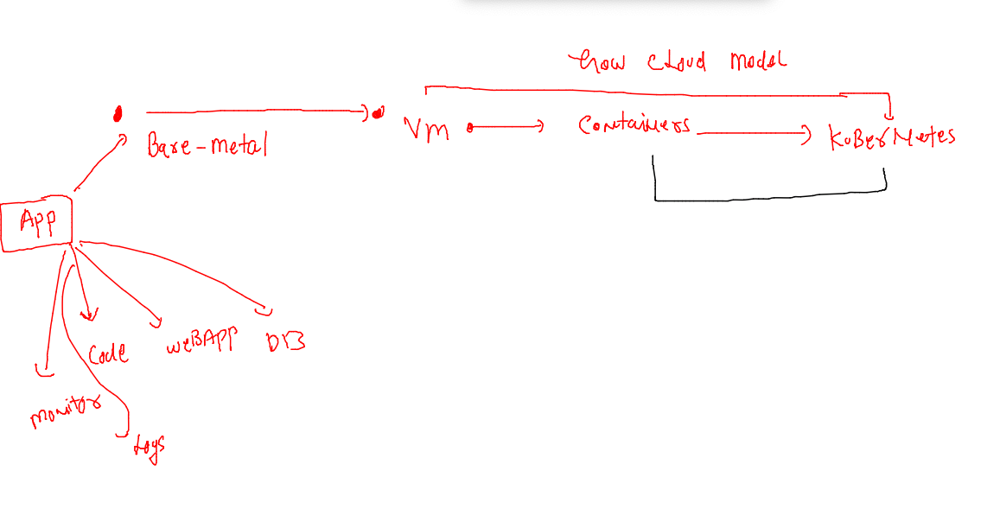
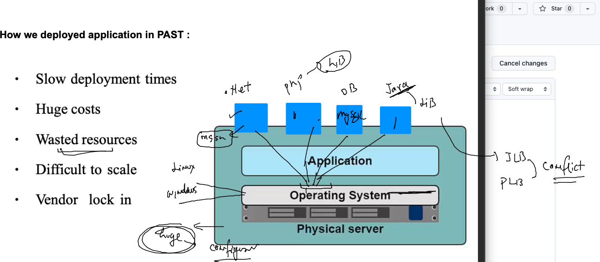
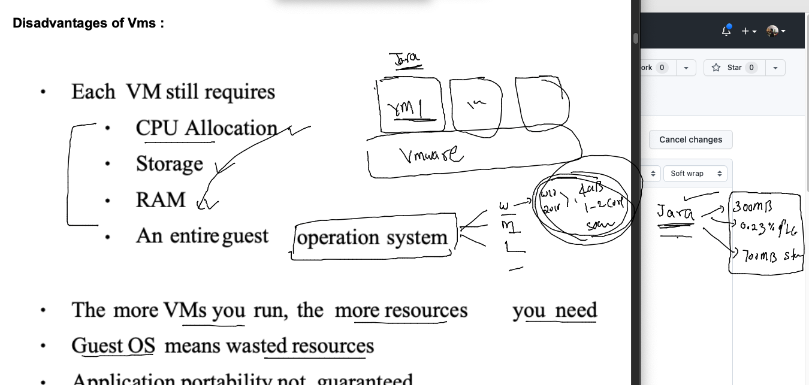
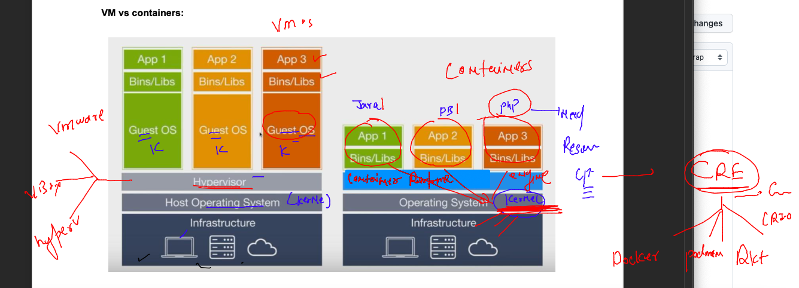
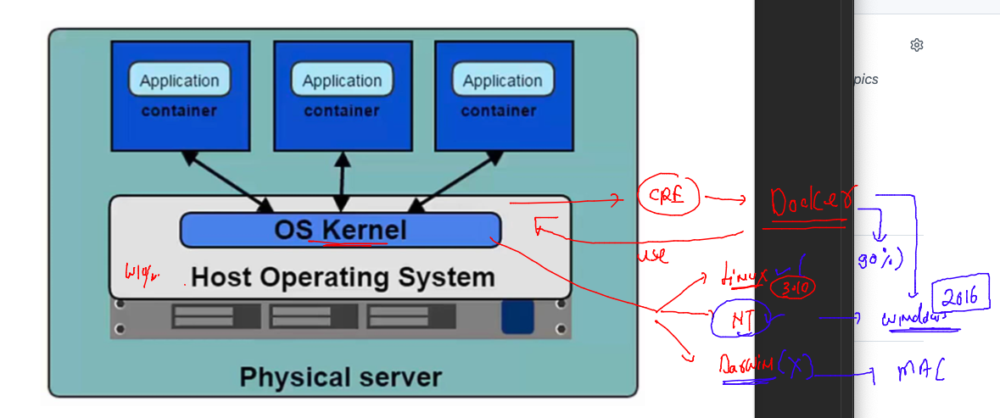
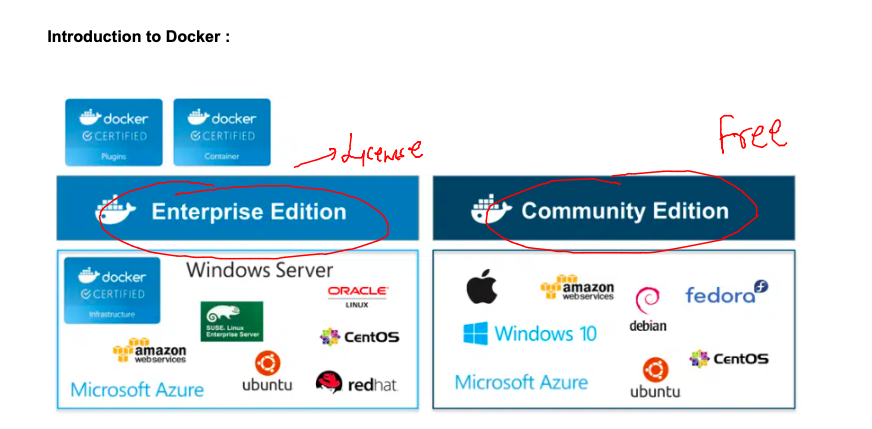

## getting started

### Understanding journey 




### app conflict in bare-metal servers



### problem with vms wrt to app deployment / testing 



### Introduction to container runtime engine (CRE)




### Docker support with OS kernels 



### Introduction to Docker 



## Installing docker ce  on amazon cloud linux machine 

### checking linux kernel 

```
fire@ashutoshhs-MacBook-Air ~ % ssh  ashu@54.198.64.250
ashu@54.198.64.250's password: 

       __|  __|_  )
       _|  (     /   Amazon Linux 2 AMI
      ___|\___|___|

https://aws.amazon.com/amazon-linux-2/
7 package(s) needed for security, out of 8 available
Run "sudo yum update" to apply all updates.
-bash: warning: setlocale: LC_CTYPE: cannot change locale (UTF-8): No such file or directory
[ashu@docker-host ~]$ 
[ashu@docker-host ~]$ 
[ashu@docker-host ~]$ uname -r
5.10.157-139.675.amzn2.x86_64
[ashu@docker-host ~]$ docker 
-bash: docker: command not found
[ashu@docker-host ~]$ 


```

### Installing docker in linux box using root user only 

```
[root@docker-host ~]# whoami
root
[root@docker-host ~]# yum  install docker  
Failed to set locale, defaulting to C
Loaded plugins: extras_suggestions, langpacks, priorities, update-motd
amzn2-core                                                                                                         | 3.7 kB  00:00:00     
Resolving Dependencies
--> Running transaction check
---> Package docker.x86_64 0:20.10.17-1.amzn2.0.1 will be installed
--> Processing Dependency: runc >= 1.0.0 for package: docker-20.10.17-1.amzn2.0.1.x86_64
--> Processing Dependency: libcgroup >= 0.40.rc1-5.15 for package: docker-20.10.17-1.amzn2.0.1.x86_64
--> Processing Dependency: containerd >= 1.3.2 for package: docker-20.10.17-1.amzn2.0.1.x86_64
--> Processing Dependency: pigz for package: docker-20.10.17-1.amzn2.0.1.x86_64
--> Running transaction check
---> Package containerd.x86_64 0:1.6.8-1.amzn2 will be installed
---> Package libcgroup.x86_64 0:0.41-21.amzn2 will be installed
---> Package pigz.x86_64 0:2.3.4-1.amzn2.0.1 will be installed
---> Package runc.x86_64 0:1.1.4-1.amzn2 will be installed
--> Finished Dependency Resolution

Dependencies Resolved

==========================================================================================================================================
 Package                      Arch                     Version                                  Repository                           Size
==========================================================================================================================================
Installing:
 docker                       x86_64                   20.10.17-1.amzn2.0.1                     amzn2extra-docker                    39 M
Installing for dependencies:
 containerd                   x86_64                   1.6.8-1.amzn2                            amzn2extra-docker                    27 M
 libcgroup                    x86_64                   0.41-21.amzn2                            amzn2-core                           66 k
 pigz                         x86_64                   2.3.4-1.amzn2.0.1                        amzn2-core                           81 k
 runc                         x86_64                   1.1.4-1.amzn2                            amzn2extra-docker                   2.9 M

Transaction Summary
==========================================================================================================================================
Install  1 Package (+4 Dependent packages)

Total download size: 69 M
Installed size: 260 M
Is this ok [y/d/N]: y
Downloading packages:

```

### for docker ce installation you can use below link

[docker-ce-installation](https://docs.docker.com/engine/install/)

### verify docker installation from non root user also 

```
[ashu@docker-host ~]$ docker  -v
Docker version 20.10.17, build 100c701
[ashu@docker-host ~]$ 


```

### docker ce -- configuration and components 


