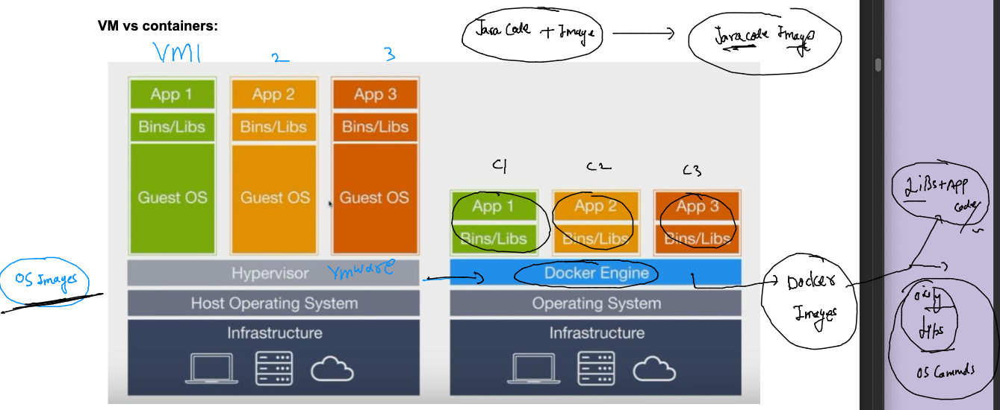
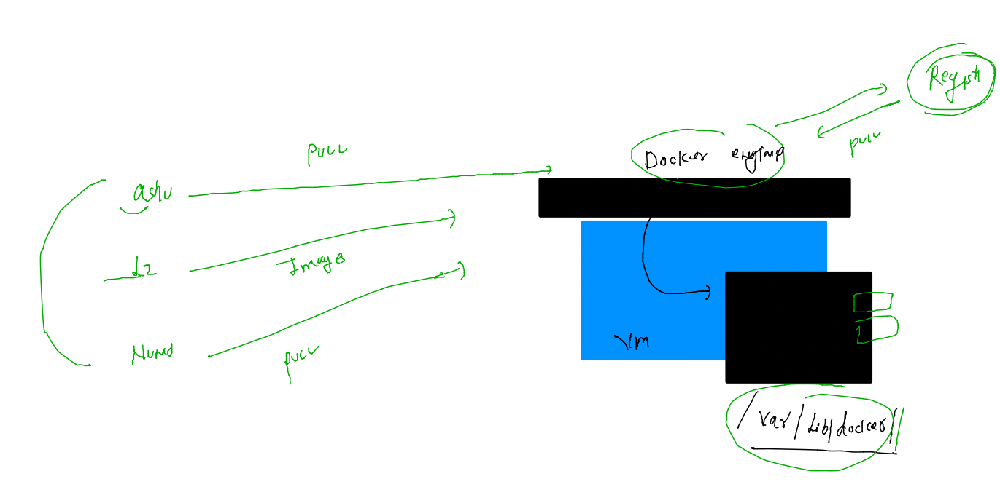
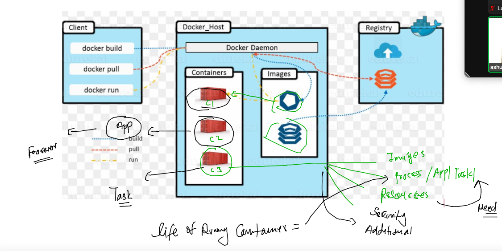
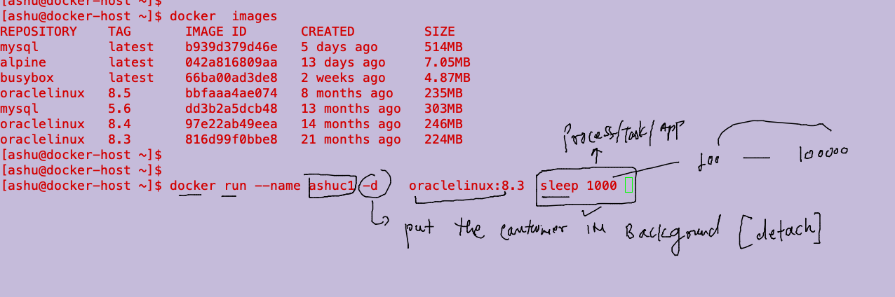

## getting started

### Understanding journey 


### app conflict in bare-metal servers


### problem with vms wrt to app deployment / testing 


### Introduction to container runtime engine (CRE)


### Docker support with OS kernels 


### Introduction to Docker 


## Installing docker ce  on amazon cloud linux machine 

### checking linux kernel 

```
fire@ashutoshhs-MacBook-Air ~ % ssh  ashu@54.198.64.250
ashu@54.198.64.250's password: 

       __|  __|_  )
       _|  (     /   Amazon Linux 2 AMI
      ___|\___|___|

https://aws.amazon.com/amazon-linux-2/
7 package(s) needed for security, out of 8 available
Run "sudo yum update" to apply all updates.
-bash: warning: setlocale: LC_CTYPE: cannot change locale (UTF-8): No such file or directory
[ashu@docker-host ~]$ 
[ashu@docker-host ~]$ 
[ashu@docker-host ~]$ uname -r
5.10.157-139.675.amzn2.x86_64
[ashu@docker-host ~]$ docker 
-bash: docker: command not found
[ashu@docker-host ~]$ 


```

### Installing docker in linux box using root user only 

```
[root@docker-host ~]# whoami
root
[root@docker-host ~]# yum  install docker  
Failed to set locale, defaulting to C
Loaded plugins: extras_suggestions, langpacks, priorities, update-motd
amzn2-core                                                                                                         | 3.7 kB  00:00:00     
Resolving Dependencies
--> Running transaction check
---> Package docker.x86_64 0:20.10.17-1.amzn2.0.1 will be installed
--> Processing Dependency: runc >= 1.0.0 for package: docker-20.10.17-1.amzn2.0.1.x86_64
--> Processing Dependency: libcgroup >= 0.40.rc1-5.15 for package: docker-20.10.17-1.amzn2.0.1.x86_64
--> Processing Dependency: containerd >= 1.3.2 for package: docker-20.10.17-1.amzn2.0.1.x86_64
--> Processing Dependency: pigz for package: docker-20.10.17-1.amzn2.0.1.x86_64
--> Running transaction check
---> Package containerd.x86_64 0:1.6.8-1.amzn2 will be installed
---> Package libcgroup.x86_64 0:0.41-21.amzn2 will be installed
---> Package pigz.x86_64 0:2.3.4-1.amzn2.0.1 will be installed
---> Package runc.x86_64 0:1.1.4-1.amzn2 will be installed
--> Finished Dependency Resolution

Dependencies Resolved

==========================================================================================================================================
 Package                      Arch                     Version                                  Repository                           Size
==========================================================================================================================================
Installing:
 docker                       x86_64                   20.10.17-1.amzn2.0.1                     amzn2extra-docker                    39 M
Installing for dependencies:
 containerd                   x86_64                   1.6.8-1.amzn2                            amzn2extra-docker                    27 M
 libcgroup                    x86_64                   0.41-21.amzn2                            amzn2-core                           66 k
 pigz                         x86_64                   2.3.4-1.amzn2.0.1                        amzn2-core                           81 k
 runc                         x86_64                   1.1.4-1.amzn2                            amzn2extra-docker                   2.9 M

Transaction Summary
==========================================================================================================================================
Install  1 Package (+4 Dependent packages)

Total download size: 69 M
Installed size: 260 M
Is this ok [y/d/N]: y
Downloading packages:

```

### for docker ce installation you can use below link

[docker-ce-installation](https://docs.docker.com/engine/install/)

### verify docker installation from non root user also 

```
[ashu@docker-host ~]$ docker  -v
Docker version 20.10.17, build 100c701
[ashu@docker-host ~]$ 


```

### TIp -- installing docker on mac / windows 10 /11 --using docker desktop 


### docker ce -- configuration and components 


### verify local docker client and server

```
[ashu@docker-host ~]$ docker  version 
Client:
 Version:           20.10.17
 API version:       1.41
 Go version:        go1.18.6
 Git commit:        100c701
 Built:             Wed Sep 28 23:10:17 2022
 OS/Arch:           linux/amd64
 Context:           default
 Experimental:      true
Cannot connect to the Docker daemon at unix:///var/run/docker.sock. Is the docker daemon running?
[ashu@docker-host ~]$ 
[ashu@docker-host ~]$ docker  images
Cannot connect to the Docker daemon at unix:///var/run/docker.sock. Is the docker daemon running?
[ashu@docker-host ~]$ 
[ashu@docker-host ~]$ docker  ps
Cannot connect to the Docker daemon at unix:///var/run/docker.sock. Is the docker daemon running?
[ashu@docker-host ~]$ 


```

### on docker host / server lets start docker service 

```
[root@docker-host ~]# systemctl start  docker 
[root@docker-host ~]# systemctl status  docker 
● docker.service - Docker Application Container Engine
   Loaded: loaded (/usr/lib/systemd/system/docker.service; disabled; vendor preset: disabled)
   Active: active (running) since Mon 2023-01-23 11:19:58 UTC; 7s ago
     Docs: https://docs.docker.com
  Process: 5268 ExecStartPre=/usr/libexec/docker/docker-setup-runtimes.sh (code=exited, status=0/SUCCESS)
  Process: 5266 ExecStartPre=/bin/mkdir -p /run/docker (code=exited, status=0/SUCCESS)
 Main PID: 5270 (dockerd)
    Tasks: 9
   Memory: 22.0M
   CGroup: /system.slice/docker.service
           └─5270 /usr/bin/dockerd -H fd:// --containerd=/run/containerd/containerd.sock --default-ulimit nofile=32768:65536


### making service persistent after reboot 

[root@docker-host ~]# systemctl enable docker 
Created symlink from /etc/systemd/system/multi-user.target.wants/docker.service to /usr/lib/systemd/system/docker.service.
[root@docker-host ~]# 

```

### lets connect from docker client users 

```
[ashu@docker-host ~]$ docker version 
Client:
 Version:           20.10.17
 API version:       1.41
 Go version:        go1.18.6
 Git commit:        100c701
 Built:             Wed Sep 28 23:10:17 2022
 OS/Arch:           linux/amd64
 Context:           default
 Experimental:      true
Got permission denied while trying to connect to the Docker daemon socket at unix:///var/run/docker.sock: Get "http://%2Fvar%2Frun%2Fdocker.sock/v1.24/version": dial unix /var/run/docker.sock: connect: permission denied
[ashu@docker-host ~]$ docker images
Got permission denied while trying to connect to the Docker daemon socket at unix:///var/run/docker.sock: Get "http://%2Fvar%2Frun%2Fdocker.sock/v1.24/images/json": dial unix /var/run/docker.sock: connect: permission denied
[ashu@docker-host ~]$ 
```

### Note: by default a local non root user can not connect to docker server / host 

### from root user add ashu to docker group 

```
[root@docker-host ~]# usermod -aG docker  ashu 
```

### from client 

```
[ashu@docker-host ~]$ exit
logout
Connection to 54.198.64.250 closed.
fire@ashutoshhs-MacBook-Air ~ % 
fire@ashutoshhs-MacBook-Air ~ % ssh  ashu@54.198.64.250
ashu@54.198.64.250's password: 
Last login: Mon Jan 23 10:33:40 2023 from 103.59.75.183

       __|  __|_  )
       _|  (     /   Amazon Linux 2 AMI
      ___|\___|___|

https://aws.amazon.com/amazon-linux-2/
7 package(s) needed for security, out of 8 available
Run "sudo yum update" to apply all updates.
-bash: warning: setlocale: LC_CTYPE: cannot change locale (UTF-8): No such file or directory
[ashu@docker-host ~]$ 
[ashu@docker-host ~]$ docker  version 
Client:
 Version:           20.10.17
 API version:       1.41
 Go version:        go1.18.6
 Git commit:        100c701
 Built:             Wed Sep 28 23:10:17 2022
 OS/Arch:           linux/amd64
 Context:           default
 Experimental:      true

Server:
 Engine:
  Version:          20.10.17
  API version:      1.41 (minimum version 1.12)
  Go version:       go1.18.6
  Git commit:       a89b842
  Built:            Wed Sep 28 23:10:55 2022
  OS/Arch:          linux/amd64
  Experimental:     false
 containerd:
  Version:          1.6.8
  GitCommit:        9cd3357b7fd7218e4aec3eae239db1f68a5a6ec6
 runc:
  Version:          1.1.4
  GitCommit:        5fd4c4d144137e991c4acebb2146ab1483a97925
 docker-init:
  Version:          0.19.0
  GitCommit:        de40ad0
```

### importance of docker /container images 



## Docker client opertaions 

### searching images on docker hub 

```
[ashu@docker-host ~]$ docker  search   mysql
NAME                            DESCRIPTION                                     STARS     OFFICIAL   AUTOMATED
mysql                           MySQL is a widely used, open-source relation…   13718     [OK]       
mariadb                         MariaDB Server is a high performing open sou…   5235      [OK]       
phpmyadmin                      phpMyAdmin - A web interface for MySQL and M…   725       [OK]       
percona                         Percona Server is a fork of the MySQL relati…   599       [OK]       
databack/mysql-backup           Back up mysql databases to... anywhere!         80                   
bitnami/mysql                   Bitnami MySQL Docker Image                      80                   [OK]
linuxserver/mysql-workbench                                                     48                   
ubuntu/mysql                    MySQL open source fast, stable, multi-thread…   41                   
linuxserver/mysql               A Mysql container, brought to you by LinuxSe…   38                   
circleci/mysql                  MySQL is a widely used, open-source relation…   28                   
google/mysql                    MySQL server for Google Compute Engine          22                   [OK]
rapidfort/mysql                 RapidFort optimized, hardened image for MySQL   14                   
bitnami/mysqld-exporter                                                         4                    
ibmcom/mysql-s390x              Docker image for mysql-s390x                    2                    
vitess/mysqlctld                vitess/mysqlctld                                1                    [OK]
newrelic/mysql-plugin           New Relic Plugin for monitoring MySQL databa…   1                    [OK]
```

### search by tag


```
 19  docker  search   mysql
   20  docker  search   mysql:5.7 
   21  docker  search nginx:1.11

```

### lets pull image from docker hub 

```
[ashu@docker-host ~]$ docker pull mysql
Using default tag: latest
latest: Pulling from library/mysql
2c57acc5afca: Pull complete 
0a990ab965c1: Pull complete 
7acb6a84f0f1: Pull complete 
6a2351a691a4: Pull complete 
cdd0aae0ac1a: Pull complete 
0c024d6bf869: Pull complete 
e536ea8ecf65: Pull complete 
d24661dff86b: Pull complete 
95ef82dfce7a: Pull complete 
c9a31e1bffa1: Pull complete 
4edb4789da39: Pull complete 
Digest: sha256:6f54880f928070a036aa3874d4a3fa203adc28688eb89e9f926a0dcacbce3378
Status: Downloaded newer image for mysql:latest
docker.io/library/mysql:latest
[ashu@docker-host ~]$ 
[ashu@docker-host ~]$ docker  images
REPOSITORY   TAG       IMAGE ID       CREATED      SIZE
mysql        latest    b939d379d46e   5 days ago   514MB
[ashu@docker-host ~]$ 


```

### docker pull concept 



### creating container from image



### creating first container 



### perform 

```
[ashu@docker-host ~]$ docker run --name ashuc1 -d    oraclelinux:8.3  sleep 1000 
960c81d1104fc3506ca946837e4bc721129bf18dcce6f2e5d69e655c15d47833
[ashu@docker-host ~]$ docker  ps
CONTAINER ID   IMAGE             COMMAND         CREATED              STATUS              PORTS     NAMES
960c81d1104f   oraclelinux:8.3   "sleep 1000"    7 seconds ago        Up 6 seconds                  ashuc1
9790c2f72363   oraclelinux:8.5   "sleep 10000"   About a minute ago   Up About a minute             nmgrilo_oracle
```

### listing all the containers 

```
[ashu@docker-host ~]$ docker  ps -a
CONTAINER ID   IMAGE             COMMAND                  CREATED              STATUS                          PORTS                 NAMES
d63d66c4f06b   oraclelinux:8.5   "sleep 10"               25 seconds ago       Exited (0) 14 seconds ago                             acsilva
ffaf720df119   mysql             "docker-entrypoint.s…"   About a minute ago   Up About a minute               3306/tcp, 33060/tcp   mysqlContainer
9be58ac8b4f4   mysql:5.6         "docker-entrypoint.s…"   2 minutes ago        Up 2 minutes                    3306/tcp              dphenriques1
99fb8726598c   oraclelinux:8.3   "sleep 1000"             2 minutes ago        Up 2 minutes              
```

### stopping a running container 

```
 docker  stop   ashuc1
```

### starting the existing container 

```
[ashu@docker-host ~]$ docker  start  ashuc1
ashuc1
[ashu@docker-host ~]$ docker ps
CONTAINER ID   IMAGE             COMMAND         CREATED          STATUS          PORTS     NAMES
d71323aa18a7   oraclelinux:8.3   "sleep 1000"    35 seconds ago   Up 34 seconds             dvvladimirov
0b99bf66bce9   oraclelinux:8.3   "sleep 1000"    2 minutes ago    Up 2 minutes              dgneto1
2231e343a5af   oraclelinux:8.3   "sleep 10000"   4 minutes ago    Up 4 minutes              jpconceicaoc1
df673bb65207   oraclelinux:8.3   "sleep 1000"    5 minutes ago    Up 5 minutes              jjisidoro1
960c81d1104f   oraclelinux:8.3   "sleep 1000"    6 minutes ago    Up 2 seconds              ashuc1
[ashu@docker-host ~]$ 

```

### checking the resouces consumption of the containers 

```
 64  docker  stats 
   65  docker  stats  ashuc1
```


