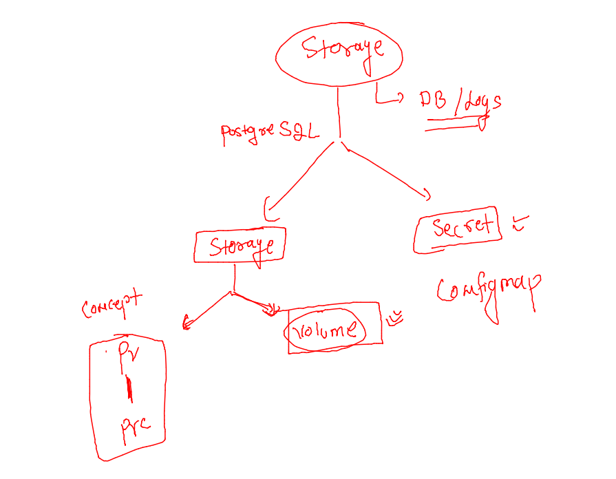
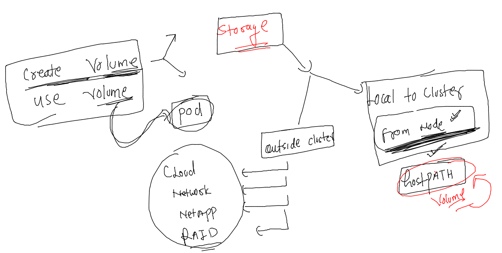
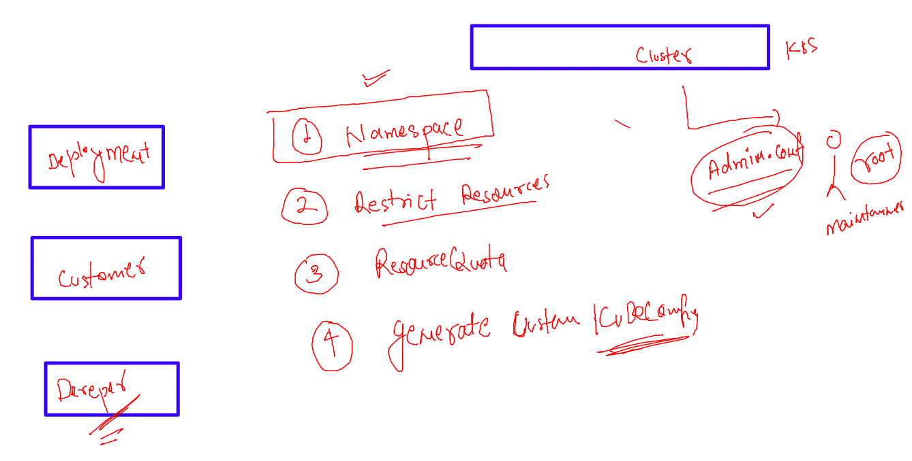
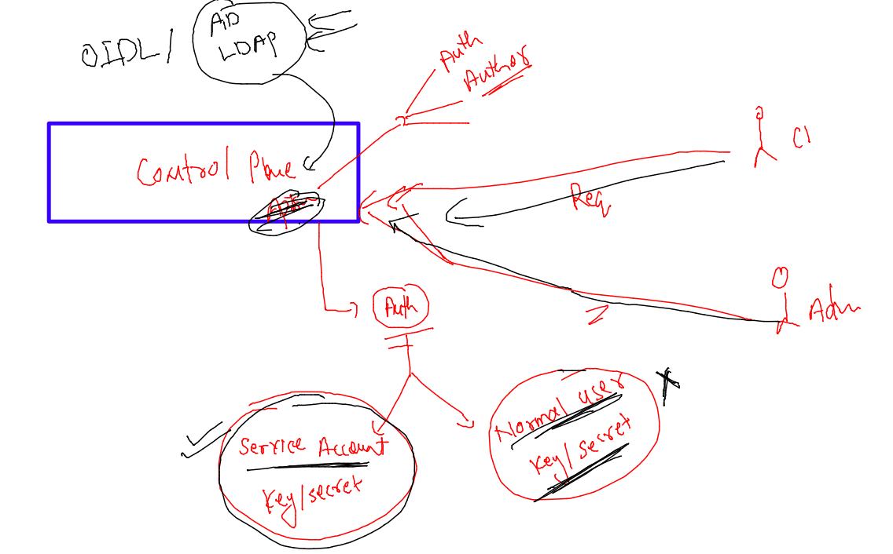
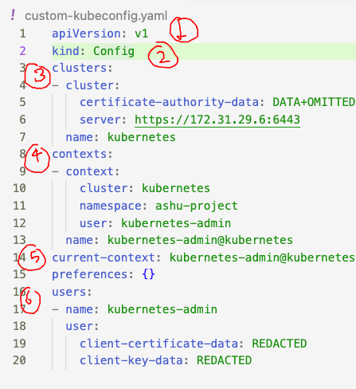
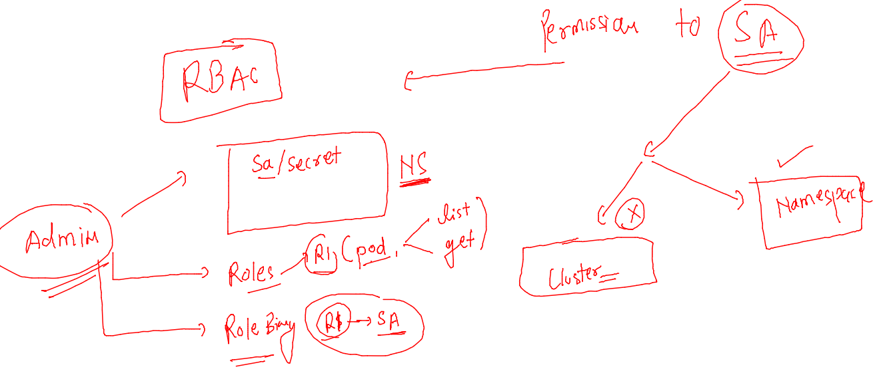

## getting started

### Storage COncept 



## Deploying PostGreSQL 

### creating configMap to store info 

```
[ashu@docker-host post-gre-deploy]$ kubectl create configmap  ashu-postgre-cm --from-literal  POSTGRES_USER=admin  --dry-run=client -o yaml  >configmap.yaml 
[ashu@docker-host post-gre-deploy]$ ls
configmap.yaml
```

### updating more ENv section in CM 

```
apiVersion: v1
kind: ConfigMap
metadata:
  creationTimestamp: null
  name: ashu-postgre-cm
data:
  POSTGRES_USER: admin
  POSTGRES_DB: ashdudb

```

#### lets deploy that 

```
[ashu@docker-host post-gre-deploy]$ ls
configmap.yaml
[ashu@docker-host post-gre-deploy]$ kubectl apply -f configmap.yaml 
configmap/ashu-postgre-cm created
[ashu@docker-host post-gre-deploy]$ kubectl  get  cm 
NAME               DATA   AGE
ashu-db-details    1      36m
ashu-env-cm        2      22h
ashu-postgre-cm    2      5s
kube-root-ca.crt   1      3d21h
[ashu@docker-host post-gre-deploy]$ 
```

### creating secret to store password or any confidential info 

```
[ashu@docker-host post-gre-deploy]$ kubectl  create secret  generic ashu-postgre-secret  --from-literal  mypass="MobiAshu@098#" --dry-run=client -o yaml >secret.yaml 
```

### secret creation 

```
[ashu@docker-host post-gre-deploy]$ kubectl apply -f secret.yaml 
secret/ashu-postgre-secret created
[ashu@docker-host post-gre-deploy]$ kubectl  get  secret 
NAME                  TYPE                                  DATA   AGE
ashu-db-cred          Opaque                                1      41m
ashu-postgre-secret   Opaque                                1      6s
default-token-s2d7c   kubernetes.io/service-account-token   3      3d21h
[ashu@docker-host post-gre-deploy]$ 

```

### volume info in k8s 



### Deployment creation 

```
[ashu@docker-host post-gre-deploy]$ kubectl  create  deployment  ashu-post-db --image=postgres  --port 5432 --dry-run=client  -o yaml >deployment.yaml 
[ashu@docker-host post-gre-deploy]$ ls
configmap.yaml  deployment.yaml  secret.yaml
[ashu@docker-host post-gre-deploy]$ 

```

### updataing deployment file for volume related data 

```
apiVersion: apps/v1
kind: Deployment
metadata:
  creationTimestamp: null
  labels:
    app: ashu-post-db
  name: ashu-post-db
spec:
  replicas: 1
  selector:
    matchLabels:
      app: ashu-post-db
  strategy: {}
  template: # template section 
    metadata:
      creationTimestamp: null
      labels:
        app: ashu-post-db
    spec:
      volumes: # for creating volume 
      - name: ashu-vol123 # name of volume 
        hostPath: # type of volume -- hostpath means local node storage 
          path: /mnt/ashudb-space  # this directory will be created automatically 
          type: Directory 
      containers: # for creating container 
      - image: postgres
        name: postgres
        ports:
        - containerPort: 5432
        volumeMounts: # attaching / mounting volume we created above 
        - name: ashu-vol123 
          mountPath: /var/lib/postgresql/data/ 
        resources: {}
status: {}

```

### updating configMap & Secret 

```
apiVersion: apps/v1
kind: Deployment
metadata:
  creationTimestamp: null
  labels:
    app: ashu-post-db
  name: ashu-post-db
spec:
  replicas: 1
  selector:
    matchLabels:
      app: ashu-post-db
  strategy: {}
  template: # template section 
    metadata:
      creationTimestamp: null
      labels:
        app: ashu-post-db
    spec:
      volumes: # for creating volume 
      - name: ashu-vol123 # name of volume 
        hostPath: # type of volume -- hostpath means local node storage 
          path: /mnt/ashudb-space  # this directory will be created automatically 
          type: DirectoryOrCreate
      containers: # for creating container 
      - image: postgres
        name: postgres
        ports:
        - containerPort: 5432
        volumeMounts: # attaching / mounting volume we created above 
        - name: ashu-vol123 
          mountPath: /var/lib/postgresql/data/ 
        envFrom: # to calling configmap / secret directly 
        - configMapRef:
            name: ashu-postgre-cm
        env: # to use / create ENV in pod container 
        - name: POSTGRES_PASSWORD
          valueFrom: 
            secretKeyRef:
              name: ashu-postgre-secret
              key: mypass
        resources: {}
status: {}

```

### deploy it 

```
[ashu@docker-host post-gre-deploy]$ kubectl apply -f deployment.yaml 
Warning: resource deployments/ashu-post-db is missing the kubectl.kubernetes.io/last-applied-configuration annotation which is required by kubectl apply. kubectl apply should only be used on resources created declaratively by either kubectl create --save-config or kubectl apply. The missing annotation will be patched automatically.
deployment.apps/ashu-post-db configured
[ashu@docker-host post-gre-deploy]$ kubectl  get  deploy 
NAME           READY   UP-TO-DATE   AVAILABLE   AGE
ashu-post-db   1/1     1            1           78s
[ashu@docker-host post-gre-deploy]$ kubectl  get  po
NAME                            READY   STATUS    RESTARTS   AGE
ashu-post-db-794dd57599-kg2f8   1/1     Running   0          81s
[ashu@docker-host post-gre-deploy]
```
### creating service for db 

```
[ashu@docker-host ashu-apps]$ kubectl  get deploy 
NAME           READY   UP-TO-DATE   AVAILABLE   AGE
ashu-post-db   1/1     1            1           14m
[ashu@docker-host ashu-apps]$ 
[ashu@docker-host ashu-apps]$ kubectl  expose  deployment  ashu-post-db  --type ClusterIP --port 5432 --name ashu-svc1 --dry-run=client -o yaml >svc.yaml 
[ashu@docker-host ashu-apps]$ kubectl  apply -f svc.yaml 
service/ashu-svc1 created
[ashu@docker-host ashu-apps]$ kubectl  get  svc
NAME        TYPE        CLUSTER-IP   EXTERNAL-IP   PORT(S)    AGE
ashu-svc1   ClusterIP   10.97.28.6   <none>        5432/TCP   4s
[ashu@docker-host ashu-apps]$ 


```


### lets clean up 

```
[ashu@docker-host ashu-apps]$ kubectl delete all,cm,secret  --all 
pod "ashu-post-db-7d65467b9f-rv4l2" deleted
service "ashu-svc1" deleted
deployment.apps "ashu-post-db" deleted
replicaset.apps "ashu-post-db-7d65467b9f" deleted
configmap "ashu-db-details" deleted
configmap "ashu-env-cm" deleted
configmap "ashu-postgre-cm" deleted
configmap "kube-root-ca.crt" deleted
secret "ashu-db-cred" deleted
secret "ashu-postgre-secret" deleted
secret "default-token-s2d7c" deleted
[ashu@docker-host ashu-apps]$ 
```

### Splunk deployment in k8s 

```
1023  kubectl  create ns  ashusplunkns --dry-run=client -o yaml >ashusplunk.yaml
 1024  kubectl create configmap  ashu-sp --from-literal  lic="--accept-license"  --dry-run=client  -o yaml >>ashusplunk.yaml 
 1025  kubectl  create  secret  generic  ashu-sec --from-literal sp_pass="SpMobi@098#" --namespace  ashusplunkns  --dry-run=client -o yaml  >>ashusplunk.yaml 
 1026  history 
 1027  kubectl create deployment ashu-sp-dep --image=splunk/splunk:latest  --port 8000  --namespace  ashusplunkns  --dry-run=client -o yaml >>ashusplunk.yaml 
 1028  history 
 1029  kubectl apply -f ashusplunk.yaml 
 1030  kubectl   get  cm -n ashusplunkns 
 1031  kubectl   get  secre -n ashusplunkns 
 1032  history 
 1033  kubectl get  secret -n ashusplunkns 
 1034  kubectl  get  deploy -n ashusplunkns 
 1035  kubectl  get  po -n ashusplunkns 
 1036  kubectl expose  deployment  ashu-sp-dep  --type NodePort --port 8000 --name ssv1 --dry-run=client -o yaml  >>ashusplunk.yaml 
 1037  kubectl expose  deployment  ashu-sp-dep  --type NodePort --port 8000 --name ssv1 -n ashusplunk.yaml --dry-run=client -o yaml  >>ashusplunk.yaml 
 1038  history 
 1039  kubectl -n ashusplunkns expose deploy ashu-sp-dep --type NodePort --port 8000 --name ss11 --dry-run=client -o yaml >>ashusplunk.yaml 
 1040  kubectl apply -f ashusplunk.yaml 
 1041  history 
[ashu@docker-host post-gre-deploy]$ kubectl  get  svc -n ashusplunkns 
NAME   TYPE       CLUSTER-IP       EXTERNAL-IP   PORT(S)          AGE
ss11   NodePort   10.111.142.121   <none>        8000:30101/TCP   15s
```

### YAML file 

```
apiVersion: v1
kind: Namespace
metadata:
  creationTimestamp: null
  name: ashusplunkns
spec: {}
status: {}
---
apiVersion: v1
data:
  lic: --accept-license
kind: ConfigMap
metadata:
  creationTimestamp: null
  name: ashu-sp
  namespace: ashusplunkns

---

apiVersion: v1
data:
  sp_pass: U3BNb2JpQDA5OCM=
kind: Secret
metadata:
  creationTimestamp: null
  name: ashu-sec
  namespace: ashusplunkns
---

apiVersion: apps/v1
kind: Deployment
metadata:
  creationTimestamp: null
  labels:
    app: ashu-sp-dep
  name: ashu-sp-dep
  namespace: ashusplunkns
spec:
  replicas: 1
  selector:
    matchLabels:
      app: ashu-sp-dep
  strategy: {}
  template:
    metadata:
      creationTimestamp: null
      labels:
        app: ashu-sp-dep
    spec:
      containers:
      - image: splunk/splunk:latest
        name: splunk
        ports:
        - containerPort: 8000
        resources: {}
        env:
        - name: SPLUNK_START_ARGS
          valueFrom:
            configMapKeyRef:
              name: ashu-sp
              key: lic
        - name: SPLUNK_PASSWORD
          valueFrom:
            secretKeyRef:
              name: ashu-sec
              key: sp_pass
status: {}
---
apiVersion: v1
kind: Service
metadata:
  creationTimestamp: null
  labels:
    app: ashu-sp-dep
  name: ss11
  namespace: ashusplunkns
spec:
  ports:
  - port: 8000
    protocol: TCP
    targetPort: 8000
  selector:
    app: ashu-sp-dep
  type: NodePort
status:
  loadBalancer: {}

```

## Best practise to share k8s cluster cred with someone 



### users in k8s 



### creating new NS 

```
[ashu@docker-host post-gre-deploy]$ kubectl  create  ns  ashu-developer 
namespace/ashu-developer created
[ashu@docker-host post-gre-deploy]$ 
[ashu@docker-host post-gre-deploy]$ kubectl   get  serviceaccount  -n ashu-developer 
NAME      SECRETS   AGE
default   1         12s
[ashu@docker-host post-gre-deploy]$ 
[ashu@docker-host post-gre-deploy]$ kubectl   get  secret  -n ashu-developer 
NAME                  TYPE                                  DATA   AGE
default-token-kcg5f   kubernetes.io/service-account-token   3      63s
[ashu@docker-host post-gre-deploy]$ 


```

### describe secret 

```
ashu@docker-host post-gre-deploy]$ kubectl   get  secret  -n ashu-developer 
NAME                  TYPE                                  DATA   AGE
default-token-kcg5f   kubernetes.io/service-account-token   3      63s
[ashu@docker-host post-gre-deploy]$ 
[ashu@docker-host post-gre-deploy]$ kubectl describe  secret default-token-kcg5f  -n ashu-developer 
Name:         default-token-kcg5f
Namespace:    ashu-developer
Labels:       <none>
Annotations:  kubernetes.io/service-account.name: default
              kubernetes.io/service-account.uid: 8fec2c6e-1641-4975-8487-eeb3e80a2782

Type:  kubernetes.io/service-account-token

Data
====
ca.crt:     1099 bytes
namespace:  14 bytes
token:      eyJhbGciOiJSUzI1NiIsImtpZCI6ImJGNEpKeG5pZEdGU2NYa0pKSDZyNjd3aVRXN25lVGdsLThCRjg1U1otNkEifQ.eyJpc3MiOiJrdWJlcm5ldGVzL3NlcnZpY2VhY2NvdW50Iiwia3ViZXJuZXRlcy5pby9zZXJ2aWNlYWNjb3VudC9uYW1lc3BhY2UiOiJhc2h1LWRldmVsb3BlciIsImt1YmVybmV0ZXMuaW8vc2VydmljZWFjY291bnQvc2VjcmV0Lm5hbWUiOiJkZWZhdWx0LXRva2VuLWtjZzVmIiwia3ViZXJuZXRlcy5pby9zZXJ2aWNlYWNjb3VudC9zZXJ2aWNlLWFjY291bnQubmFtZSI6ImRlZmF1bHQiLCJrdWJlcm5ldGVz
```

### understanding kube-config for authentication purpose 



### lets check and verify 

```
ashu@docker-host ashu-apps]$ 
[ashu@docker-host ashu-apps]$ kubectl   get  nodes  --kubeconfig  custom-kubeconfig.yaml  
Error from server (Forbidden): nodes is forbidden: User "system:serviceaccount:ashu-developer:default" cannot list resource "nodes" in API group "" at the cluster scope
[ashu@docker-host ashu-apps]$ 
[ashu@docker-host ashu-apps]$ kubectl  cluster-info --kubeconfig  custom-kubeconfig.yaml 

To further debug and diagnose cluster problems, use 'kubectl cluster-info dump'.
Error from server (Forbidden): services is forbidden: User "system:serviceaccount:ashu-developer:default" cannot list resource "services" in API group "" in the namespace "kube-system"
[ashu@docker-host ashu-apps]$ 
[ashu@docker-host ashu-apps]$ kubectl  version --kubeconfig  custom-kubeconfig.yaml 
Client Version: version.Info{Major:"1", Minor:"23", GitVersion:"v1.23.16", GitCommit:"60e5135f758b6e43d0523b3277e8d34b4ab3801f", GitTreeState:"clean", BuildDate:"2023-01-18T16:01:10Z", GoVersion:"go1.19.5", Compiler:"gc", Platform:"linux/amd64"}
Server Version: version.Info{Major:"1", Minor:"23", GitVersion:"v1.23.16", GitCommit:"60e5135f758b6e43d0523b3277e8d34b4ab3801f", GitTreeState:"clean", BuildDate:"2023-01-18T15:54:23Z", GoVersion:"go1.19.5", Compiler:"gc", Platform:"linux/amd64"}
[ashu@docker-host ashu-apps]$ 
[ashu@docker-host ashu-apps]$ kubectl get pods  --kubeconfig  custom-kubeconfig.yaml 
Error from server (Forbidden): pods is forbidden: User "system:serviceaccount:ashu-developer:default" cannot list resource "pods" in API group "" in the namespace "ashu-developer"
[ashu@docker-host ashu-apps]$ 

```

## Introduction RBAC 



### Being admin i am creating role for ashu-developer namespace 

```
[ashu@docker-host ashu-apps]$ kubectl  get  roles -n ashu-developer 
No resources found in ashu-developer namespace.
[ashu@docker-host ashu-apps]$ kubectl create role pod-access  --verb=get --verb=list --verb=watch --resource=pods -n ashu-developer 
role.rbac.authorization.k8s.io/pod-access created
[ashu@docker-host ashu-apps]$ 
[ashu@docker-host ashu-apps]$ kubectl  get  roles -n ashu-developer 
NAME         CREATED AT
pod-access   2023-02-03T12:26:30Z
[ashu@docker-host ashu-apps]$ 

```

### bindding role --service account 

```
[ashu@docker-host ashu-apps]$ kubectl  create  rolebinding  bind1  --role pod-access  --serviceaccount=ashu-developer:default -n ashu-developer 
rolebinding.rbac.authorization.k8s.io/bind1 created
[ashu@docker-host ashu-apps]$ 
[ashu@docker-host ashu-apps]$ kubectl  get  rolebindings -n ashu-developer 
NAME    ROLE              AGE
bind1   Role/pod-access   24s
[ashu@docker-host ashu-apps]$ 

```

### commands for RBAC 

```
[ashu@docker-host ashu-apps]$ kubectl create role pod-access1  --verb=get --verb=list --verb=watch --resource=pods -n ashu-developer   --dry-run=client -o yaml 
apiVersion: rbac.authorization.k8s.io/v1
kind: Role
metadata:
  creationTimestamp: null
  name: pod-access1
  namespace: ashu-developer
rules:
- apiGroups:
  - ""
  resources:
  - pods
  verbs:
  - get
  - list
  - watch
```

### more commands 

```
1012  kubectl create role pod-access  --verb=get --verb=list --verb=watch --resource=pods -n ashu-developer 
 1013  kubectl  get  roles -n ashu-developer 
 1014  kubectl  create  rolebinding  bind1  --role pod-access  --serviceaccount=ashu-developer:default -n ashu-developer 
 1015  kubectl  get  rolebindings -n ashu-developer 
 1016  kubectl create role pod-access1  --verb=get --verb=list --verb=watch --resource=pods -n ashu-developer   --dry-run=client -o yaml 
```


