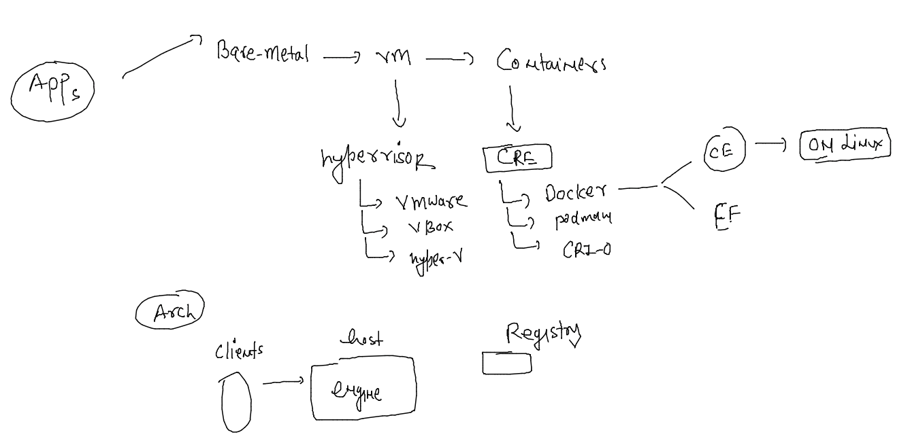
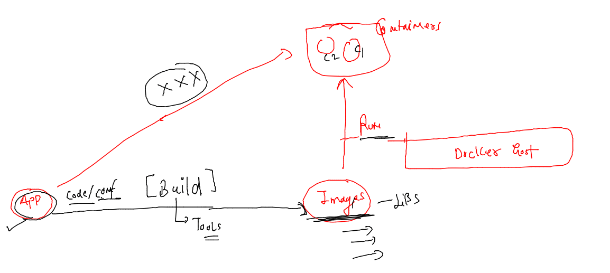
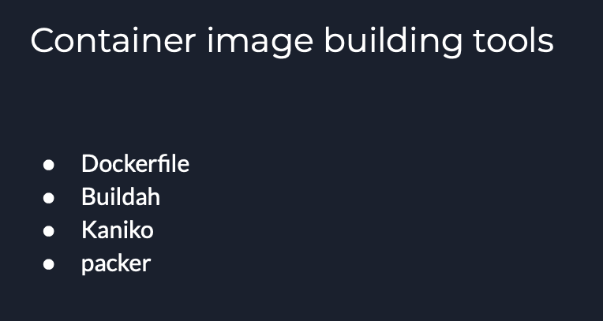
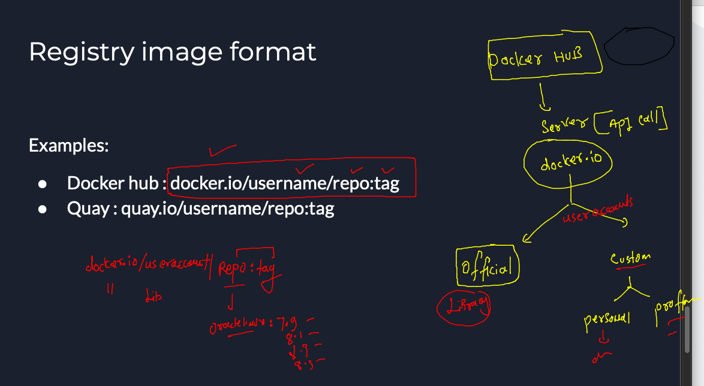

## getting started

### Revision 



### solution of last day problem 

```
[ashu@docker-host ~]$ docker run --name ashuc1 -d  alpine sleep 1000 
f1650fc40662c8ceadb5452e6b4a212ad2dac711aa618f8f766414bafca2b57f
[ashu@docker-host ~]$ docker run --name ashuc2 -d  alpine sleep 1000 
0efcd48c8b29cfac246185d317f637372d849ebb628603a282b3ef9d3b2b758a
[ashu@docker-host ~]$ docker ps
CONTAINER ID   IMAGE     COMMAND        CREATED         STATUS         PORTS     NAMES
0efcd48c8b29   alpine    "sleep 1000"   2 seconds ago   Up 2 seconds             ashuc2
f1650fc40662   alpine    "sleep 1000"   8 seconds ago   Up 8 seconds             ashuc1
[ashu@docker-host ~]$ 
[ashu@docker-host ~]$ docker  exec -it ashuc1  sh 
/ # cd  /opt/
/opt # ls
/opt # echo hello world  >helloc1.txt 
/opt # ls
helloc1.txt
/opt # exit
[ashu@docker-host ~]$ 


```

### Docker cp to copy data 

```
[ashu@docker-host ~]$ ls
[ashu@docker-host ~]$ docker cp  ashuc1:/opt/helloc1.txt  . 
[ashu@docker-host ~]$ ls
helloc1.txt
[ashu@docker-host ~]$ 
[ashu@docker-host ~]$ docker  cp  helloc1.txt   ashuc2:/mnt/
[ashu@docker-host ~]$ docker  exec  ashuc2  ls  /mnt
helloc1.txt
[ashu@docker-host ~]$ 
```

### app containerization process 



### container image building tools 



## Building images using dockerfile 

### sample java code image 

### code -- ashu.java

```
class ashu { 
    public static void main(String args[]) 
    { 
        // test expression 
        while (true) { 
            System.out.println("Hello World , i am ashutoshh \n"); 
            try {
                Thread.sleep(2000);
            } catch (Exception ex) {
                // Ignored
            }
  
            // update expression 
        } 
    } 
} 
```

### Dockerfile 

```
FROM openjdk 
# FROM is automatically will pull image from docker hub 
LABEL name=ashutoshh
LABEL email=ashutoshh@linux.com 
# Label is an optional field but you can use to share image developer info 
RUN mkdir /ashucode 
# RUn will be executing any shell command to image during build time 
COPY ashu.java /ashucode/
# copy data from docker client to docker server during image build time 
WORKDIR /ashucode
# change directory of this image during build time 
RUN javac ashu.java 
# compiling java code to create class file 
CMD  ["java","ashu"]
# this will be automatically executed whenever someone create container 
# from this image 
# CMD is used to define the default process of container 
```

## lets build image 

```
[ashu@docker-host ashu-apps]$ ls  javaapp/
ashu.java  Dockerfile
[ashu@docker-host ashu-apps]$ docker build -t  ashujavacode:1.0   javaapp/ 
Sending build context to Docker daemon  3.584kB
Step 1/8 : FROM openjdk
latest: Pulling from library/openjdk
2c57acc5afca: Already exists 
2f8fb8780af5: Pull complete 
91f16df76a51: Pull complete 
Digest: sha256:506f42afce5070bf59251966e30281195b14a46f6147e06e212e13a30ccd6b45
Status: Downloaded newer image for openjdk:latest
 ---> 948c85e875fa
Step 2/8 : LABEL name=ashutoshh
 ---> Running in 53482dad96a9
Removing intermediate container 53482dad96a9
 ---> b28af843420d
Step 3/8 : LABEL email=ashutoshh@linux.com
 ---> Running in 1647bf368ac0
Removing intermediate container 1647bf368ac0
 ---> 34ad49416d50
Step 4/8 : RUN mkdir /ashucode
 ---> Running in 25178d8123c3
Removing intermediate container 25178d8123c3
 ---> 2de3ead8a79b
Step 5/8 : COPY ashu.java /ashucode/
 ---> e411aa4b0e51
Step 6/8 : WORKDIR /ashucode
 ---> Running in 7eee0ef7782f
Removing intermediate container 7eee0ef7782f
 ---> a942e08a12e1
Step 7/8 : RUN javac ashu.java
 ---> Running in 3008c484234d
Removing intermediate container 3008c484234d
 ---> 1f3a877f02cc
Step 8/8 : CMD  ["java","ashu"]
 ---> Running in ed202c9c9f0d
Removing intermediate container ed202c9c9f0d
 ---> 66d28ca36571
Successfully built 66d28ca36571
Successfully tagged ashujavacode:1.0
```

### creating containers from this image 

```
[ashu@docker-host ashu-apps]$ docker  images  |  grep ashu
ashujavacode           1.0       66d28ca36571   15 minutes ago   467MB
[ashu@docker-host ashu-apps]$ 
[ashu@docker-host ashu-apps]$ docker run --name ashujc1  -itd ashujavacode:1.0 
a6992bbea7853566a8a3fa880815f7f12e6d6dd5137fd3cfa3a84830ed115645
[ashu@docker-host ashu-apps]$ docker ps
CONTAINER ID   IMAGE                      COMMAND               CREATED         STATUS                  PORTS     NAMES
25dbc2cbc145   jmisilvajavacode:1.0       "java jmisilva"       1 second ago    Up Less than a second             jmisilvac1
43a3f3409f97   dvvladimirovjavacode:1.0   "java dvvladimirov"   2 seconds ago   Up Less than a second             dvvladimirovjc1
07a183fd2967   lzmartincode:1.0           "java lzmartin"       2 seconds ago   Up Less than a second             lzmartinc1
fc3e4cb2fcda   jpconceicaocode:1.0        "java jpconceicao"    2 seconds ago   Up Less than a second             jpconceicaojc1
e3a30d7a7d63   scunhajavacode:1.0         "java scunha"         3 seconds ago   Up 1 second                       scunhajc1
a6992bbea785   ashujavacode:1.0           "java ashu"           4 seconds ago   Up 2 seconds                      ashujc1
[ashu@docker-host ashu-apps]$ 

```

### to check output 

```
139  docker logs  ashujc1 
  140  docker logs  -f ashujc1 
```

### verify jdk version 

```
ashu@docker-host ashu-apps]$ docker  exec -ti ashujc1  bash 
bash-4.4# 
bash-4.4# java -version 
openjdk version "18.0.2.1" 2022-08-18
OpenJDK Runtime Environment (build 18.0.2.1+1-1)
OpenJDK 64-Bit Server VM (build 18.0.2.1+1-1, mixed mode, sharing)
bash-4.4# cd  /ashucode/
bash-4.4# ls
ashu.class  ashu.java
bash-4.4# exit
exit
[ashu@docker-h
```

### Docker image remove 

```
[ashu@docker-host ashu-apps]$ docker rmi  oraclelinux:8.3 
Untagged: oraclelinux:8.3
Untagged: oraclelinux@sha256:af3182ee6c1e56f18fc1fecaf638da57d7c47233862e5c32f5ad723a6ab4c6db
Deleted: sha256:816d99f0bbe8c6cca3d2935865e23e754483d2cface2476d21376a7c656d920f
Deleted: sha256:02a3a073ed48ad477de9652df4ed376b03123bebf96ae55933a49aa098eb6dbe
```

### custom jdk 11 image 

```
FROM oraclelinux:8.4  
# FROM is automatically will pull image from docker hub 
LABEL name=ashutoshh
LABEL email=ashutoshh@linux.com 
# Label is an optional field but you can use to share image developer info 
RUN yum install java-11-openjdk.x86_64 java-11-openjdk-devel.x86_64 -y 
RUN mkdir /ashucode 
# RUn will be executing any shell command to image during build time 
COPY ashu.java /ashucode/
# copy data from docker client to docker server during image build time 
WORKDIR /ashucode
# change directory of this image during build time 
RUN javac ashu.java 
# compiling java code to create class file 
CMD  ["java","ashu"]
# this will be automatically executed whenever someone create container 
# from this image 
# CMD is used to define the default process of container 
```

### lets build it 

```
[ashu@docker-host ashu-apps]$ ls
javaapp  webapps
[ashu@docker-host ashu-apps]$ cd  javaapp/
[ashu@docker-host javaapp]$ ls
ashu.java  Dockerfile  jdk11.dockerfile
[ashu@docker-host javaapp]$ docker build -t ashujavacode:jdk11  -f jdk11.dockerfile  . 

ashu@docker-host javaapp]$ docker build -t ashujavacode:jdk11  -f jdk11.dockerfile  . 
Sending build context to Docker daemon   5.12kB
Step 1/9 : FROM oraclelinux:8.4
 ---> 97e22ab49eea
Step 2/9 : LABEL name=ashutoshh
 ---> Running in 66fe78b69b67
Removing intermediate container 66fe78b69b67
 ---> 6a8782dfacb3
Step 3/9 : LABEL email=ashutoshh@linux.com
 ---> Running in 58a1364f4966
Removing intermediate container 58a1364f4966
 ---> ef479d4355c8
Step 4/9 : RUN yum install java-11-openjdk.x86_64 java-11-openjdk-devel.x86_64 -y
 ---> Running in ed90a61c2c39
Oracle Linux 8 BaseOS Latest (x86_64)            80 MB/s |  54 MB     00:00    


```

### creating container

```
[ashu@docker-host javaapp]$ 
[ashu@docker-host javaapp]$ docker  images  |  grep ashu
ashujavacode          jdk11     a56b94ae2d13   10 seconds ago           680MB
ashujavacode          1.0       66d28ca36571   48 minutes ago           467MB
[ashu@docker-host javaapp]$ 
[ashu@docker-host javaapp]$ 
[ashu@docker-host javaapp]$ docker run -itd --name ashujjcc1  ashujavacode:jdk11 
4f5898df3020be0cc02f34321e0a88e101da73c678372be4179c0c29ec4e2535
[ashu@docker-host javaapp]$ docker ps
CONTAINER ID   IMAGE                COMMAND                  CREATED          STATUS          PORTS     NAMES
4f5898df3020   ashujavacode:jdk11   "java ashu"              2 seconds ago    Up 1 second               ashujjcc1
```

### verify version 

```
[ashu@docker-host javaapp]$ docker exec -it ashujjcc1 bash 
[root@4f5898df3020 ashucode]# 
[root@4f5898df3020 ashucode]# 
[root@4f5898df3020 ashucode]# java -version 
openjdk version "11.0.18" 2023-01-17 LTS
OpenJDK Runtime Environment (Red_Hat-11.0.18.0.10-2.el8_7) (build 11.0.18+10-LTS)
OpenJDK 64-Bit Server VM (Red_Hat-11.0.18.0.10-2.el8_7) (build 11.0.18+10-LTS, mixed mode, sharing)
[root@4f5898df3020 ashucode]# 
[root@4f5898df3020 ashucode]# exit
exit
```

### kill & remove 

```
[ashu@docker-host javaapp]$ docker kill  ashujjcc1 
ashujjcc1
[ashu@docker-host javaapp]$ docker rm ashujjcc1 
ashujjcc1
```

## Importance of Registry 


### Understanding image name format 



### pushing image to docker hub 

```
[ashu@docker-host javaapp]$ docker  images  |   grep ashu
ashujavacode           jdk11     a56b94ae2d13   30 minutes ago      680MB
ashujavacode           1.0       66d28ca36571   About an hour ago   467MB
[ashu@docker-host javaapp]$ 
[ashu@docker-host javaapp]$ docker  tag  ashujavacode:1.0    docker.io/dockerashu/ashujava:jdk18v1  
[ashu@docker-host javaapp]$ 
[ashu@docker-host javaapp]$ docker  images  |   grep ashu
ashujavacode                        jdk11     a56b94ae2d13   32 minutes ago       680MB
dockerashu/ashujava                 jdk18v1   66d28ca36571   About an hour ago    467MB
ashujavacode                        1.0       66d28ca36571   About an hour ago    467MB
[ashu@docker-host javaapp]$ docker login 
Login with your Docker ID to push and pull images from Docker Hub. If you don't have a Docker ID, head over to https://hub.docker.com to create one.
Username: dockerashu
Password: 
WARNING! Your password will be stored unencrypted in /home/ashu/.docker/config.json.
Configure a credential helper to remove this warning. See
https://docs.docker.com/engine/reference/commandline/login/#credentials-store

Login Succeeded
[ashu@docker-host javaapp]$ docker  push docker.io/dockerashu/ashujava:jdk18v1 
The push refers to repository [docker.io/dockerashu/ashujava]
0a49092c3bb8: Pushed 
9bcbf366e390: Pushed 
8af1a824cac3: Pushed 
817d0ae8823b: Mounted from library/openjdk 
0c37caf65974: Mounted from library/openjdk 
e3235af76f17: Mounted from library/openjdk 
jdk18v1: digest: sha256:361f4a7ceb7288fd25c01b982081087c787e59c5549af7df9b6be472fa2d9760 size: 1575
[ashu@docker-host javaapp]$ 
```

### optinal step 

```
[ashu@docker-host javaapp]$ docker logout 
Removing login credentials for https://index.docker.io/v1/
```


