## getting started

### Revision 

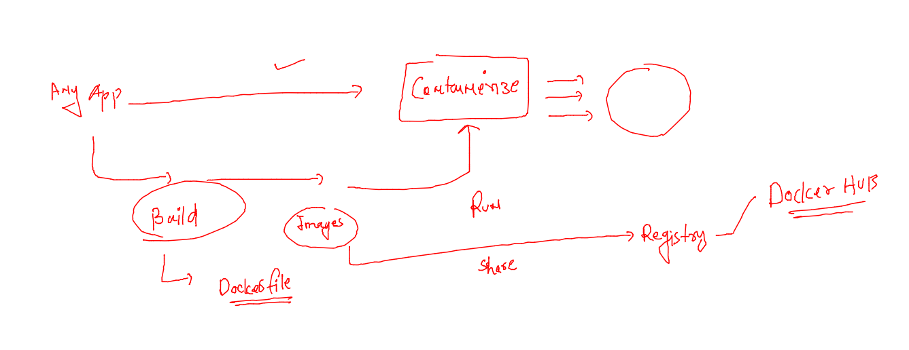

### web app containerization 

###. about web servers 

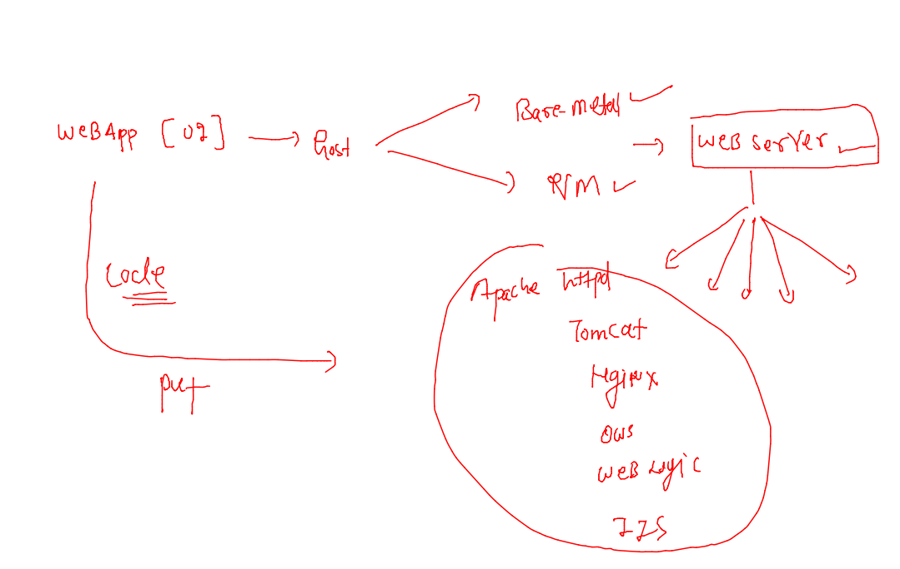

### Nginx web app server info 

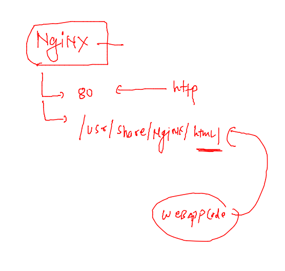

## Lets containerize fronend website 

### need source code 

```
[ashu@docker-host ashu-apps]$ ls
javaapp  webapps
[ashu@docker-host ashu-apps]$ cd  webapps/
[ashu@docker-host webapps]$ ls
[ashu@docker-host webapps]$ git clone https://github.com/yenchiah/project-website-template.git
Cloning into 'project-website-template'...
remote: Enumerating objects: 1025, done.
remote: Total 1025 (delta 0), reused 0 (delta 0), pack-reused 1025
Receiving objects: 100% (1025/1025), 1.64 MiB | 31.66 MiB/s, done.
Resolving deltas: 100% (633/633), done.
[ashu@docker-host webapps]$ ls
project-website-template
[ashu@docker-host webapps]$
```

### dockerfile code 

```
FROM nginx 
label email=ashutoshh@linux.com 
COPY project-website-template /usr/share/nginx/html/
# copy can add file or folder to docker image 
# if we are not using CMD so base image cmd will be inherited 

```

### .dockerignore 

```
project-website-template/.git
project-website-template/.github
project-website-template/.gitignore
project-website-template/LICENSE
project-website-template/README.md
```

### lets build it 

```
[ashu@docker-host webapps]$ ls
Dockerfile  project-website-template
[ashu@docker-host webapps]$ docker build -t  ashunginx:webappv1 . 
Sending build context to Docker daemon   1.73MB
Step 1/3 : FROM nginx
latest: Pulling from library/nginx
8740c948ffd4: Pull complete 
d2c0556a17c5: Pull complete 
c8b9881f2c6a: Pull complete 
693c3ffa8f43: Pull complete 
8316c5e80e6d: Pull complete 
b2fe3577faa4: Pull complete 
Digest: sha256:b8f2383a95879e1ae064940d9a200f67a6c79e710ed82ac42263397367e7cc4e
Status: Downloaded newer image for nginx:latest
 ---> a99a39d070bf
Step 2/3 : label email=ashutoshh@linux.com
 ---> Running in 23e63e55cace
Removing intermediate container 23e63e55cace
 ---> 0c501c9782c5
Step 3/3 : COPY project-website-template /usr/share/nginx/html/
 ---> a8b5aa15a99d
Successfully built a8b5aa15a99d
Successfully tagged ashunginx:webappv1
[ashu@docker-host webapps]$ 
```

### verify 

```
[ashu@docker-host webapps]$ docker images
REPOSITORY   TAG        IMAGE ID       CREATED          SIZE
ashunginx    webappv1   a8b5aa15a99d   12 seconds ago   144MB
nginx        latest     a99a39d070bf   2 weeks ago      142MB
```
### launching a container 

```
[ashu@docker-host ashu-apps]$ docker  run -itd  --name ashuwebappc1  -p  1234:80 ashunginx:webappv1  
db95870cb71b59c515c6894e84fbb27f231f848aa783018f203d4b70891a4fbd
[ashu@docker-host ashu-apps]$ docker ps
CONTAINER ID   IMAGE                  COMMAND                  CREATED         STATUS         PORTS                                   NAMES
db95870cb71b   ashunginx:webappv1     "/docker-entrypoint.…"   3 seconds ago   Up 2 seconds   0.0.0.0:1234->80/tcp, :::1234->80/tcp   ashuwebappc1
```

### COntainer restart policy 

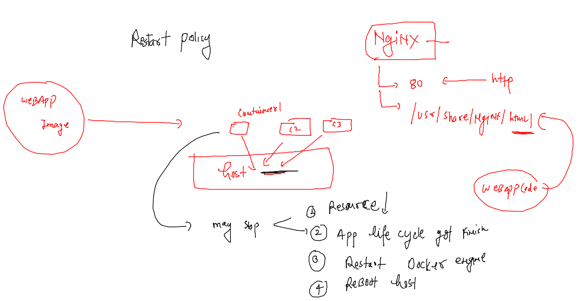

### list of restart policy in docker 

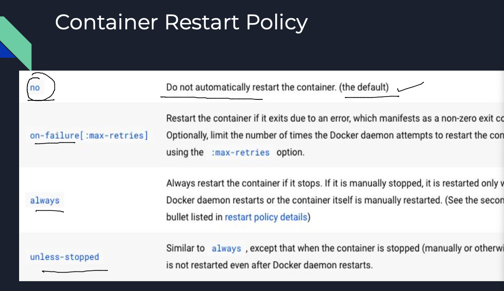

### printing restart policy of any running or  non running container 

```
[ashu@docker-host ashu-apps]$ docker  inspect  ashuwebappc1  --format='{{.Id}}'
db95870cb71b59c515c6894e84fbb27f231f848aa783018f203d4b70891a4fbd
[ashu@docker-host ashu-apps]$ docker  inspect  ashuwebappc1  --format='{{.State.Status}}'
exited
[ashu@docker-host ashu-apps]$ docker  inspect  ashuwebappc1  --format='{{.HostConfig.RestartPolicy.Name}}'
no
[ashu@docker-host ashu-apps]$ 

```

### changing restart policy of an existing container 

```
[ashu@docker-host ashu-apps]$ docker update  ashuwebappc1  --restart  always 
ashuwebappc1
[ashu@docker-host ashu-apps]$ docker  inspect  ashuwebappc1  --format='{{.HostConfig.RestartPolicy.Name}}'
always
[ashu@docker-host ashu-apps]$ 

```

### assigning restart policy during container creation time 

```
[ashu@docker-host ashu-apps]$  docker  run -itd  --name ashuwebappc1  -p  1234:80   --restart unless-stopped        ashunginx:webappv1
1a8cefefd026e73d311ea0630ef688bbe8efb605b7533d8cdc551d1e941b9fba
[ashu@docker-host ashu-apps]$ docker  inspect  ashuwebappc1  --format='{{.HostConfig.RestartPolicy.Name}}'
unless-stopped
[ashu@docker-host ashu-apps]$ 

```


## Control groups to limit resources to the containers 

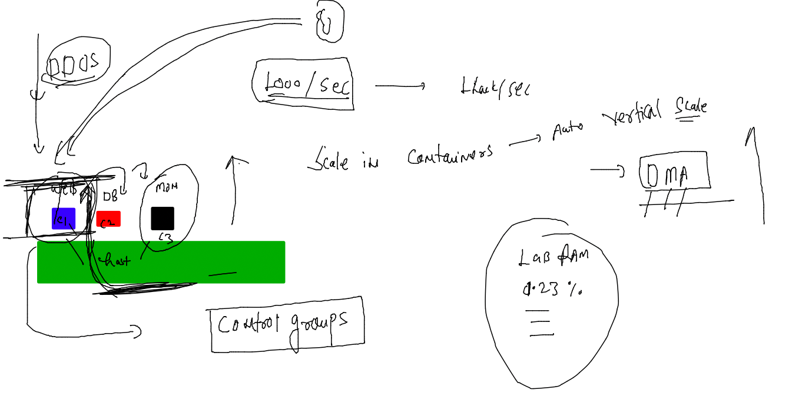

### more info 

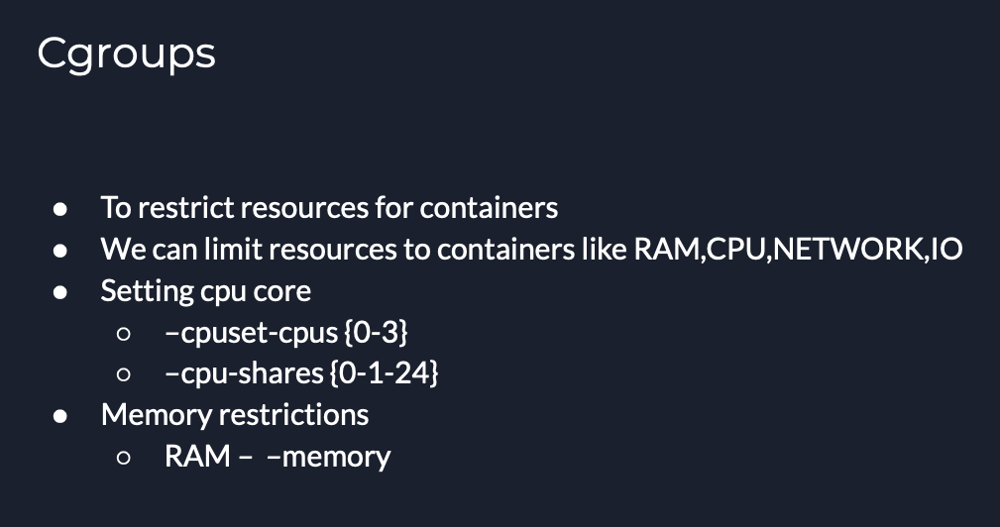

### limiting RAM 

```
[ashu@docker-host ashu-apps]$ docker run -itd --name ashuwebc1  --restart always  --memory 200M  -p 1234:80  ashunginx:webappv1
bfe98f7463ebff80629db7759be92908f7a52dcd0d5f04a7b3ab8129d04e94b4
[ashu@docker-host ashu-apps]$ docker  ps
CONTAINER ID   IMAGE                      COMMAND                  CREATED          STATUS                  PORTS                                   NAMES
2e9a2440aafa   nhenriquesnginx:webappv1   "/docker-entrypoint.…"   1 second ago     Up Less than a second   0.0.0.0:4353->80/tcp, :::4353->80/tcp   nhenriqueswebappc1
bfe98f7463eb   ashunginx:webappv1         "/docker-entrypoint.…"   3 seconds ago    Up 2 seconds            0.0.0.0:1234->80/tcp, :::1234->80/tcp   ashuwebc1
d74c74931664   jjunior:webappv1           "/docker-entrypoint.…"   19 seconds ago   Up 18 seconds           80/tcp                                  jjuniorc1
[ashu@docker-host ashu-apps]$ 

```

### CPu Understanding for containers 

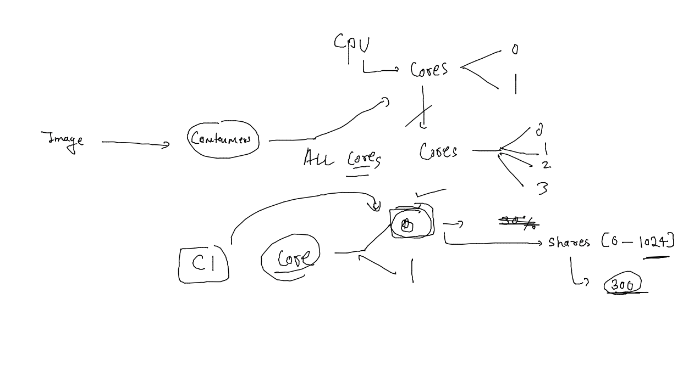

### cpu allocation 

```
docker run -itd --name ashuwebc1  --restart always  --memory 200M  -p 1234:80  --cpuset-cpus=1 --cpu-shares=325    ashunginx:webappv1
```

## Networking for containers 

### docker host info 

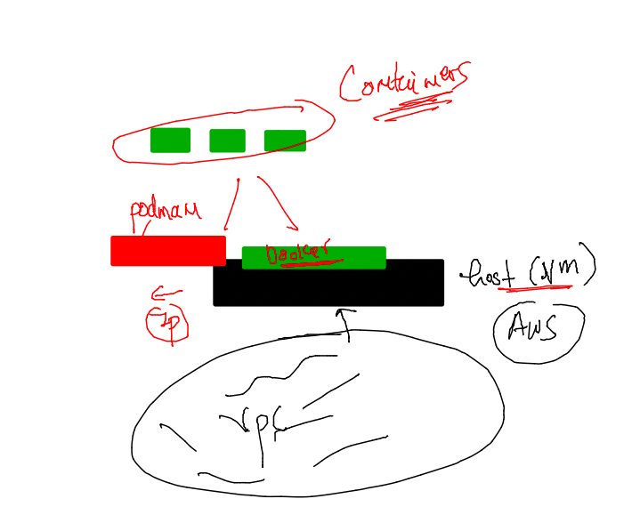

### networking model info 

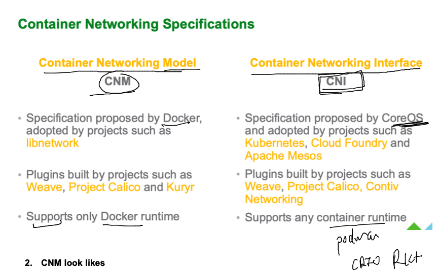

### CNM info 

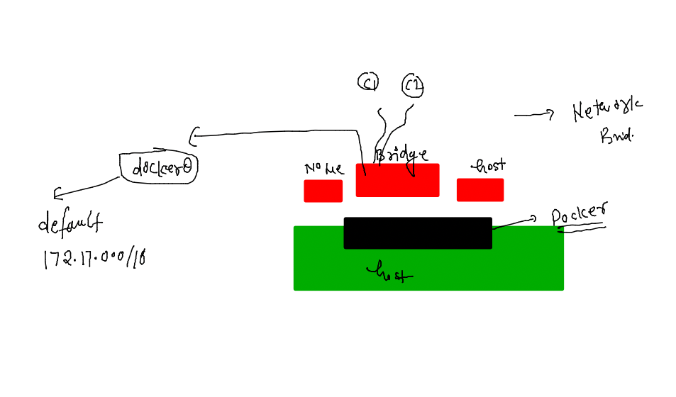

### listing default network bridges 

```
[ashu@docker-host ashu-apps]$ docker  network ls
NETWORK ID     NAME      DRIVER    SCOPE
6539a1fa754f   bridge    bridge    local
d9da15ff98a1   host      host      local
51ef9621f061   none      null      local
[ashu@docker-host ashu-apps]$ 
[ashu@docker-host ashu-apps]$ docker  network  inspect 6539a1fa754f 
[
    {
        "Name": "bridge",
        "Id": "6539a1fa754f20f93a19af26a287e65e7bd1c3c69802f37b001e714c0f0da81f",
        "Created": "2023-01-25T10:14:57.176504271Z",
        "Scope": "local",
        "Driver": "bridge",
        "EnableIPv6": false,
        "IPAM": {
            "Driver": "default",
            "Options": null,
            "Config": [
                {
                    "Subnet": "172.17.0.0/16",
                    "Gateway": "172.17.0.1"
                }
```


### creating container and listing in bridge 

```
[ashu@docker-host ashu-apps]$ docker run -itd --name ashuc1 alpine sleep 1000 
20c881aee5a72697d17f57499d6295a5e519b9984b1bb29d13e6b374cb536fc2
[ashu@docker-host ashu-apps]$ docker ps
CONTAINER ID   IMAGE     COMMAND        CREATED         STATUS         PORTS     NAMES
20c881aee5a7   alpine    "sleep 1000"   3 seconds ago   Up 2 seconds             ashuc1
[ashu@docker-host ashu-apps]$ docker ps
```

### listing in bridge 

```
[ashu@docker-host webapps]$ docker network  inspect  6539a1fa754f 
[
    {
        "Name": "bridge",
        "Id": "6539a1fa754f20f93a19af26a287e65e7bd1c3c69802f37b001e714c0f0da81f",
        "Created": "2023-01-25T10:14:57.176504271Z",
        "Scope": "local",
        "Driver": "bridge",
        "EnableIPv6": false,
        "IPAM": {
            "Driver": "default",
            "Options": null,
            "Config": [
                {
                    "Subnet": "172.17.0.0/16",
                    "Gateway": "172.17.0.1"
                }
            ]
        },
        "Internal": false,
        "Attachable": false,
        "Ingress": false,
        "ConfigFrom": {
            "Network": ""
        },
        "ConfigOnly": false,
        "Containers": {
            "05f5ba4d291c3371bb8f2ae3a63918f841854b4c8825636c9a078755c161488b": {
                "Name": "nhenriquesc1",
                "EndpointID": "31f3bcde3e5bd44531f09ccc08665761886e9d103e5dac00efd8f9d19b62963c",
                "MacAddress": "02:42:ac:11:00:03",
                "IPv4Address": "172.17.0.3/16",
                "IPv6Address": ""
            },
            "116cd59ad652ad1789cf3beedd2d4e10dcbc56a0df437fef5343d3dc4ff74a4f": {
                "Name": "jpconceicac1",
                "EndpointID": "cd7b314c45c730114b1875552e7bac25dee408527c4e7e48afdf08c4eb564388",
                "MacAddress": "02:42:ac:11:00:07",
                "IPv4Address": "172.17.0.7/16",
                "IPv6Address": ""
            },
            "20c881aee5a72697d17f57499d6295a5e519b9984b1bb29d13e6b374cb536fc2": {
                "Name": "ashuc1",
                "EndpointID": "6ad4f8dc913f1e54a2b11501e2333f26ccd17a140ab8d9de8421035047470ecf",
                "MacAddress": "02:42:ac:11:00:02",
                "IPv4Address": "172.17.0.2/16",
                "IPv6Address": ""
            },
            "232d8fb6e26b69e73618033d043fd50c8e4fb8afafb845cd5c48997c83c57832": {
                "Name": "cfantaoc1",
                "EndpointID": "83f7c144aeddb248080e3ccca22af8d5f7da1085a8e1cad7a0f5b8e9c397c30b",
                "MacAddress": "02:42:ac:11:00:06",
                "IPv4Address": "172.17.0.6/16",
                "IPv6Address": ""
            },
            "334d130dd0a9c6944bfeec29e5728d4fbf6d098c5b697aa1a685a11bd4ad52f2": {
                "Name": "danielac1",
                "EndpointID": "6316f5e1d9cf1f06b5c2bb13930a30c7f0a800852610889a713b423f5259e6ac",
                "MacAddress": "02:42:ac:11:00:0a",
                "IPv4Address": "172.17.0.10/16",
                "IPv6Address": ""
            },
            "560bc5e893a8df0ad0ca0e3f2c5eb81ccfc3953f4f73fd37a55768e2e0488c27": {
                "Name": "jmisilvacgac1",
                "EndpointID": "dfd93a663bc71465d1e4507400d5ea572d6cd452b45d56cc3070f7187973515f",
                "MacAddress": "02:42:ac:11:00:0d",
                "IPv4Address": "172.17.0.13/16",
                "IPv6Address": ""
            },
            "56be99af47ca14a6474014dd9bfdec7b0666a16cf83636a4c0c2e49b04a305bb": {
                "Name": "lzmartinc1",
                "EndpointID": "0e7094ad6400357f3b21a1c9b07adfec392c9a191b33715c5170504a47d24ba3",
                "MacAddress": "02:42:ac:11:00:0b",
                "IPv4Address": "172.17.0.11/16",
                "IPv6Address": ""
```

### checking container IP 

```
274  docker  inspect  danielac1   --format='{{.NetworkSettings.IPAddress}}'
  275  history 
[ashu@docker-host ashu-apps]$ docker  inspect  ashuc1   --format='{{.NetworkSettings.IPAddress}}'
172.17.0.2
[ashu@docker-host ashu-apps]$
```

### testing container connection in same bridge 

```
[ashu@docker-host ashu-apps]$ docker  inspect  danielac1   --format='{{.NetworkSettings.IPAddress}}'
172.17.0.10
[ashu@docker-host ashu-apps]$ 
[ashu@docker-host ashu-apps]$ docker  exec -it ashuc1  sh 
/ # 
/ # ifconfig 
eth0      Link encap:Ethernet  HWaddr 02:42:AC:11:00:02  
          inet addr:172.17.0.2  Bcast:172.17.255.255  Mask:255.255.0.0
          UP BROADCAST RUNNING MULTICAST  MTU:1500  Metric:1
          RX packets:16 errors:0 dropped:0 overruns:0 frame:0
          TX packets:0 errors:0 dropped:0 overruns:0 carrier:0
          collisions:0 txqueuelen:0 
          RX bytes:1196 (1.1 KiB)  TX bytes:0 (0.0 B)

lo        Link encap:Local Loopback  
          inet addr:127.0.0.1  Mask:255.0.0.0
          UP LOOPBACK RUNNING  MTU:65536  Metric:1
          RX packets:0 errors:0 dropped:0 overruns:0 frame:0
          TX packets:0 errors:0 dropped:0 overruns:0 carrier:0
          collisions:0 txqueuelen:1000 
          RX bytes:0 (0.0 B)  TX bytes:0 (0.0 B)

/ # ping  172.17.0.10
PING 172.17.0.10 (172.17.0.10): 56 data bytes
64 bytes from 172.17.0.10: seq=0 ttl=64 time=0.144 ms
64 bytes from 172.17.0.10: seq=1 ttl=64 time=0.075 ms
^C
--- 172.17.0.10 ping statistics ---
2 packets transmitted, 2 packets received, 0% packet loss
round-trip min/avg/max = 0.075/0.109/0.144 ms
/ # 
[ashu@docker-host ashu-apps]$ 
```

### NAT in container to use host iP 

```
[ashu@docker-host ashu-apps]$ docker  exec -it ashuc1  sh 
/ # 
/ # ping google.com 
PING google.com (172.253.63.113): 56 data bytes
64 bytes from 172.253.63.113: seq=0 ttl=95 time=1.741 ms
64 bytes from 172.253.63.113: seq=1 ttl=95 time=1.776 ms
64 bytes from 172.253.63.113: seq=2 ttl=95 time=1.782 ms
^C
--- google.com ping statistics ---
3 packets transmitted, 3 packets received, 0% packet loss
round-trip min/avg/max = 1.741/1.766/1.782 ms
/ # 
/ # apk add python3
fetch https://dl-cdn.alpinelinux.org/alpine/v3.17/main/x86_64/APKINDEX.tar.gz
fetch https://dl-cdn.alpinelinux.org/alpine/v3.17/community/x86_64/APKINDEX.tar.gz
(1/13) Installing libbz2 (1.0.8-r4)
(2/13) Installing libexpat (2.5.0-r0)
(3/13) Installing libffi (3.4.4-r0)
(4/13) Installing gdbm (1.23-r0)
(5/13) Installing xz-libs (5.2.9-r0)
(6/13) Installing libgcc (12.2.1_git20220924-r4)
(7/13) Installing libstdc++ (12.2.1_git20220924-r4)
(8/13) Installing mpdecimal (2.5.1-r1)
(9/13) Installing ncurses-terminfo-base (6.3_p20221119-r0)
(10/13) Installing ncurses-libs (6.3_p20221119-r0)
(11/13) Installing readline (8.2.0-r0)
(12/13) Installing sqlite-libs (3.40.1-r0)
(13/13) Installing python3 (3.10.9-r1)
Executing busybox-1.35.0-r29.trigger
OK: 60 MiB in 28 packages
/ # python3
Python 3.10.9 (main, Dec 12 2022, 17:52:15) [GCC 12.2.1 20220924] on linux
Type "help", "copyright", "credits" or "license" for more information.
>>> 
/ # 
```


### Understanding port mapping 

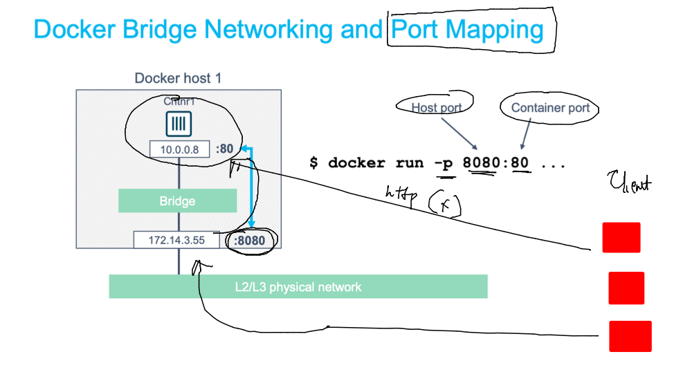


