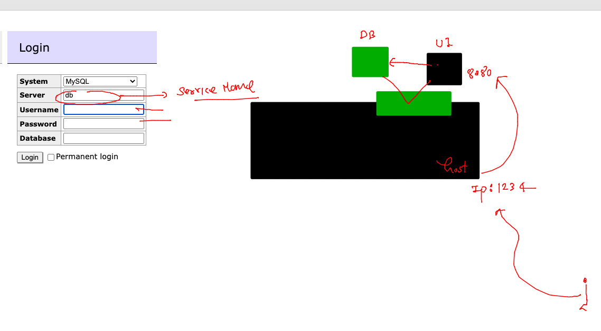
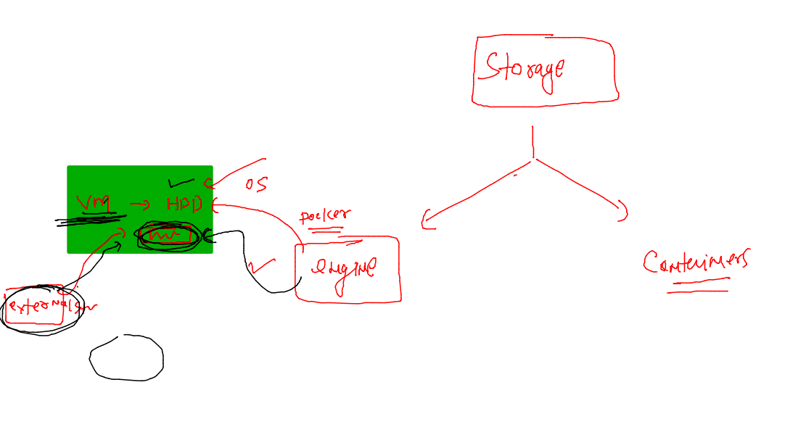
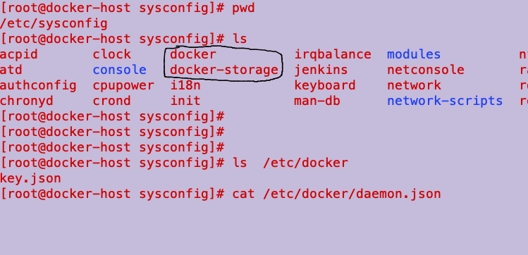
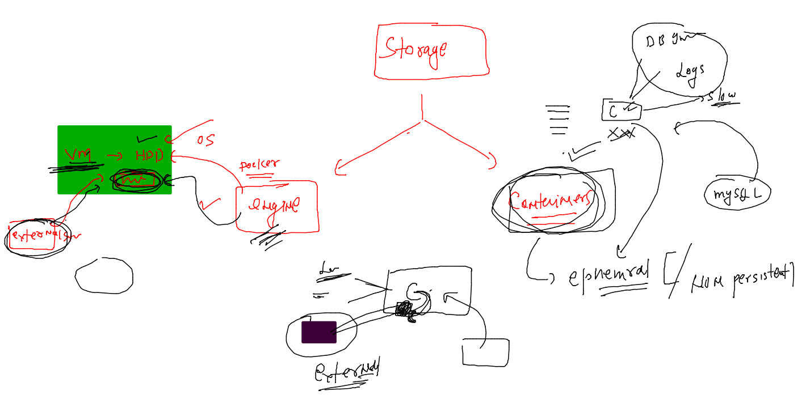
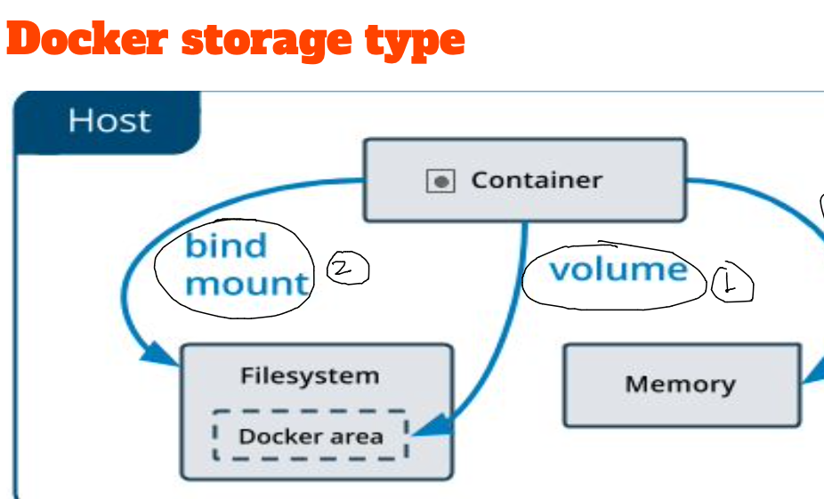
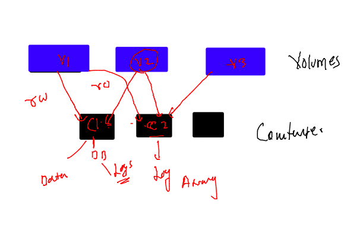

## getting started

### image pushing to GCR 

```
392  tar xvzf google-cloud-cli-415.0.0-linux-x86_64.tar.gz 
  393  ls
  394  rm google-cloud-cli-415.0.0-linux-x86_64.tar.gz 
  395  ls
  396  cd  google-cloud-sdk/
  397  ls
  398  ./install.sh 
  399  history 
  400  gcloud 
  401  gcloud init 
  402  history 
  403  gcloud projects list 
  404  docker images  |  grep ashu
  405  docker  tag  a8b5aa15a99d   gcr.io/pivotal-biplane-375806/ashumobi:webappv1 
  406  docker images  |  grep ashu
  407  docker push  gcr.io/pivotal-biplane-375806/ashumobi:webappv1
  408   gcloud auth configure-docker
```

### Docker Compose 


### more info about Compose 


## compose examples 

### example 1 

```
version:  '3.8' # version of compose file 
services: # name of apps which you want to containerize
  ashu-ui:
    image: ashunginx:webappv1
    container_name: ashu-ui-c1
    restart: always 
    ports:
    - 1234:80

```

### lets run the file 

```
[ashu@docker-host ashu-apps]$ ls
ashu-compose-examples  google-cloud-sdk  javaapp  tools  webapps
[ashu@docker-host ashu-apps]$ cd  ashu-compose-examples/
[ashu@docker-host ashu-compose-examples]$ ls
docker-compose.yaml
[ashu@docker-host ashu-compose-examples]$ docker-compose  up -d 
[+] Running 2/2
 ⠿ Network ashu-compose-examples_default  Created                                                                         0.0s
 ⠿ Container ashu-ui-c1                   Started                                                                         0.6s
[ashu@docker-host ashu-compose-examples]$ docker-compose  ps
NAME                IMAGE                COMMAND                  SERVICE             CREATED             STATUS              PORTS
ashu-ui-c1          ashunginx:webappv1   "/docker-entrypoint.…"   ashu-ui             15 seconds ago      Up 15 seconds       0.0.0.0:1234->80/tcp, :::1234->80/tcp
[ashu@docker-host ashu-compose-examples]$ 

```

### more compose commands 

```
ashu@docker-host ashu-compose-examples]$ docker-compose  ps
NAME                IMAGE                COMMAND                  SERVICE             CREATED             STATUS              PORTS
ashu-ui-c1          ashunginx:webappv1   "/docker-entrypoint.…"   ashu-ui             8 minutes ago       Up 8 minutes        0.0.0.0:1234->80/tcp, :::1234->80/tcp
[ashu@docker-host ashu-compose-examples]$ docker-compose  images
CONTAINER           REPOSITORY          TAG                 IMAGE ID            SIZE
ashu-ui-c1          ashunginx           webappv1            a8b5aa15a99d        144MB
[ashu@docker-host ashu-compose-examples]$ docker-compose  stop 
[+] Running 1/1
 ⠿ Container ashu-ui-c1  Stopped                                                                                                                                 0.2s
[ashu@docker-host ashu-compose-examples]$ docker-compose  ps
NAME                IMAGE               COMMAND             SERVICE             CREATED             STATUS              PORTS
[ashu@docker-host ashu-compose-examples]$ docker-compose  ps -a
NAME                IMAGE                COMMAND                  SERVICE             CREATED             STATUS                      PORTS
ashu-ui-c1          ashunginx:webappv1   "/docker-entrypoint.…"   ashu-ui             8 minutes ago       Exited (0) 11 seconds ago   
[ashu@docker-host ashu-compose-examples]$ docker-compose  start
[+] Running 1/1
 ⠿ Container ashu-ui-c1  Started                              
```

### more compose commands 

```
[ashu@docker-host ashu-compose-examples]$ docker-compose ps 
NAME                IMAGE                COMMAND                  SERVICE             CREATED             STATUS              PORTS
ashu-ui-c1          ashunginx:webappv1   "/docker-entrypoint.…"   ashu-ui             31 minutes ago      Up 2 seconds        0.0.0.0:1234->80/tcp, :::1234->80/tcp
[ashu@docker-host ashu-compose-examples]$ docker-compose exec ashu-ui  bash 
root@2da5d3090ece:/# ls
bin  boot  dev  docker-entrypoint.d  docker-entrypoint.sh  etc  home  lib  lib64  media  mnt  opt  proc  root  run  sbin  srv  sys  tmp  usr  var
root@2da5d3090ece:/# exit
exit
[ashu@docker-host ashu-compose-examples]$ docker-compose down
[+] Running 2/2
 ⠿ Container ashu-ui-c1                   Removed                                                                                                                0.2s
 ⠿ Network ashu-compose-examples_default  Removed                                                                                                                0.1s
[ashu@docker-host ashu-compose-examples]$ 
```

### Example 2 

```
version:  '3.8' # version of compose file 
services: # name of apps which you want to containerize
  ashu-jenkins:
    image: ashujenkins:v1 # image i want to build
    build:  # to build image using dockerfile 
      context: ../tools # location of dockerfile 
      dockerfile: jenkins.dockerfile  # name of dockerfile 
    container_name: ashujkc1
    restart: always
    ports: 
    - 1199:8080 
  ashu-ui: # name of service 
    image: ashunginx:webappv1 # name of image 
    container_name: ashu-ui-c1 # name of container 
    restart: always  # restart policy 
    ports: # port mapping 
    - 1234:80

```

### lets deploy it 

```
ashu@docker-host ashu-compose-examples]$ ls
docker-compose.yaml
[ashu@docker-host ashu-compose-examples]$ docker-compose up -d
[+] Running 0/0
 ⠿ ashu-jenkins Warning                                                                                                                                          0.1s
[+] Building 0.1s (8/8) FINISHED                                                                                                                                      
 => [internal] load build definition from jenkins.dockerfile                                                                                                     0.0s
 => => transferring dockerfile: 421B                                                                                                                             0.0s
 => [internal] load .dockerignore                                                                                                                                0.0s
 => => transferring context: 2B                                                                                                                                  0.0s
 => [internal] load metadata for docker.io/library/oraclelinux:8.4                                                                                               0.0s
 => [1/4] FROM docker.io/library/oraclelinux:8.4                                                                                                                 0.0s
 => CACHED [2/4] RUN yum install java-11-openjdk.x86_64 java-11-openjdk-devel.x86_64 wget -y && mkdir /app                                                       0.0s
 => CACHED [3/4] WORKDIR /app                                                                                                                                    0.0s
 => CACHED [4/4] RUN wget https://get.jenkins.io/war-stable/2.375.2/jenkins.war                                                                                  0.0s
 => exporting to image                                                                                                                                           0.0s
 => => exporting layers                                                                                                                                          0.0s
 => => writing image sha256:d2477f82faa1c4eb6f3ee765dc613c4fc051754106d2f28034b53fc8a5e5f43a                                                                     0.0s
 => => naming to docker.io/library/ashujenkins:v1                                                                                                                0.0s
[+] Running 2/2
 ⠿ Container ashujkc1    Started                                                                                                                                 0.6s
 ⠿ Container ashu-ui-c1  Running                                                                                                                                 0.0s
[ashu@docker-host ashu-compose-examples]$ docker-compose ps
NAME                IMAGE                COMMAND                  SERVICE             CREATED             STATUS              PORTS
ashu-ui-c1          ashunginx:webappv1   "/docker-entrypoint.…"   ashu-ui             9 minutes ago       Up 9 minutes        0.0.0.0:1234->80/tcp, :::1234->80/tcp
ashujkc1            ashujenkins:v1       "java -jar jenkins.w…"   ashu-jenkins        16 seconds ago      Up 15 seconds       0.0.0.0:1199->8080/tcp, :::1199->8080/tcp
[ashu@docker-host ashu-compose-examples]$ docker-compose images
CONTAINER           REPOSITORY          TAG                 IMAGE ID            SIZE
ashu-ui-c1          ashunginx           webappv1            a8b5aa15a99d        144MB
ashujkc1            ashujenkins         v1                  d2477f82faa1        778MB
```

### Example 3 

```
version: '3.8'
services:
  ashu-ui-app:
    image: adminer # open source sample UI image 
    container_name: ashu-ui-c1
    ports:
    - 1234:8080 
    depends_on:
    - ashu-db-app
  ashu-db-app:
    image: mysql
    container_name: ashu-db-c1
    environment: # create / update ENV variable in container 
      MYSQL_ROOT_PASSWORD: "MobiDb@098"
      MYSQL_USER: ashu
      MYSQL_PASSWORD: "AshuDb@098"
```

### lets run it 

```
[ashu@docker-host ashu-compose-examples]$ ls
ashu-app.yaml  docker-compose.yaml
[ashu@docker-host ashu-compose-examples]$ docker-compose  -f  ashu-app.yaml  up -d
[+] Running 20/20
 ⠿ ashu-db-app Pulled                                                                                                     7.7s
   ⠿ 2c57acc5afca Already exists                                                                                          0.0s
   ⠿ 0a990ab965c1 Pull complete                                                                                           0.1s
   ⠿ 7acb6a84f0f1 Pull complete                                                                                           0.2s
   ⠿ 6a2351a691a4 Pull complete                                                                                           0.5s
   ⠿ cdd0aae0ac1a Pull complete                                                                                           0.5s
   ⠿ 0c024d6bf869 Pull complete                                                                                           0.6s
   ⠿ e536ea8ecf65 Pull complete                                                                                           3.7s
   ⠿ d24661dff86b Pull complete                                                                                           3.8s
   ⠿ 95ef82dfce7a Pull complete                                                                                           7.3s
   ⠿ c9a31e1bffa1 Pull complete                                                                                           7.4s
   ⠿ 4edb4789da39 Pull complete                                                                                           7.5s
 ⠿ ashu-ui-app Pulled                                                                                                     6.9s
   ⠿ bbeef03cda1f Pull complete                                                                                           4.4s
   ⠿ f7b968dccc7e Pull complete                                                                                           6.1s
   ⠿ fcd6d6979307 Pull complete                                                                                           6.2s
   ⠿ 5694c6147308 Pull complete                                                                                           6.3s
   ⠿ d03ab2def1a9 Pull complete                                                                                           6.4s
   ⠿ 9bd1cddd5008 Pull complete                                                                                           6.5s
   ⠿ 5f49a2ac8ec9 Pull complete                                                                                           6.6s
[+] Running 2/2
 ⠿ Container ashu-db-c1  Started                                                                                          5.3s
 ⠿ Container ashu-ui-c1  Started                                                                                          1.1s
[ashu@docker-host ashu-compose-examp
```

### ui -db connecting 



### --- logs 

```
 458  history 
  459  docker-compose  -f  ashu-app.yaml   ps
  460  docker-compose  -f  ashu-app.yaml   stop ashu-ui-app 
  461  docker-compose  -f  ashu-app.yaml   ps
  462  docker-compose  -f  ashu-app.yaml   start ashu-ui-app 
  463  docker-compose  -f  ashu-app.yaml   ps
  464  history 
  465  docker-compose  -f  ashu-app.yaml   down 
  466  docker-compose  -f  ashu-app.yaml   up -d
  467  docker-compose  -f  ashu-app.yaml   ps
  468  docker-compose  -f  ashu-app.yaml  logs  ashu-db-app   
  469  docker-compose  -f  ashu-app.yaml  logs -f  ashu-db-app   
```

### Uisng ENV file with compsoe 

```
version: '3.8'
services:
  ashu-ui-app:
    image: adminer # open source sample UI image 
    container_name: ashu-ui-c1
    ports:
    - 1234:8080 
    depends_on:
    - ashu-db-app
  ashu-db-app:
    image: mysql
    container_name: ashu-db-c1
    environment: # create / update ENV variable in container 
      MYSQL_ROOT_PASSWORD: "MobiDb@098"
    env_file: .cred.env 
      
    
```

### env file --- .cred.env 

```

MYSQL_USER=ashu
MYSQL_PASSWORD=AshuDb@098
```

### Docker Storage 



### docker configuration location 



### storage to container 



### two ways to give storage to container 



### volume sharing with containers 




