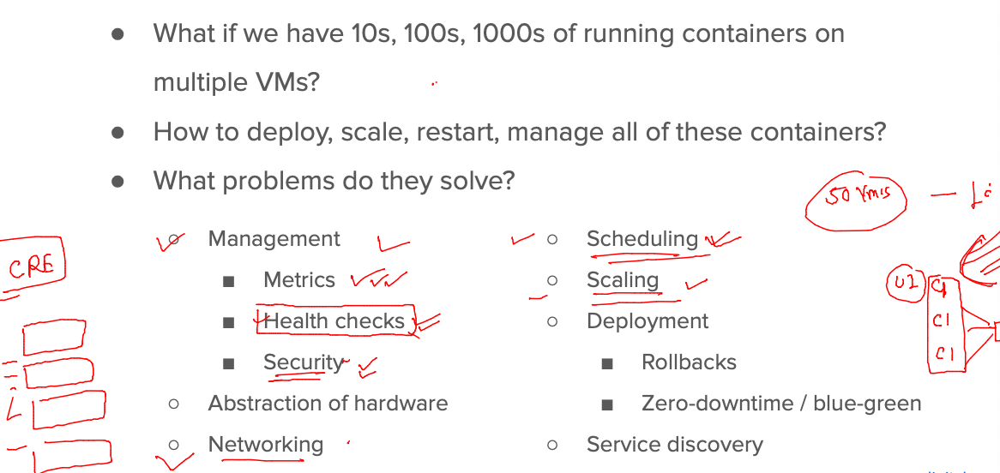
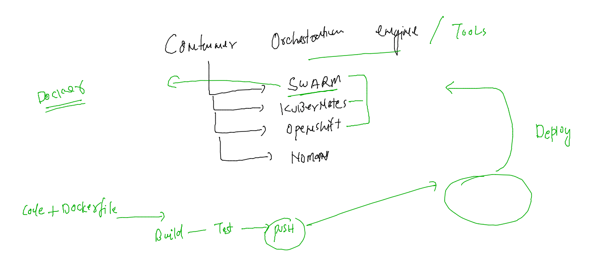

## getting started

## Docker volume usage 

### Dockerfile 

```
FROM centos
LABEL name="ashutoshh"
COPY datagen.sh /root/
WORKDIR /root
RUN chmod +x datagen.sh
ENTRYPOINT [ "./datagen.sh" ]
# using ENTRYPOINT instead of CMD 
```

### script for data generation 

```
#!/bin/bash
while [ true ]
do
    echo "Hello i am data by ashu developer .." >>/opt/mydata/ashu.txt
    date >>/opt/mydata/ashu.txt 
    sleep 15 
done
```

### using volume with compose 

```
version: '3.8'
networks: # to create network like docker network create ashubrx1 
  ashubrx1:
volumes: # creating volume like -- docker volume create ashu-volx1 
  ashu-volx1: 
services:
  ashudata-svc1:
    image: ashudata:testv1 
    build: 
      context: .
      dockerfile: Dockerfile 
    container_name: ashudatac1 
    volumes: # using volumes 
    - ashu-volx1:/opt/mydata/
    networks: # using network 
      - ashubrx1 
```

### lets run it 

```
[ashu@docker-host ashu-docker-final]$ ls
datagen.sh  docker-compose.yaml  Dockerfile
[ashu@docker-host ashu-docker-final]$ docker-compose up -d
[+] Running 0/0
 ⠿ ashudata-svc1 Warning                                                                                                  0.1s
[+] Building 0.8s (9/9) FINISHED                                                                                               
 => [internal] load build definition from Dockerfile                                                                      0.1s
 => => transferring dockerfile: 199B                                                                                      0.0s
 => [internal] load .dockerignore                                                                                         0.1s
 => => transferring context: 2B                                                                                           0.0s
 => [internal] load metadata for docker.io/library/centos:latest                                                          0.1s
 => [internal] load build context                                                                                         0.0s
 => => transferring context: 191B                                                                                         0.0s
 => CACHED [1/4] FROM docker.io/library/centos@sha256:a27fd8080b517143cbbbab9dfb7c8571c40d67d534bbdee55bd6c473f432b177    0.0s
 => [2/4] COPY datagen.sh /root/                                                                                          0.0s
 => [3/4] WORKDIR /root                                                                                                   0.0s
 => [4/4] RUN chmod +x datagen.sh                                                                                         0.4s
 => exporting to image                                                                                                    0.1s
 => => exporting layers                                                                                                   0.1s
 => => writing image sha256:1db7e78f48f6ff200b39e7616bb8ddb4815c0c3c143942c46dc4536d573a1f99                              0.0s
 => => naming to docker.io/library/ashudata:testv1                                                                        0.0s
[+] Running 3/3
 ⠿ Network ashu-docker-final_ashubrx1     Created                                                                         0.1s
 ⠿ Volume "ashu-docker-final_ashu-volx1"  Created                                                                         0.0s
 ⠿ Container ashudatac1                   Started                                                                         0.6s
[ashu@docker-host ashu-docker-final]$ docker-compose ps
NAME                IMAGE               COMMAND             SERVICE             CREATED             STATUS              PORTS
ashudatac1          ashudata:testv1     "./datagen.sh"      ashudata-svc1       16 seconds ago      Up 14 seconds       
[ashu@docker-host ashu-docker-final]$ 
```

### building image even if it is present 

```
[ashu@docker-host ashu-docker-final]$ docker-compose up -d  --build 
[+] Building 0.7s (9/9) FINISHED                                                                                         
 => [internal] load build definition from Dockerfile                                                                0.0s
 => => transferring dockerfile: 32B                                                                                 0.0s
 => [internal] load .dockerignore                                                                                   0.0s
 => => transferring context: 2B                                                                                     0.0s
 => [internal] load metadata for docker.io/library/centos:latest                                                    0.1s
 => [internal] load build context                                                                                   0.0s
 => => transferring context: 234B                                                                                   0.0s
 => CACHED [1/4] FROM docker.io/library/centos@sha256:a27fd8080b517143cbbbab9dfb7c8571c40d67d534bbdee55bd6c473f432  0.0s
 => [2/4] COPY datagen.sh /root/                                                                                    0.0s
 => [3/4] WORKDIR /root                                                                                             0.0s
 => [4/4] RUN chmod +x datagen.sh                                                                                   0.4s
 => exporting to image                                                                                              0.1s
 => => exporting layers                                                                                             0.1s
 => => writing image sha256:27a7609924902b80bb4b319a3e8661a54e5db831d3f02aaeb755005cc4289171                        0.0s
 => => naming to docker.io/library/ashudata:testv1                                                                  0.0s
[+] Running 2/2
 ⠿ Network ashu-docker-final_ashubrx1  Created                                                                      0.1s
 ⠿ Container ashudatac1                Started                                                                      0.6s
[ashu@docker-host ashu-docker-final]$ 
```

### Bind mount 

```
[ashu@docker-host ashu-apps]$ docker run -ti --rm  -v  /etc/:/myetc:ro   alpine 
/ # cd /myetc/
/myetc # ls
DIR_COLORS               exports                  machine-id               rsyncd.conf
DIR_COLORS.256color      exports.d                magic                    rsyslog.conf
DIR_COLORS.lightbgcolor  filesystems              man_db.conf              rsyslog.d
GREP_COLORS              fonts                    maven                    rwtab
GeoIP.conf               fstab                    mke2fs.conf              rwtab.d
GeoIP.conf.default       gcrypt                   modprobe.d               sasl2
NetworkManager           glvnd                    modules-load.d           scl
X11              
```

### compose demo 

```
version: '3.8'
networks: # to create network like docker network create ashubrx1 
  ashubrx1:
volumes: # creating volume like -- docker volume create ashu-volx1 
  ashu-volx1: 
services:
  ashudata-svc1:
    image: ashudata:testv1 
    build: 
      context: .
      dockerfile: Dockerfile 
    container_name: ashudatac1 
    volumes: # using volumes 
    - ashu-volx1:/opt/mydata/
    networks: # using network 
      - ashubrx1 
  ashu-ui-test:
    image: nginx 
    container_name: ashungc1 
    ports:
      - 1234:80
    networks:
      - ashubrx1
    volumes: # as volume bind or bind mount 
    - /home/ashu/ashu-apps/ashu-docker-final/project-html-website:/usr/share/nginx/html/
```

## Application deployment in container -- in a distributed env -- 

### problems with cluster of containers




 ### container orchestration tools 
 
 
 
 ### Introduction to kubernetes 
 
 
 
 ### k8s architecture at host level 
 
 
 
 ### K8s client machine software / tools options to send request to k8s control plane 
 
 
 
 ## Client side software installation of k8s 
 
 ### ON linux box 
 ```
 [root@docker-host ~]# yum install kubectl-1.23* 
Failed to set locale, defaulting to C
Loaded plugins: extras_suggestions, langpacks, priorities, update-motd
kubernetes                                                                                       | 1.4 kB  00:00:00     
kubernetes/x86_64/primary                                                                        | 124 kB  00:00:00     
kubernetes                                                                                                      920/920
Resolving Dependencies
--> Running transaction check
---> Package kubectl.x86_64 0:1.23.16-0 will be installed
--> Finished Dependency Resolution

Dependencies Resolved

========================================================================================================================
 Package                    Arch                      Version                       Repository                     Size
========================================================================================================================
Installing:
 kubectl                    x86_64                    1.23.16-0                     kubernetes                    9.8 M


 ```
 
 ### verify 
 
 ```
 [ashu@docker-host ashu-apps]$ kubectl  version --client 
Client Version: version.Info{Major:"1", Minor:"23", GitVersion:"v1.23.16", GitCommit:"60e5135f758b6e43d0523b3277e8d34b4ab3801f", GitTreeState:"clean", BuildDate:"2023-01-18T16:01:10Z", GoVersion:"go1.19.5", Compiler:"gc", Platform:"linux/amd64"}
[ashu@docker-host ashu-apps]$ 

 ```
 
 ### LInk for k8s client (kubectl installation)

[link](https://kubernetes.io/docs/tasks/tools/)

### k8s system setup methods 


### COntrol plane components 


### minion side components 


## Control plane -- apiserver / kube-apiserver component Info 


 


