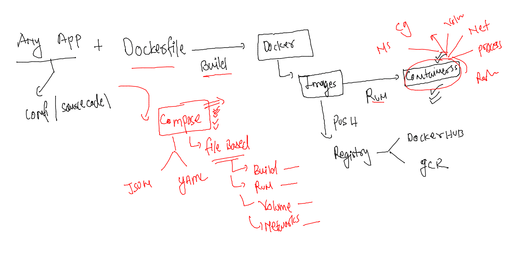
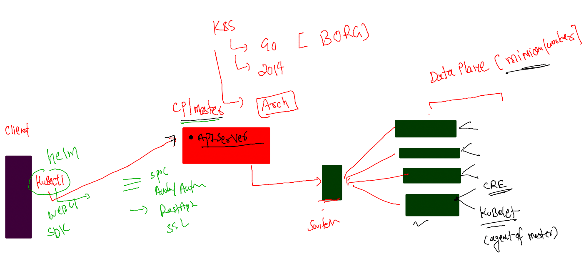
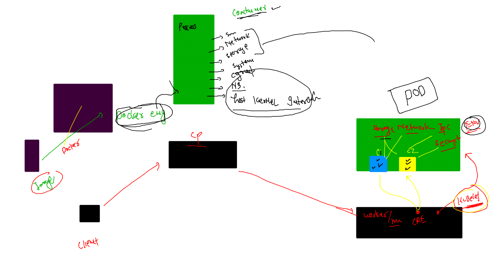
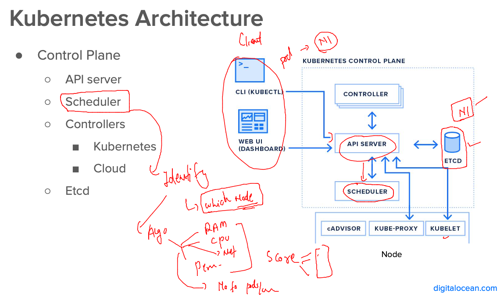

## Revision 

### Docker revision 



### K8s Revision 



### checking connection to k8s control plane 

```
[ashu@docker-host ashu-apps]$ kubectl  cluster-info 
Kubernetes control plane is running at https://172.31.29.6:6443
CoreDNS is running at https://172.31.29.6:6443/api/v1/namespaces/kube-system/services/kube-dns:dns/proxy

To further debug and diagnose cluster problems, use 'kubectl cluster-info dump'.
[ashu@docker-host ashu-apps]$ 
[ashu@docker-host ashu-apps]$ kubectl  get  nodes
NAME            STATUS   ROLES                  AGE    VERSION
control-plane   Ready    control-plane,master   3d2h   v1.23.16
node1           Ready    <none>                 3d2h   v1.23.16
node2           Ready    <none>                 3d2h   v1.23.16
node3           Ready    <none>                 3d2h   v1.23.16
[ashu@docker-host ashu-apps]$ 
```

### etcd the brain of k8s -- running in CP / master node 


## k8s will run app container in a env called POD 

### POd info 



### pushing image to deploy in k8s 

```
[ashu@docker-host webapps]$ ls
Dockerfile  project-website-template
[ashu@docker-host webapps]$ docker build -t  docker.io/dockerashu/ashu-ui:mobiv1 . 
Sending build context to Docker daemon   1.73MB
Step 1/3 : FROM nginx
 ---> a99a39d070bf
Step 2/3 : label email=ashutoshh@linux.com
 ---> Running in b92157f0fc4f
Removing intermediate container b92157f0fc4f
 ---> 4008272a8a67
Step 3/3 : COPY project-website-template /usr/share/nginx/html/
 ---> eff1395a1609
Successfully built eff1395a1609
Successfully tagged dockerashu/ashu-ui:mobiv1
[ashu@docker-host webapps]$ docker login -u dockerashu
Password: 
WARNING! Your password will be stored unencrypted in /home/ashu/.docker/config.json.
Configure a credential helper to remove this warning. See
https://docs.docker.com/engine/reference/commandline/login/#credentials-store

Login Succeeded
[ashu@docker-host webapps]$ docker push docker.io/dockerashu/ashu-ui:mobiv1
The push refers to repository [docker.io/dockerashu/ashu-ui]
784d477c1a69: Pushed 
80115eeb30bc: Mounted from library/nginx 
049fd3bdb25d: Mounted from library/nginx 
ff1154af28db: Mounted from library/nginx 
8477a329ab95: Mounted from library/nginx 
7e7121bf193a: Mounted from library/nginx 
67a4178b7d47: Mounted from library/nginx 
mobiv1: digest: sha256:e6e1111eddfee0b1ca40d72d04e07f7f0c58153ee448575272572b0be81c1e68 size: 1781
[ashu@docker-host webapps]$ 
```

### Most sample Pod YAML file 

```
apiVersion: v1 # apiserver version to target 
kind: Pod  # Resource on apiversion 
metadata: # info about Resource like POd 
  name: ashu-test-pod  
spec: # need of pod like services in compose 
  containers: # number of container for my app 
  - image: docker.io/dockerashu/ashu-ui:mobiv1
    name: ashuc1
    ports:
    - containerPort: 80 # container app port number 
```

### lets deploy it 

```
[ashu@docker-host ashu-apps]$ ls
admin.conf  ashu-compose-examples  ashu-docker-final  javaapp  k8s-app-deploy  tools  webapps
[ashu@docker-host ashu-apps]$ cd  k8s-app-deploy/
[ashu@docker-host k8s-app-deploy]$ ls
ashupod1.yaml
[ashu@docker-host k8s-app-deploy]$ kubectl apply -f  ashupod1.yaml 
pod/ashu-test-pod created
[ashu@docker-host k8s-app-deploy]$ kubectl  get  pods
NAME               READY   STATUS    RESTARTS   AGE
ashu-test-pod      1/1     Running   0          14s
daniela-test-pod   1/1     Running   0          7s
scunha-test-pod    1/1     Running   0          12s
[ashu@docker-host k8s-app-deploy]$ 

```

### where control plane planned our pods 

```
[ashu@docker-host webapps]$ kubectl  get  pod  ashu-test-pod -o wide 
NAME            READY   STATUS    RESTARTS   AGE   IP              NODE    NOMINATED NODE   READINESS GATES
ashu-test-pod   1/1     Running   0          13m   192.168.104.3   node2   <none>           <none>
[ashu@docker-host webapps]$ 

```

### checking more 

```
[ashu@docker-host webapps]$ kubectl  get  pod  -o wide 
NAME                   READY   STATUS    RESTARTS   AGE     IP                NODE    NOMINATED NODE   READINESS GATES
acsilva-test-pod       1/1     Running   0          8m54s   192.168.166.137   node1   <none>           <none>
ashu-test-pod          1/1     Running   0          15m     192.168.104.3     node2   <none>           <none>
cfantao-test-pod       1/1     Running   0          9m36s   192.168.166.136   node1   <none>           <none>
daniela-test-pod       1/1     Running   0          15m     192.168.135.5     node3   <none>           <none>
dvvlad-test-pod        1/1     Running   0          9m34s   192.168.104.5     node2   <none>           <none>
jji-test-pod           1/1     Running   0          7m2s    192.168.135.7     node3   <none>           <none>
jjunior-pod1           1/1     Running   0          8m54s   192.168.135.6     node3   <none>           <none>
jpconceicao-test-pod   1/1     Running   0          14m     192.168.104.4     node2   <none>           <none>
lzmartin-test-pod      1/1     Running   0          6m54s   192.168.104.6     node2   <none>           <none>
nmgrilo-test-pod       1/1     Running   0          14m     192.168.166.135   node1   <none>           <none>
scunha-test-pod        1/1     Running   0          15m     192.168.135.4     node3   <none>           <none>
[ashu@docker-host webapps]$ kubectl  get  pod  -o wide   |  wc -l
12
[ashu@docker-host webapps]$ 

```

### Pod scheduling done by control plane component called -- Scheduler 



## More pod commands 

### checking logs of pod container 

```
ashu@docker-host webapps]$ kubectl  logs ashu-test-pod
/docker-entrypoint.sh: /docker-entrypoint.d/ is not empty, will attempt to perform configuration
/docker-entrypoint.sh: Looking for shell scripts in /docker-entrypoint.d/
/docker-entrypoint.sh: Launching /docker-entrypoint.d/10-listen-on-ipv6-by-default.sh
10-listen-on-ipv6-by-default.sh: info: Getting the checksum of /etc/nginx/conf.d/default.conf
10-listen-on-ipv6-by-default.sh: info: Enabled listen on IPv6 in /etc/nginx/conf.d/default.conf
/docker-entrypoint.sh: Launching /docker-entrypoint.d/20-envsubst-on-templates.sh
/docker-entrypoint.sh: Launching /docker-entrypoint.d/30-tune-worker-processes.sh
/docker-entrypoint.sh: Configuration complete; ready for start up
2023/01/30 10:13:14 [notice] 1#1: using the "epoll" event method
2023/01/30 10:13:14 [notice] 1#1: nginx/1.23.3
2023/01/30 10:13:14 [notice] 1#1: built by gcc 10.2.1 20210110 (Debian 10.2.1-6) 
2023/01/30 10:13:14 [notice] 1#1: OS: Linux 5.10.162-141.675.amzn2.x86_64
2023/01/30 10:13:14 [notice] 1#1: getrlimit(RLIMIT_NOFILE): 32768:65
```

### accessing container shell inside pod 

```
[ashu@docker-host webapps]$ kubectl  exec  -it ashu-test-pod  -- bash 
root@ashu-test-pod:/# ls
bin  boot  dev  docker-entrypoint.d  docker-entrypoint.sh  etc  home  lib  lib64  media  mnt  opt  proc  root  run  sbin  srv  sys  tmp  usr  var
root@ashu-test-pod:/# exit
exit
```

### describe pod 

```
[ashu@docker-host webapps]$ kubectl  describe pod ashu-test-pod
Name:         ashu-test-pod
Namespace:    default
Priority:     0
Node:         node2/172.31.26.13
Start Time:   Mon, 30 Jan 2023 10:13:08 +0000
Labels:       <none>
Annotations:  cni.projectcalico.org/containerID: 99e8a5a5b9e1afd04ed5d18d9950a3f5bdf349003ace866f912c5221eebd5df0
              cni.projectcalico.org/podIP: 192.168.104.3/32
              cni.projectcalico.org/podIPs: 192.168.104.3/32
Status:       Running
IP:           192.168.104.3
IPs:
  IP:  192.168.104.3
Containers:
  ashuc1:
    Container ID:   docker://25ebe1e324b3b7103d2d243e49c4b71454e51fff7ce29aa0898580829ace5b28
    Image:          docker.io/dockerashu/ashu-ui:mobiv1
    Image ID:       docker-pullable://dockerashu/ashu-ui@sha256:e6e1111eddfee0b1ca40d72d04e07f7f0c58153ee448575272572b0be81c1e68
    Port:           80/TCP
    Host Port:      0/TCP
    State:          Running
      Started:      Mon, 30 Jan 2023 10:13:14 +0000
    Ready:          True
    Restart Count:  0
    Environment:    <none>
    Mounts:
      /var/run/secrets/kubernetes.io/serviceaccount from kube-api-access-gc67f (ro)
Conditions:
  Type              Status
  Initialized       True 
  Ready             True 
  ContainersReady   True 
  PodScheduled      True 
Volumes:
  kube-api-access-gc67f:
    Type:                    Projected (a volume that contains injected data from multiple sources)
    TokenExpirationSeconds:  3607
    ConfigMapName:           kube-root-ca.crt
    ConfigMapOptional:       <nil>
    DownwardAPI:             true
QoS Class:                   BestEffort
Node-Selectors:              <none>
Tolerations:                 node.kubernetes.io/not-ready:NoExecute op=Exists for 300s
                             node.kubernetes.io/unreachable:NoExecute op=Exists for 300s
Events:
  Type    Reason     Age   From               Message
  ----    ------     ----  ----               -------
  Normal  Scheduled  26m   default-scheduler  Successfully assigned default/ashu-test-pod to node2
  Normal  Pulling    26m   kubelet            Pulling image "docker.io/dockerashu/ashu-ui:mobiv1"
  Normal  Pulled     26m   kubelet            Successfully pulled image "docker.io/dockerashu/ashu-ui:mobiv1" in 3.420635353s (3.420643345s including waiting)
  Normal  Created    26m   kubelet            Created container ashuc1
  Normal  Started    26m   kubelet            Started container ashuc1
```

### events 

```
[ashu@docker-host webapps]$ kubectl  get events 
LAST SEEN   TYPE      REASON      OBJECT                     MESSAGE
20m         Normal    Scheduled   pod/acsilva-test-pod       Successfully assigned default/acsilva-test-pod to node1
20m         Normal    Pulling     pod/acsilva-test-pod       Pulling image "docker.io/acsilva80/acsilva-ui:mobiv1"
20m         Normal    Pulled      pod/acsilva-test-pod       Successfully pulled image "docker.io/acsilva80/acsilva-ui:mobiv1" in 435.395539ms (435.403282ms including waiting)
20m         Normal    Created     pod/acsilva-test-pod
```

### delete pod 

```
[ashu@docker-host webapps]$ kubectl delete pod  ashu-test-pod 
pod "ashu-test-pod" deleted
```


