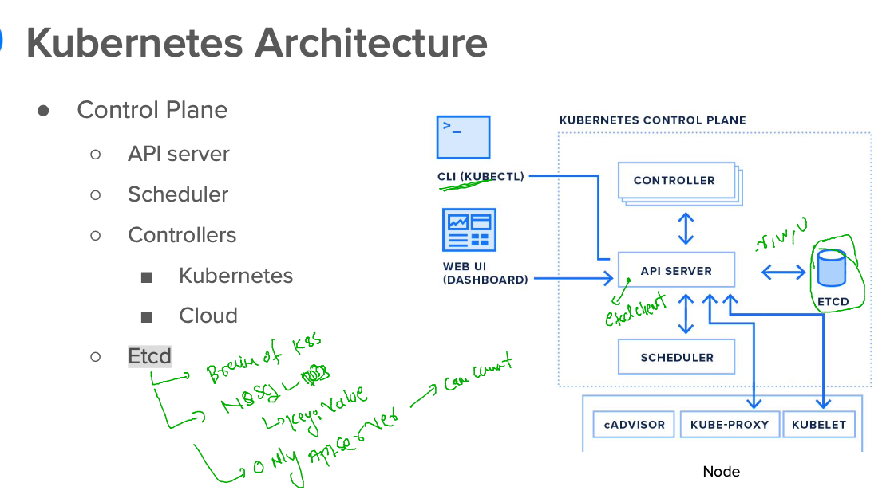

## Revision 

### Docker revision 


### K8s Revision 


### checking connection to k8s control plane 

```
[ashu@docker-host ashu-apps]$ kubectl  cluster-info 
Kubernetes control plane is running at https://172.31.29.6:6443
CoreDNS is running at https://172.31.29.6:6443/api/v1/namespaces/kube-system/services/kube-dns:dns/proxy

To further debug and diagnose cluster problems, use 'kubectl cluster-info dump'.
[ashu@docker-host ashu-apps]$ 
[ashu@docker-host ashu-apps]$ kubectl  get  nodes
NAME            STATUS   ROLES                  AGE    VERSION
control-plane   Ready    control-plane,master   3d2h   v1.23.16
node1           Ready    <none>                 3d2h   v1.23.16
node2           Ready    <none>                 3d2h   v1.23.16
node3           Ready    <none>                 3d2h   v1.23.16
[ashu@docker-host ashu-apps]$ 
```

### etcd the brain of k8s -- running in CP / master node 



## k8s will run app container in a env called POD 

### POd info 


### pushing image to deploy in k8s 

```
[ashu@docker-host webapps]$ ls
Dockerfile  project-website-template
[ashu@docker-host webapps]$ docker build -t  docker.io/dockerashu/ashu-ui:mobiv1 . 
Sending build context to Docker daemon   1.73MB
Step 1/3 : FROM nginx
 ---> a99a39d070bf
Step 2/3 : label email=ashutoshh@linux.com
 ---> Running in b92157f0fc4f
Removing intermediate container b92157f0fc4f
 ---> 4008272a8a67
Step 3/3 : COPY project-website-template /usr/share/nginx/html/
 ---> eff1395a1609
Successfully built eff1395a1609
Successfully tagged dockerashu/ashu-ui:mobiv1
[ashu@docker-host webapps]$ docker login -u dockerashu
Password: 
WARNING! Your password will be stored unencrypted in /home/ashu/.docker/config.json.
Configure a credential helper to remove this warning. See
https://docs.docker.com/engine/reference/commandline/login/#credentials-store

Login Succeeded
[ashu@docker-host webapps]$ docker push docker.io/dockerashu/ashu-ui:mobiv1
The push refers to repository [docker.io/dockerashu/ashu-ui]
784d477c1a69: Pushed 
80115eeb30bc: Mounted from library/nginx 
049fd3bdb25d: Mounted from library/nginx 
ff1154af28db: Mounted from library/nginx 
8477a329ab95: Mounted from library/nginx 
7e7121bf193a: Mounted from library/nginx 
67a4178b7d47: Mounted from library/nginx 
mobiv1: digest: sha256:e6e1111eddfee0b1ca40d72d04e07f7f0c58153ee448575272572b0be81c1e68 size: 1781
[ashu@docker-host webapps]$ 
```

### Most sample Pod YAML file 

```
apiVersion: v1 # apiserver version to target 
kind: Pod  # Resource on apiversion 
metadata: # info about Resource like POd 
  name: ashu-test-pod  
spec: # need of pod like services in compose 
  containers: # number of container for my app 
  - image: docker.io/dockerashu/ashu-ui:mobiv1
    name: ashuc1
    ports:
    - containerPort: 80 # container app port number 
```

### lets deploy it 

```
[ashu@docker-host ashu-apps]$ ls
admin.conf  ashu-compose-examples  ashu-docker-final  javaapp  k8s-app-deploy  tools  webapps
[ashu@docker-host ashu-apps]$ cd  k8s-app-deploy/
[ashu@docker-host k8s-app-deploy]$ ls
ashupod1.yaml
[ashu@docker-host k8s-app-deploy]$ kubectl apply -f  ashupod1.yaml 
pod/ashu-test-pod created
[ashu@docker-host k8s-app-deploy]$ kubectl  get  pods
NAME               READY   STATUS    RESTARTS   AGE
ashu-test-pod      1/1     Running   0          14s
daniela-test-pod   1/1     Running   0          7s
scunha-test-pod    1/1     Running   0          12s
[ashu@docker-host k8s-app-deploy]$ 

```


