## getting started

### REvision 

### taking webapp to containerize and test it 

```
[ashu@docker-host ashu-apps]$ cd  ashu-compose-examples/
[ashu@docker-host ashu-compose-examples]$ ls
ashu-app.yaml  docker-compose.yaml  myapp  tomcat.dockerfile  tomcat.yaml
[ashu@docker-host ashu-compose-examples]$ git clone https://github.com/microsoft/project-html-website.git
Cloning into 'project-html-website'...
remote: Enumerating objects: 24, done.
remote: Counting objects: 100% (5/5), done.
remote: Compressing objects: 100% (5/5), done.
remote: Total 24 (delta 0), reused 3 (delta 0), pack-reused 19
Receiving objects: 100% (24/24), 465.86 KiB | 29.12 MiB/s, done.
[ashu@docker-host ashu-compose-examples]$ ls
ashu-app.yaml  docker-compose.yaml  myapp  project-html-website  tomcat.dockerfile  tomcat.yaml
[ashu@docker-host ashu-compose-examples]$ 


```

### Using apache httpd for docker based app hosting 


### above code project-html-website  -- with Dockerfile and .dockerignore

```
FROM oraclelinux:8.4 
LABEL name="ashutoshh"
LABEL email="ashutoshh@linux.com"
RUN yum install httpd -y 
ADD project-html-website /var/www/html/
# COPY and add both are same while add can accept data from URL also 
ENTRYPOINT [ "httpd","-DFOREGROUND" ]
# like CMD we can use ENTRYPOINT 
```

### .dockerignore 

```
project-html-website/.git
project-html-website/*.md
project-html-website/LICENSE
```

### Docker compose for above example 

```
version: '3.8'
services:
  ashu-ui-app:
    image: docker.io/dockerashu/ashu-mobiwebapp:v1 
    build:
      context: . 
      dockerfile: httpd.dockerfile
    container_name: ashuwebc1
    restart: always 
    ports:
    - 1234:80 
```

### lets test it 

```
[ashu@docker-host ashu-compose-examples]$ ls
ashu-app.yaml        httpd-compose.yaml  myapp                 tomcat.dockerfile
docker-compose.yaml  httpd.dockerfile    project-html-website  tomcat.yaml
[ashu@docker-host ashu-compose-examples]$ docker-compose -f httpd-compose.yaml  --build up -d 
unknown flag: --build
[ashu@docker-host ashu-compose-examples]$ docker-compose -f httpd-compose.yaml up -d  --build 
[+] Building 10.9s (6/8)                                                                                                       
 => [internal] load build definition from httpd.dockerfile                                                                0.0s
 => => transferring dockerfile: 331B                                                                                      0.0s
 => [internal] load .dockerignore                                                                                         0.0s
 => => transferring context: 120B                                                                                         0.0s
 => [internal] load metadata for docker.io/library/oraclelinux:8.4                                                        0.3s
 => [auth] library/oraclelinux:pull token for registry-1.docker.io                                                        0.0s
 => CACHED [1/3] FROM docker.io/library/oraclelinux:8.4@sha256:b81d5b0638bb67030b207d28586d0e714a811cc612396dbe3410db406  0.0s
 => => resolve docker.io/library/oraclelinux:8.4@sha256:b81d5b0638bb67030b207d28586d0e714a811cc612396dbe3410db406998b3ad  0.0s
 => [internal] load build context                                                                                         0.0s
 => => transferring context: 823.15kB                                                                                     0.0s
 => [2/3] RUN yum install httpd -y                                                                                       10.5s
 => => # Oracle Linux 8 BaseOS Latest (x86_64)            70 MB/s |  54 MB     00:00                                          

```

###  lets push image 

```
[ashu@docker-host ashu-compose-examples]$ ls
ashu-app.yaml        httpd-compose.yaml  myapp                 tomcat.dockerfile
docker-compose.yaml  httpd.dockerfile    project-html-website  tomcat.yaml
[ashu@docker-host ashu-compose-examples]$ docker-compose -f httpd-compose.yaml down 
[ashu@docker-host ashu-compose-examples]$ docker images  |   grep ashu
dockerashu/ashu-mobiwebapp          v1        af4b91c944ef   4 minutes ago        461MB
dockerashu/ashu-ui                  mobiv1    f45551527ab7   24 hours ago         144MB
dockerashu/ashu-ui                  <none>    eff1395a1609   24 hours ago         144MB
ashu-compose-examples-myapp         latest    133d735eb1da   3 days ago           475MB
[ashu@docker-host ashu-compose-examples]$ docker login -u dockerashu
Password: 
WARNING! Your password will be stored unencrypted in /home/ashu/.docker/config.json.
Configure a credential helper to remove this warning. See
https://docs.docker.com/engine/reference/commandline/login/#credentials-store

Login Succeeded
[ashu@docker-host ashu-compose-examples]$ docker push  docker.io/dockerashu/ashu-mobiwebapp:v1
The push refers to repository [docker.io/dockerashu/ashu-mobiwebapp]
83c7de0e0d89: Pushed 
15d4e0316d93: Pushed 
2d3586eacb61: Mounted from dockerashu/ashucimg 
v1: digest: sha256:2d149feeebc82e279fa85ac699ae18ac7e453e33d090517366cb230a28d449d2 size: 952
[ashu@docker-host ashu-compose-examples]$ 

```

### Lets deploy above image to k8s 

### verify namespace 

```
[ashu@docker-host ashu-apps]$ kubectl  get  ns
NAME                   STATUS   AGE
acsilvaproject         Active   21h
ashu-project           Active   21h
cfantao-project        Active   21h
daniela-project        Active   21h
default                Active   4d2h
dvvlad-project         Active   21h
jji-project            Active   21h
jjunior-ns             Active   21h
jpconceicao-project    Active   21h
kube-node-lease        Active   4d2h
kube-public            Active   4d2h
kube-system            Active   4d2h
kubernetes-dashboard   Active   4d2h
lzmartin-project       Active   21h
nmgrilo-project        Active   21h
scunha-project         Active   21h
[ashu@docker-host ashu-apps]$ kubectl  config get-contexts 
CURRENT   NAME                          CLUSTER      AUTHINFO           NAMESPACE
*         kubernetes-admin@kubernetes   kubernetes   kubernetes-admin   ashu-project
[ashu@docker-host ashu-apps]$ 
```

### lets clean up namespace data 

```
[ashu@docker-host ashu-apps]$ kubectl  get  pods
NAME          READY   STATUS    RESTARTS      AGE
ashu-tomcat   1/1     Running   1 (20h ago)   21h
[ashu@docker-host ashu-apps]$ kubectl delete pods ashu-tomcat 
pod "ashu-tomcat" deleted
[ashu@docker-host ashu-apps]$ 


```

### problem with Pods 

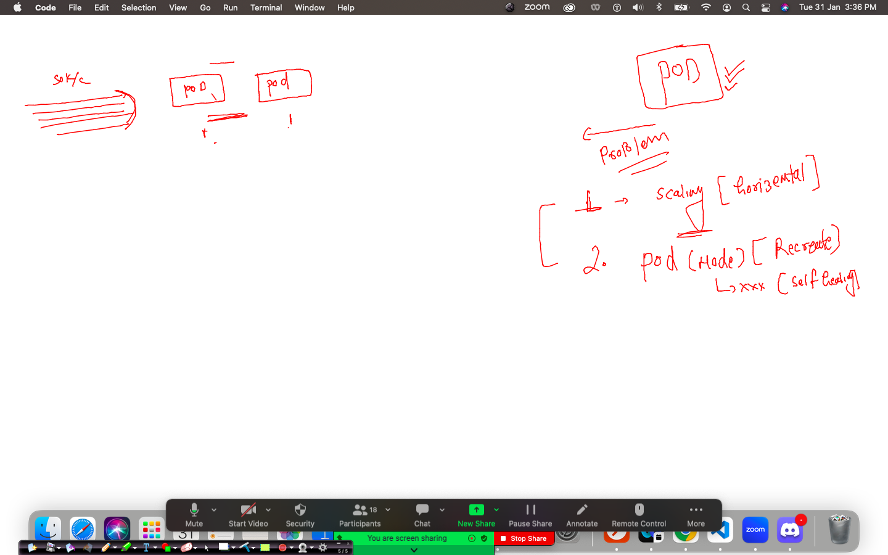

## Introduction to COntrollers in k8s 

### importance of RC & RS 

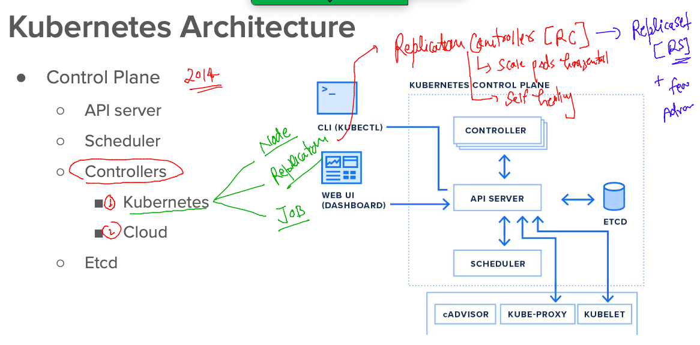

### Incase of webapp updates / upgrade  RC & RS is not good 


### understanding the Most advanced controllers in k8s -- for stateless and statefull applications 

### stateless app controller -- Deployment 

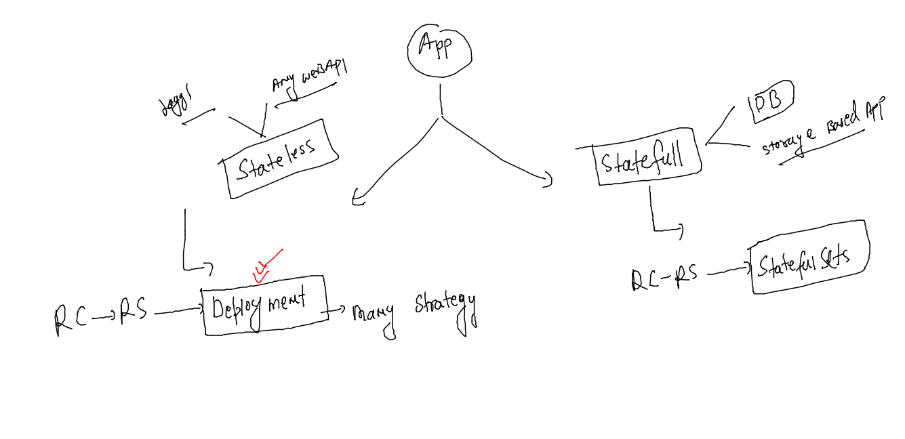

### creating Deployment YAML using kubectl 

```
ashu@docker-host ashu-apps]$ ls
admin.conf  ashu-compose-examples  ashu-docker-final  javaapp  k8s-app-deploy  tools  webapps
[ashu@docker-host ashu-apps]$ cd  k8s-app-deploy/
[ashu@docker-host k8s-app-deploy]$ ls
ashupod1.yaml  autopod.json  autopod.yaml  logs.txt  mynslimitcg.yaml  task1.yaml  tomcat.yaml
[ashu@docker-host k8s-app-deploy]$ kubectl  create  deployment  ashu-webapp --image=docker.io/dockerashu/ashu-mobiwebapp:v  --port 80 --dry-run=client -o yaml >appashu_deployment.yaml 
[ashu@docker-host k8s-app-deploy]$ ls
appashu_deployment.yaml  ashupod1.yaml  autopod.json  autopod.yaml  logs.txt  mynslimitcg.yaml  task1.yaml  tomcat.yaml
[ashu@docker-host k8s-app-deploy]$ 

```

### more visual understanding of apiserver with its apiversion expose resources 

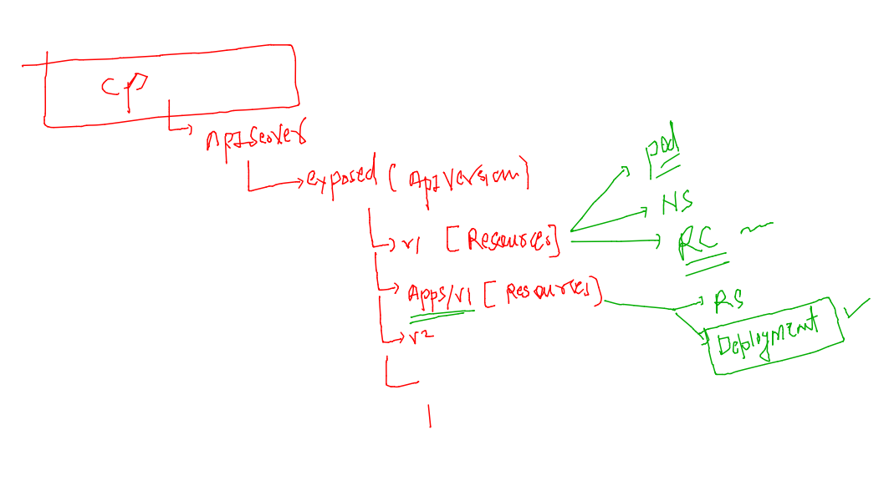

### lets deploy YAML file of Deployment 

```
[ashu@docker-host k8s-app-deploy]$ kubectl apply -f appashu_deployment.yaml 
deployment.apps/ashu-webapp configured
[ashu@docker-host k8s-app-deploy]$ kubectl  get  deployment 
NAME          READY   UP-TO-DATE   AVAILABLE   AGE
ashu-webapp   1/1     1            1           50s
[ashu@docker-host k8s-app-deploy]$ kubectl  get  deploy
NAME          READY   UP-TO-DATE   AVAILABLE   AGE
ashu-webapp   1/1     1            1           52s
[ashu@docker-host k8s-app-deploy]$ 
[ashu@docker-host k8s-app-deploy]$ kubectl  get  po 
NAME                           READY   STATUS    RESTARTS   AGE
ashu-webapp-77d578f4fd-k4v67   1/1     Running   0          18s
[ashu@docker-host k8s-app-deploy]$ kubectl  get  po -o wide
NAME                           READY   STATUS    RESTARTS   AGE   IP               NODE    NOMINATED NODE   READINESS GATES
ashu-webapp-77d578f4fd-k4v67   1/1     Running   0          23s   192.168.104.36   node2   <none>           <none>
[ashu@docker-host k8s-app-deploy]$ 


```

### self healing of pods

```
[ashu@docker-host k8s-app-deploy]$ kubectl   get  deployment 
NAME          READY   UP-TO-DATE   AVAILABLE   AGE
ashu-webapp   1/1     1            1           5m59s
[ashu@docker-host k8s-app-deploy]$ kubectl   get  pods
NAME                           READY   STATUS    RESTARTS   AGE
ashu-webapp-77d578f4fd-k4v67   1/1     Running   0          5m25s
[ashu@docker-host k8s-app-deploy]$ kubectl  delete  pods ashu-webapp-77d578f4fd-k4v67
pod "ashu-webapp-77d578f4fd-k4v67" deleted
[ashu@docker-host k8s-app-deploy]$ kubectl   get  pods -o wide
NAME                           READY   STATUS    RESTARTS   AGE   IP               NODE    NOMINATED NODE   READINESS GATES
ashu-webapp-77d578f4fd-7mjvt   1/1     Running   0          6s    192.168.135.54   node3   <none>           <none>
[ashu@docker-host k8s-app-deploy]$ 
```

### horizental scaling of pods 

```
[ashu@docker-host k8s-app-deploy]$ kubectl  get  deploy 
NAME          READY   UP-TO-DATE   AVAILABLE   AGE
ashu-webapp   1/1     1            1           7m32s
[ashu@docker-host k8s-app-deploy]$ kubectl  scale  deployment  ashu-webapp  --replicas=3
deployment.apps/ashu-webapp scaled
[ashu@docker-host k8s-app-deploy]$ kubectl  get  deploy 
NAME          READY   UP-TO-DATE   AVAILABLE   AGE
ashu-webapp   1/3     3            1           7m51s
[ashu@docker-host k8s-app-deploy]$ kubectl  get  deploy 
NAME          READY   UP-TO-DATE   AVAILABLE   AGE
ashu-webapp   3/3     3            3           8m2s
[ashu@docker-host k8s-app-deploy]$ kubectl  get po -o wide
NAME                           READY   STATUS    RESTARTS   AGE   IP                NODE    NOMINATED NODE   READINESS GATES
ashu-webapp-77d578f4fd-7mjvt   1/1     Running   0          98s   192.168.135.54    node3   <none>           <none>
ashu-webapp-77d578f4fd-nvmjw   1/1     Running   0          21s   192.168.104.40    node2   <none>           <none>
ashu-webapp-77d578f4fd-xdjhz   1/1     Running   0          21s   192.168.166.168   node1   <none>           <none>
[ashu@docker-host k8s-app-deploy]$ 
```

### Container Networking Interface by K8s 

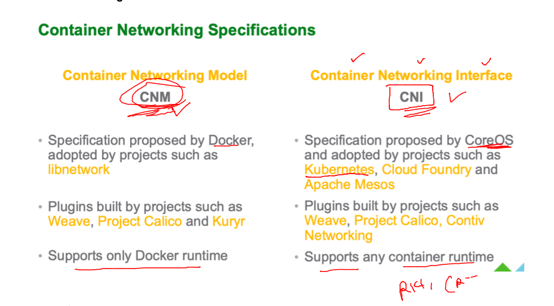

### Overlay Network Bridge by CNI in k8s 

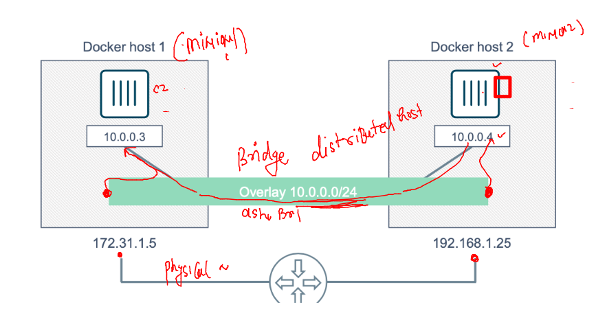

### CNI plugins for Network implementations 

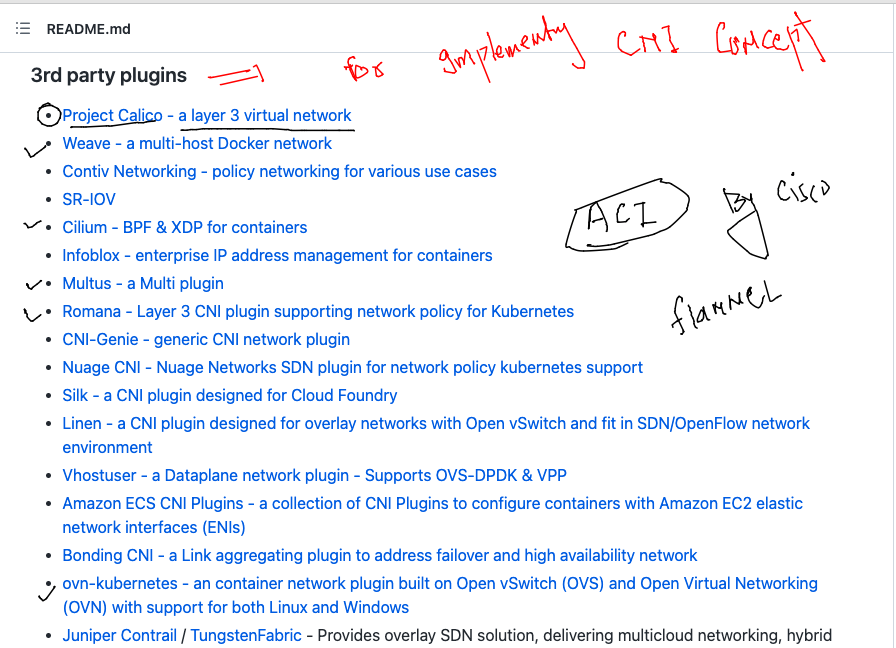

### checking k8s internal components in kube-system namespace

```
[ashu@docker-host k8s-app-deploy]$ kubectl  get  pods -n kube-system 
NAME                                       READY   STATUS    RESTARTS      AGE
calico-kube-controllers-6695595bd4-v77rm   1/1     Running   3 (22h ago)   4d3h
calico-node-bhqnd                          1/1     Running   3 (22h ago)   4d3h
calico-node-mnrg9                          1/1     Running   3 (22h ago)   4d3h
calico-node-rxrqc                          1/1     Running   3 (22h ago)   4d3h
calico-node-skjp4                          1/1     Running   3 (22h ago)   4d3h
coredns-bd6b6df9f-5zthd                    1/1     Running   3 (22h ago)   4d4h
coredns-bd6b6df9f-v2r76                    1/1     Running   3 (22h ago)   4d4h
etcd-control-plane                         1/1     Running   3 (22h ago)   4d4h
kube-apiserver-control-plane               1/1     Running   3 (22h ago)   4d4h
kube-controller-manager-control-plane      1/1     Running   3 (22h ago)   4d4h
kube-proxy-9pcjv                           1/1     Running   3 (22h ago)   4d4h
kube-proxy-dl7g4                           1/1     Running   3 (22h ago)   4d4h
kube-proxy-hvjbb                           1/1     Running   3 (22h ago)   4d4h
kube-proxy-n6ddb                           1/1     Running   3 (22h ago)   4d4h
kube-scheduler-control-plane               1/1     Running   3 (22h ago)   4d4h
metrics-server-5c69db44f5-p97gf            1/1     Running   3 (22h ago)   4d4h
[ashu@docker-host k8s-app-deploy]$ 

```

### Verify pod CNI plugin 

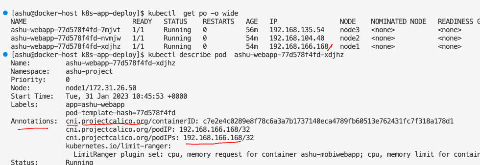

### Overal Networking flow of k8s app

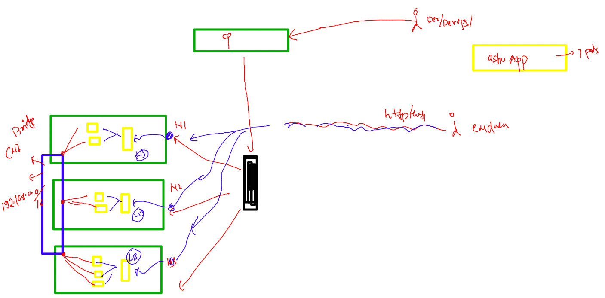

### Introduction to Internal LB for pods in k8s using service resource in k8s 

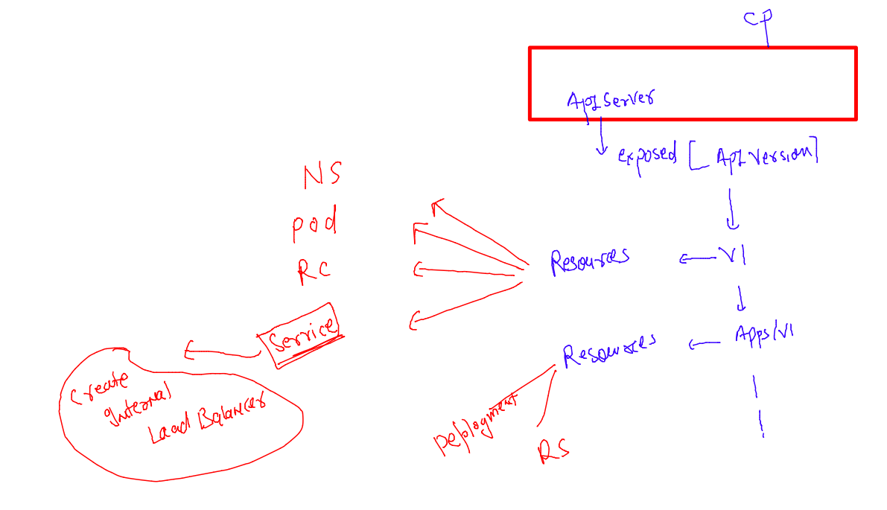

### type of service in k8s also Loadbalancer and Nodeport service 

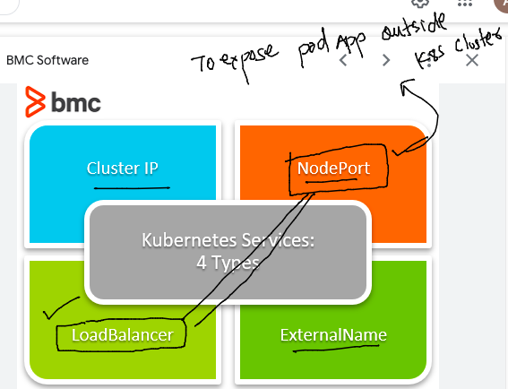

### Lets implement NodePOrt service type to expose pod app to outside world 

### understanding port mapping for service 

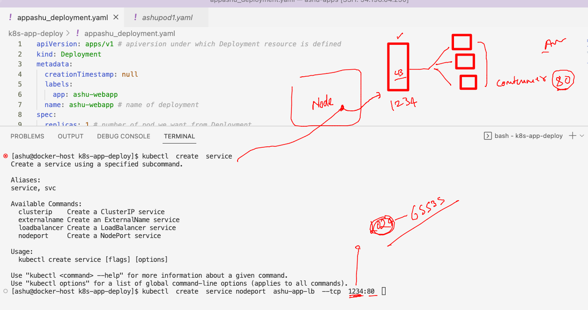

### lets create yaml 

```
[ashu@docker-host k8s-app-deploy]$ kubectl  create  service 
Create a service using a specified subcommand.

Aliases:
service, svc

Available Commands:
  clusterip    Create a ClusterIP service
  externalname Create an ExternalName service
  loadbalancer Create a LoadBalancer service
  nodeport     Create a NodePort service

Usage:
  kubectl create service [flags] [options]

Use "kubectl <command> --help" for more information about a given command.
Use "kubectl options" for a list of global command-line options (applies to all commands).
[ashu@docker-host k8s-app-deploy]$ kubectl  create  service nodeport  ashu-app-lb  --tcp  1234:80  --dry-run=client -o yaml >ashunodeportlb.yaml 
[ashu@docker-host k8s-app-deploy]$ 

```

### lets create 

```
[ashu@docker-host k8s-app-deploy]$ kubectl  apply -f  ashunodeportlb.yaml 
service/ashu-app-lb created
[ashu@docker-host k8s-app-deploy]$ kubectl  get  services 
NAME          TYPE       CLUSTER-IP      EXTERNAL-IP   PORT(S)          AGE
ashu-app-lb   NodePort   10.103.56.170   <none>        1234:31960/TCP   9s
[ashu@docker-host k8s-app-deploy]$ kubectl  get  svc
NAME          TYPE       CLUSTER-IP      EXTERNAL-IP   PORT(S)          AGE
ashu-app-lb   NodePort   10.103.56.170   <none>        1234:31960/TCP   13s
[ashu@docker-host k8s-app-deploy]$ 


```


