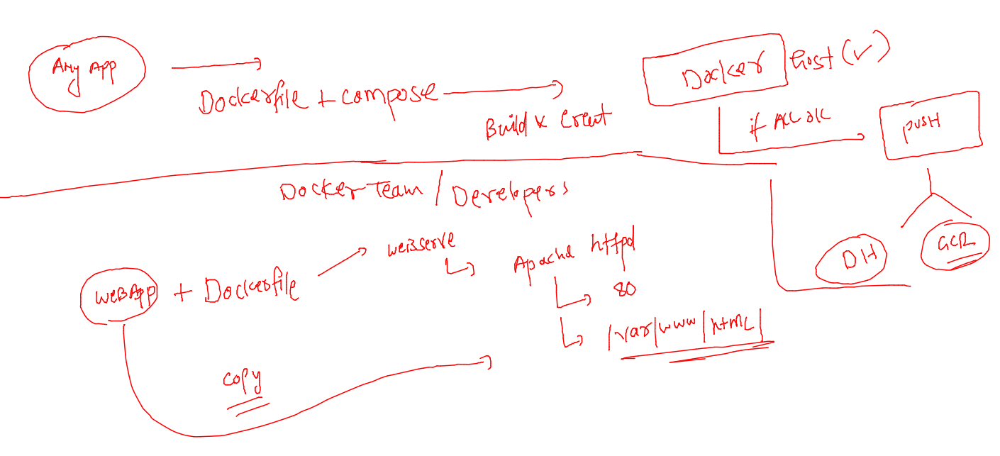

## getting started

### REvision 

### taking webapp to containerize and test it 

```
[ashu@docker-host ashu-apps]$ cd  ashu-compose-examples/
[ashu@docker-host ashu-compose-examples]$ ls
ashu-app.yaml  docker-compose.yaml  myapp  tomcat.dockerfile  tomcat.yaml
[ashu@docker-host ashu-compose-examples]$ git clone https://github.com/microsoft/project-html-website.git
Cloning into 'project-html-website'...
remote: Enumerating objects: 24, done.
remote: Counting objects: 100% (5/5), done.
remote: Compressing objects: 100% (5/5), done.
remote: Total 24 (delta 0), reused 3 (delta 0), pack-reused 19
Receiving objects: 100% (24/24), 465.86 KiB | 29.12 MiB/s, done.
[ashu@docker-host ashu-compose-examples]$ ls
ashu-app.yaml  docker-compose.yaml  myapp  project-html-website  tomcat.dockerfile  tomcat.yaml
[ashu@docker-host ashu-compose-examples]$ 


```

### Using apache httpd for docker based app hosting 



### above code project-html-website  -- with Dockerfile and .dockerignore

```
FROM oraclelinux:8.4 
LABEL name="ashutoshh"
LABEL email="ashutoshh@linux.com"
RUN yum install httpd -y 
ADD project-html-website /var/www/html/
# COPY and add both are same while add can accept data from URL also 
```

### .dockerignore 

```
project-html-website/.git
project-html-website/*.md
project-html-website/LICENSE
```

