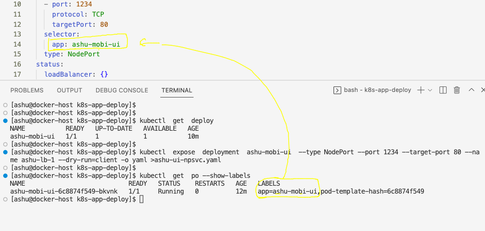
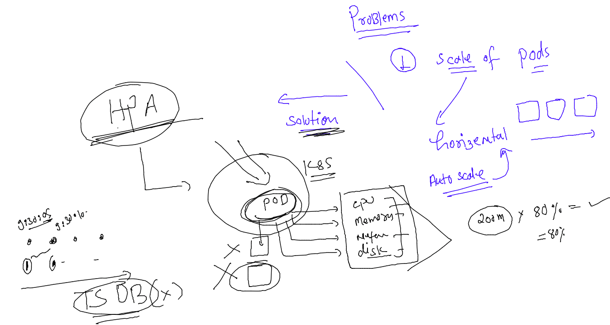

## getting started

### taking same web ui code 

### index.html & dog.jpg 

```
<!DOCTYPE html>
<html lang="en">
<head>
    <meta charset="UTF-8">
    <meta http-equiv="X-UA-Compatible" content="IE=edge">
    <meta name="viewport" content="width=device-width, initial-scale=1.0">
    <title>ashu-ui</title>
</head>
<body>
    <h1> This is TOp message of your web ui </h1>
    <h2> Second top message of UI </h2>
    
</body>
</html>
```

## Dockerfile adding 

### dockerfile 
```
FROM nginx
LABEL name="ashutoshh"
COPY . /usr/share/nginx/html/

```

### .dockerignore 

```
nginx.dockerfile
.dockerignore
```

### build the image 

```
[ashu@docker-host ashu-ui-app]$ ls
dog.jpg  index.html  nginx.dockerfile
[ashu@docker-host ashu-ui-app]$ docker build -t  ashumobi:uiv1  -f nginx.dockerfile  . 
Sending build context to Docker daemon  38.91kB
Step 1/3 : FROM nginx
 ---> a99a39d070bf
Step 2/3 : LABEL name="ashutoshh"
 ---> Running in 83815ca3b272
Removing intermediate container 83815ca3b272
 ---> 3396abc6204f
Step 3/3 : COPY . /usr/share/nginx/html/
 ---> c58f0bc54191
Successfully built c58f0bc54191
Successfully tagged ashumobi:uiv1
[ashu@docker-host ashu-ui-app]$ docker images  |  grep ashu
ashumobi                            uiv1      c58f0bc54191   7 seconds ago   142MB
```

### pushing image on Docker Hub which is public registry 

```
[ashu@docker-host ashu-ui-app]$ docker images  |  grep ashu
ashumobi                            uiv1      c58f0bc54191   2 minutes ago        142MB
dockerashu/ashu-mobiwebapp          <none>    af4b91c944ef   24 hours ago         461MB
dockerashu/ashu-mobiwebapp          v1        7aeab02a7ecf   24 hours ago         461MB
dockerashu/ashu-ui                  mobiv1    f45551527ab7   2 days ago           144MB
dockerashu/ashu-ui                  <none>    eff1395a1609   2 days ago           144MB
ashu-compose-examples-myapp         latest    133d735eb1da   4 days ago           475MB
[ashu@docker-host ashu-ui-app]$ 
[ashu@docker-host ashu-ui-app]$ docker  tag  ashumobi:uiv1  docker.io/dockerashu/ashumobi:uiv1  
[ashu@docker-host ashu-ui-app]$ docker  login -u dockerashu
Password: 
WARNING! Your password will be stored unencrypted in /home/ashu/.docker/config.json.
Configure a credential helper to remove this warning. See
https://docs.docker.com/engine/reference/commandline/login/#credentials-store

Login Succeeded
[ashu@docker-host ashu-ui-app]$ docker push  docker.io/dockerashu/ashumobi:uiv1 
The push refers to repository [docker.io/dockerashu/ashumobi]
b80a0366baec: Pushed 
80115eeb30bc: Mounted from dockerashu/ashu-ui 
049fd3bdb25d: Mounted from dockerashu/ashu-ui 
ff1154af28db: Mounted from dockerashu/ashu-ui 
8477a329ab95: Mounted from dockerashu/ashu-ui 
7e7121bf193a: Mounted from dockerashu/ashu-ui 
67a4178b7d47: Mounted from dockerashu/ashu-ui 
uiv1: digest: sha256:73ac06306b1e4a0b774e7dea8cb3d874c0278a87bb87a016117812e9e1f70244 size: 1779
```

### Creating Deployment of above image 

```
 kubectl create deployment  ashu-mobi-ui  --image=docker.io/dockerashu/ashumobi:uiv1  --port  80 --dry-run=client -o yaml  >ui_deploy.yaml 
```

### deploy it 

```
[ashu@docker-host k8s-app-deploy]$ kubectl apply -f ui_deploy.yaml 
deployment.apps/ashu-mobi-ui created
[ashu@docker-host k8s-app-deploy]$ kubectl  get  deployment 
NAME           READY   UP-TO-DATE   AVAILABLE   AGE
ashu-mobi-ui   1/1     1            1           5s
[ashu@docker-host k8s-app-deploy]$ kubectl  get  pods
NAME                            READY   STATUS    RESTARTS   AGE
ashu-mobi-ui-6c8874f549-bkvnk   1/1     Running   0          9s
[ashu@docker-host k8s-app-deploy]$ 
```

### using expose command to create service for auto match pod labels to the selector of service 



### giving commands 

```
[ashu@docker-host k8s-app-deploy]$ kubectl  get  deploy 
NAME           READY   UP-TO-DATE   AVAILABLE   AGE
ashu-mobi-ui   1/1     1            1           10m
[ashu@docker-host k8s-app-deploy]$ 
[ashu@docker-host k8s-app-deploy]$ kubectl  expose  deployment  ashu-mobi-ui  --type NodePort --port 1234 --target-port 80 --name ashu-lb-1 --dry-run=client -o yaml >ashu-ui-npsvc.yaml 
[ashu@docker-host k8s-app-deploy]$ 
```

### let me create service 

```
[ashu@docker-host k8s-app-deploy]$ kubectl apply -f ashu-ui-npsvc.yaml 
service/ashu-lb-1 created
[ashu@docker-host k8s-app-deploy]$ kubectl  get  svc
NAME        TYPE       CLUSTER-IP     EXTERNAL-IP   PORT(S)          AGE
ashu-lb-1   NodePort   10.99.78.161   <none>        1234:31020/TCP   4s
[ashu@docker-host k8s-app-deploy]$ 
```

## HPA in k8s 



### writing HPA rule 

```
[ashu@docker-host k8s-app-deploy]$ kubectl  get  deploy 
NAME           READY   UP-TO-DATE   AVAILABLE   AGE
ashu-mobi-ui   1/1     1            1           43m
[ashu@docker-host k8s-app-deploy]$ kubectl autoscale  deployment ashu-mobi-ui  --min=3 --max=20  --cpu-percent=85 --dry-run=client -o yaml >hpa.yaml 
[ashu@docker-host k8s-app-deploy]$
```

### implement HPA 

```
[ashu@docker-host k8s-app-deploy]$ kubectl get  deploy 
NAME           READY   UP-TO-DATE   AVAILABLE   AGE
ashu-mobi-ui   1/1     1            1           53m
[ashu@docker-host k8s-app-deploy]$ kubectl apply -f hpa.yaml 
horizontalpodautoscaler.autoscaling/ashu-mobi-ui created
[ashu@docker-host k8s-app-deploy]$ 
[ashu@docker-host k8s-app-deploy]$ kubectl get  hpa
NAME           REFERENCE                 TARGETS         MINPODS   MAXPODS   REPLICAS   AGE
ashu-mobi-ui   Deployment/ashu-mobi-ui   <unknown>/85%   3         20        0          8s
[ashu@docker-host k8s-app-deploy]$ 
[ashu@docker-host k8s-app-deploy]$ kubectl  get  deploy 
NAME           READY   UP-TO-DATE   AVAILABLE   AGE
ashu-mobi-ui   1/1     1            1           53m
[ashu@docker-host k8s-app-deploy]$ 
```

### 

```
[ashu@docker-host k8s-app-deploy]$ kubectl get  hpa
NAME           REFERENCE                 TARGETS         MINPODS   MAXPODS   REPLICAS   AGE
ashu-mobi-ui   Deployment/ashu-mobi-ui   <unknown>/85%   3         20        0          8s
[ashu@docker-host k8s-app-deploy]$ 
[ashu@docker-host k8s-app-deploy]$ kubectl  get  deploy 
NAME           READY   UP-TO-DATE   AVAILABLE   AGE
ashu-mobi-ui   1/1     1            1           53m
[ashu@docker-host k8s-app-deploy]$ kubectl  get  deploy 
NAME           READY   UP-TO-DATE   AVAILABLE   AGE
ashu-mobi-ui   3/3     3            3           54m
[ashu@docker-host k8s-app-deploy]$ kubectl  get po -owide
NAME                            READY   STATUS    RESTARTS   AGE   IP                NODE    NOMINATED NODE   READINESS GATES
ashu-mobi-ui-6c8874f549-bkvnk   1/1     Running   0          54m   192.168.135.51    node3   <none>           <none>
ashu-mobi-ui-6c8874f549-bzpfz   1/1     Running   0          43s   192.168.166.167   node1   <none>           <none>
ashu-mobi-ui-6c8874f549-hdvw2   1/1     Running   0          43s   192.168.104.58    node2   <none>           <none>
[ashu@docker-host k8s-app-deploy]$ 
```

## many LB management and costing is very big problem 


### Introudcing Ingress controller 


### deploy Nginx ingress controller in k8s

```
[ashu@docker-host k8s-app-deploy]$ kubectl apply -f https://raw.githubusercontent.com/kubernetes/ingress-nginx/main/deploy/static/provider/baremetal/deploy.yaml
namespace/ingress-nginx created
serviceaccount/ingress-nginx created
serviceaccount/ingress-nginx-admission created
role.rbac.authorization.k8s.io/ingress-nginx created
role.rbac.authorization.k8s.io/ingress-nginx-admission created
clusterrole.rbac.authorization.k8s.io/ingress-nginx created
clusterrole.rbac.authorization.k8s.io/ingress-nginx-admission created
rolebinding.rbac.authorization.k8s.io/ingress-nginx created
rolebinding.rbac.authorization.k8s.io/ingress-nginx-admission created
clusterrolebinding.rbac.authorization.k8s.io/ingress-nginx created
clusterrolebinding.rbac.authorization.k8s.io/ingress-nginx-admission created
configmap/ingress-nginx-controller created
service/ingress-nginx-controller created
service/ingress-nginx-controller-admission created
deployment.apps/ingress-nginx-controller created
job.batch/ingress-nginx-admission-create created
job.batch/ingress-nginx-admission-patch created
ingressclass.networking.k8s.io/nginx created
validatingwebhookconfiguration.admissionregistration.k8s.io/ingress-nginx-admission created
[ashu@docker-host k8s-app-deploy]$ 

```

### verify it 

```
[ashu@docker-host k8s-app-deploy]$ kubectl  get  deploy -n ingress-nginx
NAME                       READY   UP-TO-DATE   AVAILABLE   AGE
ingress-nginx-controller   1/1     1            1           45s
[ashu@docker-host k8s-app-deploy]$ kubectl  get svc  -n ingress-nginx
NAME                                 TYPE        CLUSTER-IP       EXTERNAL-IP   PORT(S)                      AGE
ingress-nginx-controller             NodePort    10.106.211.147   <none>        80:32114/TCP,443:31929/TCP   53s
ingress-nginx-controller-admission   ClusterIP   10.101.178.216   <none>        443/TCP                      53s
[ashu@docker-host k8s-app-deploy]$ 
```

### Now creating External LB and forward traffice to 32114 for http & 31929 for https from LB to Nodes 

### a view of k8s cluster with Ingress controller 


### lets deploy app with Ingress rule now 

```
[ashu@docker-host k8s-app-deploy]$ ls
admin.yaml               ashunodeportlb.yaml  ashu-ui-npsvc.yaml  autopod.yaml  logs.txt          s1.yaml     tomcat.yaml
appashu_deployment.yaml  ashupod1.yaml        autopod.json        hpa.yaml      mynslimitcg.yaml  task1.yaml  ui_deploy.yaml
[ashu@docker-host k8s-app-deploy]$ kubectl apply -f ui_deploy.yaml 
deployment.apps/ashu-mobi-ui created
[ashu@docker-host k8s-app-deploy]$ kubectl  get  deploy 
NAME           READY   UP-TO-DATE   AVAILABLE   AGE
ashu-mobi-ui   1/1     1            1           4s
[ashu@docker-host k8s-app-deploy]$ kubectl apply -f  hpa.yaml 
horizontalpodautoscaler.autoscaling/ashu-mobi-ui created
[ashu@docker-host k8s-app-deploy]$ kubectl  get  hpa
NAME           REFERENCE                 TARGETS         MINPODS   MAXPODS   REPLICAS   AGE
ashu-mobi-ui   Deployment/ashu-mobi-ui   <unknown>/85%   3         20        0          4s
[ashu@docker-host k8s-app-deploy]$ kubectl  get  deploy 
NAME           READY   UP-TO-DATE   AVAILABLE   AGE
ashu-mobi-ui   1/1     1            1           29s
[ashu@docker-host k8s-app-deploy]$ 


```

### creating clusterip type service 

```
[ashu@docker-host k8s-app-deploy]$ kubectl  get  deploy 
NAME           READY   UP-TO-DATE   AVAILABLE   AGE
ashu-mobi-ui   3/3     3            3           10m
[ashu@docker-host k8s-app-deploy]$ kubectl  expose deployment ashu-mobi-ui --type ClusterIP --port 1234 --target-port 80 --name ashu-svc1 --dry-run=client -o yaml  >clusterip_svc.yaml 
[ashu@docker-host k8s-app-deploy]$ kubectl apply -f clusterip_svc.yaml 
service/ashu-svc1 created
[ashu@docker-host k8s-app-deploy]$ kubectl  get svc
NAME        TYPE        CLUSTER-IP       EXTERNAL-IP   PORT(S)    AGE
ashu-svc1   ClusterIP   10.107.101.151   <none>        1234/TCP   5s
[ashu@docker-host k8s-app-deploy]$ 


```

### Ingress rule 

```
apiVersion: networking.k8s.io/v1
kind: Ingress
metadata:
  name: ashu-app-ingress-rule # name of rule
  namespace: ashu-project # namespace info 
  annotations:
    nginx.ingress.kubernetes.io/rewrite-target: /
spec:
  ingressClassName: nginx  # using which product you are creating ingress rule like istio , nginx etc 
  rules:
  - host: me.ashutoshh.in # DNS name of app which you have purchased 
    http:
      paths:
      - path: / # home page of your app 
        pathType: Prefix
        backend:
          service:
            name: ashu-svc1 # name of service where ingress will forward traffic 
            port:
              number: 1234 # service port number 
```

### lets deploy it 

```
[ashu@docker-host k8s-app-deploy]$ kubectl apply -f ingress-route-rule.yaml 
ingress.networking.k8s.io/ashu-app-ingress-rule created
[ashu@docker-host k8s-app-deploy]$ 
[ashu@docker-host k8s-app-deploy]$ kubectl  get  ingress 
NAME                    CLASS   HOSTS             ADDRESS   PORTS   AGE
ashu-app-ingress-rule   nginx   me.ashutoshh.in             80      5s
[ashu@docker-host k8s-app-deploy]$ 


```


