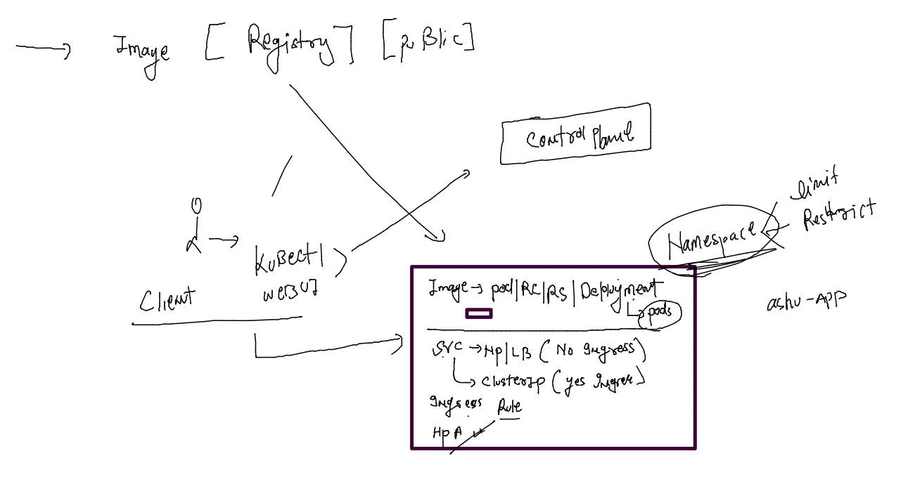
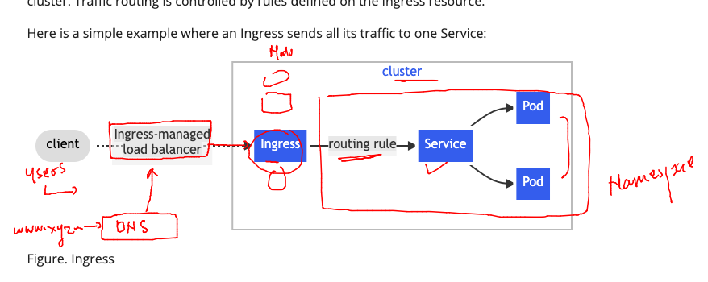
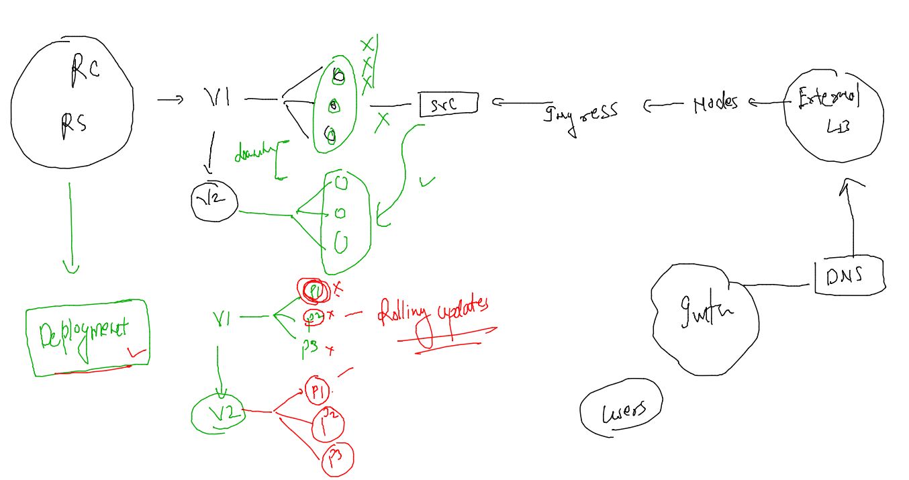
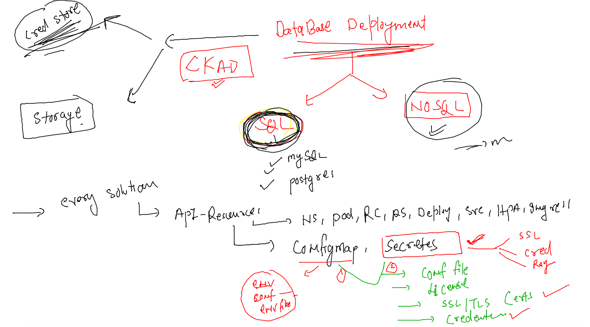
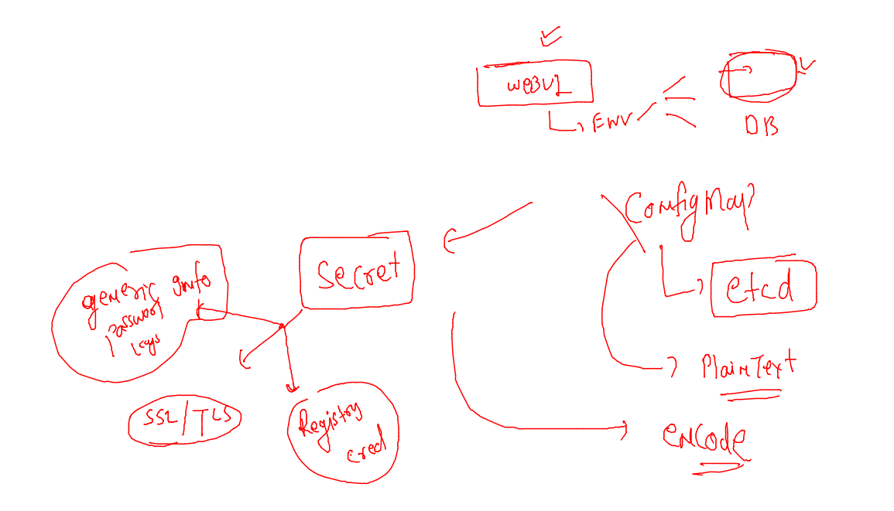

## getting started

### Revision 



### One more clouser look 



### verify last day deployment 

```
[ashu@docker-host ashu-apps]$ kubectl  config get-contexts 
CURRENT   NAME                          CLUSTER      AUTHINFO           NAMESPACE
*         kubernetes-admin@kubernetes   kubernetes   kubernetes-admin   ashu-project
[ashu@docker-host ashu-apps]$ kubectl  get  deploy 
NAME           READY   UP-TO-DATE   AVAILABLE   AGE
ashu-mobi-ui   3/3     3            3           21h
[ashu@docker-host ashu-apps]$ kubectl  get  hpa
NAME           REFERENCE                 TARGETS   MINPODS   MAXPODS   REPLICAS   AGE
ashu-mobi-ui   Deployment/ashu-mobi-ui   0%/85%    3         20        3          21h
[ashu@docker-host ashu-apps]$ kubectl  get pods -o wide
NAME                            READY   STATUS    RESTARTS      AGE   IP                NODE    NOMINATED NODE   READINESS GATES
ashu-mobi-ui-6c8874f549-4q9jc   1/1     Running   1 (19h ago)   21h   192.168.135.21    node3   <none>           <none>
ashu-mobi-ui-6c8874f549-dzz2c   1/1     Running   1 (19h ago)   21h   192.168.104.24    node2   <none>           <none>
ashu-mobi-ui-6c8874f549-ggfsr   1/1     Running   1 (19h ago)   21h   192.168.166.135   node1   <none>           <none>
[ashu@docker-host ashu-apps]$ kubectl  get  svc
NAME        TYPE        CLUSTER-IP       EXTERNAL-IP   PORT(S)    AGE
ashu-svc1   ClusterIP   10.107.101.151   <none>        1234/TCP   20h
[ashu@docker-host ashu-apps]$ kubectl  get  ingress
NAME                    CLASS   HOSTS             ADDRESS         PORTS   AGE
ashu-app-ingress-rule   nginx   me.ashutoshh.in   172.31.17.130   80      20h
[ashu@docker-host ashu-apps]$ 
```

### change something in UI app -- build -push it docker hub 

```
1009  cd ashu-ui-app/
 1010  ls
 1011  docker images  |  grep ashu
 1012  docker build -t ashumobi:uiv2 -f nginx.dockerfile  . 
 1013  history 
[ashu@docker-host ashu-ui-app]$ 
[ashu@docker-host ashu-ui-app]$ docker images  |  grep ashu
ashumobi                            uiv2      99e99a306420   13 seconds ago   142MB
dockerashu/ashumobi                 uiv1      c58f0bc54191   24 hours ago     142MB
ashumobi                            uiv1      c58f0bc54191   24 hours ago     142MB
dockerashu/ashu-mobiwebapp          v1        7aeab02a7ecf   2 days ago       461MB
dockerashu/ashu-mobiwebapp          <none>    af4b91c944ef   2 days ago       461MB
dockerashu/ashu-ui                  mobiv1    f45551527ab7   2 days ago       144MB
dockerashu/ashu-ui                  <none>    eff1395a1609   2 days ago       144MB
ashu-compose-examples-myapp         latest    133d735eb1da   5 days ago       475MB
[ashu@docker-host ashu-ui-app]$ docker tag  ashumobi:uiv2  docker.io/dockerashu/ashumobi:uiv2 
[ashu@docker-host ashu-ui-app]$ docker login 
Authenticating with existing credentials...
WARNING! Your password will be stored unencrypted in /home/ashu/.docker/config.json.
Configure a credential helper to remove this warning. See
https://docs.docker.com/engine/reference/commandline/login/#credentials-store

Login Succeeded
[ashu@docker-host ashu-ui-app]$ docker push docker.io/dockerashu/ashumobi:uiv2
The push refers to repository [docker.io/dockerashu/ashumobi]
493b10705743: Pushed 
80115eeb30bc: Layer already exists 
049fd3bdb25d: Layer already exists 
ff1154af28db: Layer already exists 
8477a329ab95: Layer already exists 
7e7121bf193a: Layer already exists 
67a4178b7d47: Layer already exists 
uiv2: digest: sha256:162d6c59f2702d9bcc6ba31a977968389b51bbe8c698b6e109b062b40076e973 size: 1779
[ashu@docker-host ashu-ui-app]$ 
```

### app upgradation strategy for deployment controller



### manual update of image in deployment 

```
[ashu@docker-host ashu-apps]$ kubectl  set  image deployment  ashu-mobi-ui   ashumobi=docker.io/dockerashu/ashumobi:uiv2
deployment.apps/ashu-mobi-ui image updated
```

### checking image

```
ashu@docker-host ashu-apps]$ kubectl  describe  deployment  ashu-mobi-ui 
Name:                   ashu-mobi-ui
Namespace:              ashu-project
CreationTimestamp:      Wed, 01 Feb 2023 12:15:57 +0000
Labels:                 app=ashu-mobi-ui
Annotations:            deployment.kubernetes.io/revision: 2
Selector:               app=ashu-mobi-ui
Replicas:               3 desired | 3 updated | 3 total | 3 available | 0 unavailable
StrategyType:           RollingUpdate
MinReadySeconds:        0
RollingUpdateStrategy:  25% max unavailable, 25% max surge
Pod Template:
  Labels:  app=ashu-mobi-ui
  Containers:
   ashumobi:
    Image:        docker.io/dockerashu/ashumobi:uiv2
    Port:         80/TCP
    Host Port:    0/TCP
```

### rollout to rollback app 

```
[ashu@docker-host ashu-apps]$ 
[ashu@docker-host ashu-apps]$ kubectl rollout undo deployment ashu-mobi-ui 
deployment.apps/ashu-mobi-ui rolled back
[ashu@docker-host ashu-apps]$ 
[ashu@docker-host ashu-apps]$ kubectl  describe deploy ashu-mobi-ui 
Name:                   ashu-mobi-ui
Namespace:              ashu-project
CreationTimestamp:      Wed, 01 Feb 2023 12:15:57 +0000
Labels:                 app=ashu-mobi-ui
Annotations:            deployment.kubernetes.io/revision: 3
Selector:               app=ashu-mobi-ui
Replicas:               3 desired | 3 updated | 4 total | 3 available | 1 unavailable
StrategyType:           RollingUpdate
MinReadySeconds:        0
RollingUpdateStrategy:  25% max unavailable, 25% max surge
Pod Template:
  Labels:  app=ashu-mobi-ui
  Containers:
   ashumobi:
    Image:        docker.io/dockerashu/ashumobi:uiv1
    Port:         80/TCP
    Host Port:    0/TCP
    Environment:  <none>
```

### lets clean all the resources in Namespace 

```
[ashu@docker-host ashu-apps]$ 
[ashu@docker-host ashu-apps]$ 
[ashu@docker-host ashu-apps]$ kubectl delete all --all
pod "ashu-mobi-ui-6c8874f549-2nc7x" deleted
pod "ashu-mobi-ui-6c8874f549-m4xkg" deleted
pod "ashu-mobi-ui-6c8874f549-rmqkj" deleted
service "ashu-svc1" deleted
deployment.apps "ashu-mobi-ui" deleted
horizontalpodautoscaler.autoscaling "ashu-mobi-ui" deleted
[ashu@docker-host ashu-apps]$ kubectl  get  ing
NAME                    CLASS   HOSTS             ADDRESS         PORTS   AGE
ashu-app-ingress-rule   nginx   me.ashutoshh.in   172.31.17.130   80      21h
[ashu@docker-host ashu-apps]$ kubectl delete ing ashu-app-ingress-rule 
ingress.networking.k8s.io "ashu-app-ingress-rule" deleted
[ashu@docker-host ashu-apps]$ 
```

### Introduction to ConfigMap & Secret 



### use configMap 

### dockerfile 

```
FROM oraclelinux:8.4
ENV code=blue
RUN mkdir /test
COPY hello.sh /test/
WORKDIR /test
RUN chmod +x hello.sh
ENTRYPOINT ["./hello.sh"]
```

### hello.sh 

```
#!/bin/bash

if [ "$code" == "blue"  ]
then
    while [ true ]
    do  
        echo "Hello i am code Blue !!!"
        sleep 10 
    done
elif [ "$code" == "black"  ]
then
    while [ true ]
    do
        echo "Hello i am code black !!!"
        sleep 10
    done
fi 
```

### deploy test image 

```
[ashu@docker-host k8s-app-deploy]$ kubectl create deployment ashu-test --image=docker.io/dockerashu/testing:v1 --dry-run=client -o yaml >testcm.yaml 
[ashu@docker-host k8s-app-deploy]$ kubectl apply -f testcm.yaml 
deployment.apps/ashu-test created
[ashu@docker-host k8s-app-deploy]$ kubectl  get  deploy 
NAME        READY   UP-TO-DATE   AVAILABLE   AGE
ashu-test   0/1     1            0           3s
[ashu@docker-host k8s-app-deploy]$ kubectl  get  po
NAME                         READY   STATUS    RESTARTS   AGE
ashu-test-8689b84f64-8rhcc   1/1     Running   0          6s
[ashu@docker-host k8s-app-deploy]$ 

```

### checking output 

```
[ashu@docker-host k8s-app-deploy]$ kubectl  get  po
NAME                         READY   STATUS    RESTARTS   AGE
ashu-test-8689b84f64-8rhcc   1/1     Running   0          61s
[ashu@docker-host k8s-app-deploy]$ kubectl logs  ashu-test-8689b84f64-8rhcc 
Hello i am code Blue !!!
Hello i am code Blue !!!
Hello i am code Blue !!!
Hello i am code Blue !!!
Hello i am code Blue !!!
Hello i am code Blue !!!
Hello i am code Blue !!!
```

### lets add ENV section in Deployment file 

```
apiVersion: apps/v1
kind: Deployment
metadata:
  creationTimestamp: null
  labels:
    app: ashu-test
  name: ashu-test
spec:
  replicas: 1
  selector:
    matchLabels:
      app: ashu-test
  strategy: {}
  template:
    metadata:
      creationTimestamp: null
      labels:
        app: ashu-test
    spec:
      containers:
      - image: docker.io/dockerashu/testing:v1
        name: testing
        resources: {}
        env: # to create / use ENV variable of docker images 
        - name: code # name of ENV 
          value: black # value of ENV 
status: {}

```

### deploy again 

```
[ashu@docker-host k8s-app-deploy]$ kubectl apply -f testcm.yaml 
deployment.apps/ashu-test configured
[ashu@docker-host k8s-app-deploy]$ kubectl  get  po 
NAME                         READY   STATUS        RESTARTS   AGE
ashu-test-7b76fbfbf4-jkjcd   1/1     Running       0          4s
ashu-test-8689b84f64-8rhcc   1/1     Terminating   0          5m32s
[ashu@docker-host k8s-app-deploy]$ kubectl  logs ashu-test-7b76fbfbf4-jkjcd
Hello i am code black !!!
Hello i am code black !!!
[ashu@docker-host k8s-app-deploy]$
```

### creating configMAP 

```
[ashu@docker-host k8s-app-deploy]$ kubectl  create  configmap  ashu-env-cm  --from-literal  code=black --dry-run=client -o yaml 
apiVersion: v1
data:
  code: black
kind: ConfigMap
metadata:
  creationTimestamp: null
  name: ashu-env-cm
[ashu@docker-host k8s-app-deploy]$ kubectl  create  configmap  ashu-env-cm  --from-literal  code=black --dry-run=client -o yaml  >mycm.yaml 
[ashu@docker-host k8s-app-deploy]$ kubectl apply -f mycm.yaml 
configmap/ashu-env-cm created
[ashu@docker-host k8s-app-deploy]$ kubectl   get  configmap 
NAME               DATA   AGE
ashu-env-cm        1      8s
kube-root-ca.crt   1      2d23h
[ashu@docker-host k8s-app-deploy]$
```

### calling configmap in deployment file 

```
apiVersion: apps/v1
kind: Deployment
metadata:
  creationTimestamp: null
  labels:
    app: ashu-test
  name: ashu-test
spec:
  replicas: 1
  selector:
    matchLabels:
      app: ashu-test
  strategy: {}
  template:
    metadata:
      creationTimestamp: null
      labels:
        app: ashu-test
    spec:
      containers:
      - image: docker.io/dockerashu/testing:v1
        name: testing
        resources: {}
        envFrom: # to call some resources 
        - configMapRef:
            name: ashu-env-cm
status: {}


```

### lets deploy the deployment controller 

```
[ashu@docker-host k8s-app-deploy]$ kubectl apply -f  testcm.yaml 
deployment.apps/ashu-test created
[ashu@docker-host k8s-app-deploy]$ kubectl  get  deployment 
NAME        READY   UP-TO-DATE   AVAILABLE   AGE
ashu-test   1/1     1            1           6s
[ashu@docker-host k8s-app-deploy]$ kubectl  get po 
NAME                         READY   STATUS    RESTARTS   AGE
ashu-test-6dfbc9ff8c-5t6d8   1/1     Running   0          10s
[ashu@docker-host k8s-app-deploy]$ kubectl get cm 
NAME               DATA   AGE
ashu-env-cm        1      7m49s
kube-root-ca.crt   1      2d23h
```

### logs

```
[ashu@docker-host k8s-app-deploy]$ kubectl logs ashu-test-6dfbc9ff8c-5t6d8 
Hello i am code black !!!
Hello i am code black !!!
Hello i am code black !!!
Hello i am code black !!!
Hello i am code black !!
```

### task solution 

```
apiVersion: v1
kind: Namespace
metadata:
  creationTimestamp: null
  name: ashuk8s1
spec: {}
status: {}
---
apiVersion: v1
kind: Pod
metadata:
  creationTimestamp: null
  labels:
    run: ashupod1
  name: ashupod1
  namespace: ashuk8s1 # adding namespace info 
spec:
  containers:
  - image: ubuntu
    name: ashupod1
    command: ["sleep","10000"] # to give parent process to pod container 
    resources: {}
  dnsPolicy: ClusterFirst
  restartPolicy: Always
status: {}

---

apiVersion: v1
kind: Service
metadata:
  creationTimestamp: null
  labels:
    app: ashusvc1
  name: ashusvc1
  namespace: ashuk8s1 # namespace info 
spec:
  ports:
  - name: 1234-80
    port: 1234
    protocol: TCP
    targetPort: 80
    nodePort: 31009 # we can choose port number statically 
  selector:
    app: ashusvc1
  type: NodePort
status:
  loadBalancer: {}
```

### 

```
[ashu@docker-host k8s-app-deploy]$ kubectl apply -f mytask.yaml 
namespace/ashuk8s1 configured
pod/ashupod1 configured
service/ashusvc1 created
[ashu@docker-host k8s-app-deploy]$ kubectl  get po,svc -n ashuk8s1 
NAME           READY   STATUS    RESTARTS   AGE
pod/ashupod1   1/1     Running   0          2m36s

NAME               TYPE       CLUSTER-IP     EXTERNAL-IP   PORT(S)          AGE
service/ashusvc1   NodePort   10.110.9.249   <none>        1234:31009/TCP   12s
[ashu@docker-host k8s-app-deploy]$ ls
admin.yaml               ashupod1.yaml       autopod.yaml        ingress-route-rule.yaml  mynslimitcg.yaml  task1.yaml   ui_deploy.yaml
appashu_deployment.yaml  ashu-ui-npsvc.yaml  clusterip_svc.yaml  logs.txt                 mytask.yaml       testcm.yaml
ashunodeportlb.yaml      autopod.json        hpa.yaml            mycm.yaml                s1.yaml           tomcat.yaml
[ashu@docker-host k8s-app-deploy]$ 
[ashu@docker-host k8s-app-deploy]$ 
[ashu@docker-host k8s-app-deploy]$ 
[ashu@docker-host k8s-app-deploy]$ kubectl  get po  -n ashuk8s1 
NAME       READY   STATUS    RESTARTS   AGE
ashupod1   1/1     Running   0          3m22s
[ashu@docker-host k8s-app-deploy]$ 
[ashu@docker-host k8s-app-deploy]$ kubectl -n ashuk8s1   cp  autopod.json  ashupod1:/tmp/
[ashu@docker-host k8s-app-deploy]$ 
[ashu@docker-host k8s-app-deploy]$ kubectl  -n ashuk8s1  exec ashupod1 -- bash 
[ashu@docker-host k8s-app-deploy]$ 
[ashu@docker-host k8s-app-deploy]$ kubectl  -n ashuk8s1  exec -it ashupod1 -- bash 
root@ashupod1:/# 
root@ashupod1:/# 
root@ashupod1:/# cd /tmp/
root@ashupod1:/tmp# ls
autopod.json
root@ashupod1:/tmp# exit
exit
```

### commands to generate YAML of tasks 

```
kubectl create ns ashuk8s1 --dry-run=client -o yaml
 kubectl  run ashupod1  --image=ubuntu --dry-run=client -o yaml
 kubectl  create  service nodeport ashusvc1 --tcp 1234:80 --dry-run=client -o yaml 
```

## Creating database using deployment -- no storage 

### creating configMAP 

```
ashu@docker-host k8s-app-deploy]$ kubectl create  configmap ashu-db-details --from-literal MYSQL_DATABASE="MobiEmp" --dry-run=client  -o yaml 
apiVersion: v1
data:
  MYSQL_DATABASE: MobiEmp
kind: ConfigMap
metadata:
  creationTimestamp: null
  name: ashu-db-details
```

### adding more variable 

```
apiVersion: v1
data:
  MYSQL_DATABASE: MobiEmp
  MYSQL_USER: ashu 
kind: ConfigMap
metadata:
  creationTimestamp: null
  name: ashu-db-details
```

===

```
[ashu@docker-host k8s-app-deploy]$ kubectl apply -f mysql_deployment.yaml 
configmap/ashu-db-details created
[ashu@docker-host k8s-app-deploy]$ kubectl  get  cm 
NAME               DATA   AGE
ashu-db-details    2      5s
ashu-env-cm        2      68m
kube-root-ca.crt   1      3d
```

### understanding and creating secret in k8s 



```
[ashu@docker-host k8s-app-deploy]$ kubectl  create  secret
Create a secret using specified subcommand.

Available Commands:
  docker-registry Create a secret for use with a Docker registry
  generic         Create a secret from a local file, directory, or literal value
  tls             Create a TLS secret

Usage:
  kubectl create secret [flags] [options]

Use "kubectl <command> --help" for more information about a given command.
Use "kubectl options" for a list of global command-line options (applies to all commands).
[ashu@docker-host k8s-app-deploy]$ kubectl  create  secret  generic ashu-db-cred  --from-literal rootpass=
secret/ashu-db-cred created
[ashu@docker-host k8s-app-deploy]$ kubectl  create  secret  generic ashu-db-cred  --from-literal rootpass="MobiPass@09" --dry-run=client -o yaml 
apiVersion: v1
data:
  rootpass: TW9iaVBhc3NAMDk=
kind: Secret
metadata:
  creationTimestamp: null
  name: ashu-db-cred
```

### lets deploy it 

```
[ashu@docker-host k8s-app-deploy]$ kubectl apply -f mysql_deployment.yaml 
configmap/ashu-db-details configured
secret/ashu-db-cred created
[ashu@docker-host k8s-app-deploy]$ kubectl  get  cm 
NAME               DATA   AGE
ashu-db-details    2      8m16s
ashu-env-cm        2      76m
kube-root-ca.crt   1      3d
[ashu@docker-host k8s-app-deploy]$ kubectl  get  secret
NAME                  TYPE                                  DATA   AGE
ashu-db-cred          Opaque                                1      7s
default-token-s2d7c   kubernetes.io/service-account-token   3      3d
[ashu@docker-host k8s-app-deploy]$ 


```

### Deployment YAML and calling configmap and secret 

```
ashu@docker-host k8s-app-deploy]$ kubectl  create deployment  ashu-db-server  --image=mysql:5.6  --port 3306 --dry-run=client -o yaml 
apiVersion: apps/v1
kind: Deployment
metadata:
  creationTimestamp: null
  labels:
```
### final YAML of mysql Deployment with configmap & secret 

```
apiVersion: v1
data:
  MYSQL_DATABASE: MobiEmp
  MYSQL_USER: ashu 
kind: ConfigMap
metadata:
  creationTimestamp: null
  name: ashu-db-details
---
apiVersion: v1
data:
  rootpass: TW9iaVBhc3NAMDk=
kind: Secret
metadata:
  creationTimestamp: null
  name: ashu-db-cred
---
apiVersion: apps/v1
kind: Deployment
metadata:
  creationTimestamp: null
  labels:
    app: ashu-db-server
  name: ashu-db-server
spec:
  replicas: 1
  selector:
    matchLabels:
      app: ashu-db-server
  strategy: {}
  template:
    metadata:
      creationTimestamp: null
      labels:
        app: ashu-db-server
    spec:
      containers:
      - image: mysql:5.6
        name: mysql
        ports:
        - containerPort: 3306
        resources: {}
        envFrom:
        - configMapRef: # keyword to call CM 
            name: ashu-db-details # name of configmap 
        env: # calling values 
        - name: MYSQL_ROOT_PASSWORD # this variable want a value 
          valueFrom: 
            secretKeyRef: # keyword to call secret 
              name: ashu-db-cred # name of secret 
              key: rootpass  # key of secret 
status: {}
```


